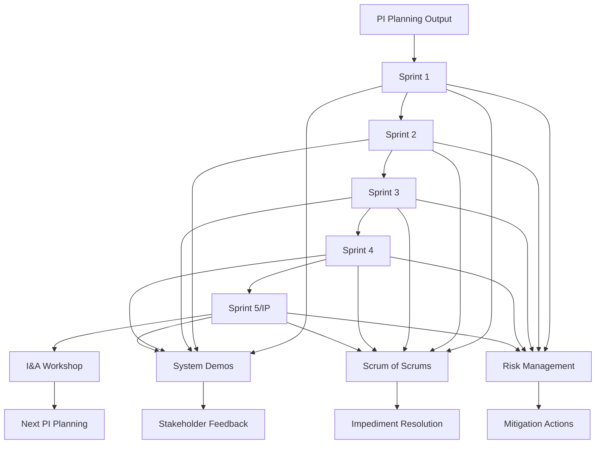

# PI Execution Workflow

## Workflow Metadata
```yaml
workflow:
  id: pi-execution
  name: Program Increment Execution Flow
  duration: 8-12 weeks per PI
  complexity: medium
  agents_involved:
    - release-train-engineer (lead)
    - agile-coach
    - metrics-analyst
    - portfolio-manager
```

## Workflow Overview



## Pre-PI Execution Setup

### Step 0.1: PI Planning Outputs Consolidation
**Agent:** release-train-engineer
**Duration:** Day after PI Planning

```markdown
Consolidate Artifacts:
□ Team PI objectives documented
□ Program board photographed/digitized
□ Dependencies logged in tool
□ Risks captured in ROAM
□ Capacity allocations confirmed

Communication Package:
- PI objectives summary
- Key milestones
- Major dependencies
- Top risks
- Success metrics

Distribution:
- All team members
- Stakeholders
- Business owners
- Support functions
```

### Step 0.2: Execution Readiness
**Agent:** release-train-engineer
**Duration:** Before Sprint 1

```markdown
Readiness Checklist:
□ All ceremonies scheduled
□ Meeting invites sent
□ Tools configured
□ Boards prepared
□ Communication channels active

First Week Schedule:
- Monday: Sprint planning (teams)
- Tuesday: First standups
- Tuesday PM: First SoS
- Wednesday: Architecture sync
- Thursday: PO sync
- Friday: Coaching rounds
```

## Sprint 1 Execution (Weeks 1-2)

### Step 1.1: Sprint 1 Launch
**Agent:** release-train-engineer
**Task:** manage-sprint-coordination
**Duration:** First 3 days

```markdown
Intensive Support:
Day 1:
- Attend team planning
- Verify PI alignment
- Dependency confirmation
- Tool usage support

Day 2:
- Observe standups
- First SoS facilitation
- Impediment capture
- Quick wins focus

Day 3:
- Team check-ins
- Early issue resolution
- Confidence assessment
- Adjustment planning

Common Week 1 Issues:
- Tool confusion → Quick training
- Unclear objectives → Clarification sessions
- Dependencies fuzzy → Direct connects
- Overcommitment → Scope adjustment
```

### Step 1.2: Establishing Rhythms
**Agent:** release-train-engineer
**Duration:** Week 1-2

```markdown
Daily Rhythms:
9:00 - Team standups
10:00 - Scrum of Scrums
14:00 - Ad-hoc support
16:00 - Impediment review

Weekly Rhythms:
Monday: Sprint goals alignment
Wednesday: Architecture sync
Thursday: PO sync
Friday: Metrics & risks

Key Behaviors to Reinforce:
- Visual management
- Proactive communication
- Early escalation
- Cross-team collaboration
```

### Step 1.3: Early Adjustments
**Agent:** agile-coach
**Duration:** End of Sprint 1

```markdown
Sprint 1 Retrospective Focus:
Process:
- What's working?
- What's confusing?
- What's missing?

Quick Improvements:
- Meeting effectiveness
- Communication clarity
- Tool usage
- Dependency handling

Coaching Points:
- Celebrate small wins
- Address frustrations
- Reinforce practices
- Build confidence
```

## Sprint 2-3 Execution (Weeks 3-6)

### Step 2.1: System Demo Preparation
**Agent:** release-train-engineer
**Duration:** Every 2 weeks

```markdown
Demo Orchestration:
Week Before:
- Identify integration points
- Assign demo leads
- Environment validation
- Script outline

Demo Week:
- Monday: Content finalization
- Wednesday: Dry run
- Thursday: Final prep
- Friday: System demo

Demo Excellence:
- Business focus
- Integrated value
- Working software
- Stakeholder engagement
- Feedback capture
```

### Step 2.2: Dependency Management
**Agent:** release-train-engineer
**Duration:** Continuous

```markdown
Dependency Tracking:
Visual Board:
┌─────────┬────────┬─────────┬──────────┐
│ Team A  │ Team B │ Status  │ Due Date │
├─────────┼────────┼─────────┼──────────┤
│ API spec│ Needs  │ On track│ Sprint 2 │
│ Provides│ Data   │ At risk │ Sprint 3 │
└─────────┴────────┴─────────┴──────────┘

Management Actions:
- Daily visibility
- Proactive communication
- Early warning system
- Mitigation planning
- Regular sync meetings
```

### Step 2.3: Risk Evolution
**Agent:** release-train-engineer
**Task:** track-program-risks
**Duration:** Weekly

```markdown
Risk Management Rhythm:
Weekly ROAM Review:
- New risks emerged?
- Status changes?
- Mitigation progress?
- Escalation needed?

Risk Communication:
- Team awareness
- Stakeholder updates
- Executive briefings
- Mitigation support

Common Mid-PI Risks:
- Scope creep
- Technical surprises
- Resource changes
- External delays
```

## Sprint 4-5 Execution (Weeks 7-10)

### Step 3.1: Momentum Maintenance
**Agent:** agile-coach
**Duration:** Ongoing

```markdown
Energy Management:
Watch for:
- Team fatigue
- Process drift
- Motivation drops
- Conflict emergence

Interventions:
- Celebration moments
- Process tune-ups
- Team building
- Coaching support
- Leadership visibility

Late PI Patterns:
- Rush to complete
- Quality concerns
- Burnout risks
- Next PI anxiety
```

### Step 3.2: Innovation & Planning Sprint
**Agent:** release-train-engineer
**Duration:** Sprint 5 (if used)

```markdown
IP Sprint Options:

Option 1: Innovation Focus
- Hackathons
- Technical debt
- Exploration
- Learning time
- Team choice

Option 2: Planning Focus
- Next PI prep
- Backlog refinement
- Capacity planning
- Dependency mapping
- Risk identification

Option 3: Hybrid
- 3 days innovation
- 2 days planning
- Balance creativity
- Prepare future

Guidance:
- Clear expectations
- Outcomes defined
- Support available
- Sharing planned
```

### Step 3.3: PI Completion Push
**Agent:** release-train-engineer + metrics-analyst
**Duration:** Last 2 weeks

```markdown
Completion Activities:
□ Objective tracking
□ Integration testing
□ Demo preparation
□ Metrics finalization
□ Success stories

Communication Intensity:
- Daily status updates
- Impediment escalation
- Risk mitigation
- Stakeholder alignment
- Celebration planning

Common Challenges:
- Integration issues → Extra support
- Unfinished work → Scope decisions
- Quality concerns → Focus shift
- Team exhaustion → Energy injection
```

## Continuous Activities Throughout PI

### Step 4.1: Scrum of Scrums Excellence
**Agent:** release-train-engineer
**Duration:** 2-3x per week

```markdown
Meeting Evolution:

Weeks 1-2: Establishing
- Learning format
- Building trust
- Finding rhythm
Focus: Mechanics

Weeks 3-6: Performing
- Efficient updates
- Proactive coordination
- Quick decisions
Focus: Value

Weeks 7-10: Optimizing
- Pattern recognition
- Preventive actions
- Strategic alignment
Focus: Improvement

Facilitation Tips:
- Stand up (energy)
- Visual boards
- Round-robin
- Park details
- Action focus
```

### Step 4.2: Metrics & Reporting
**Agent:** metrics-analyst
**Task:** generate-flow-metrics
**Duration:** Weekly

```markdown
Weekly Metrics Package:
Executive View:
- PI objective progress
- Burnup chart
- Risk summary
- Key decisions needed

Team View:
- Velocity trends
- Sprint burndown
- Impediment aging
- Quality metrics

Stakeholder View:
- Feature completion
- Demo highlights
- Business value
- Next milestones

Insights Focus:
- What's working?
- What needs attention?
- What decisions needed?
- What support required?
```

### Step 4.3: Stakeholder Engagement
**Agent:** portfolio-manager
**Duration:** Bi-weekly

```markdown
Engagement Strategy:
System Demos:
- Business language
- Value demonstration
- Feedback sessions
- Celebration moments

Regular Updates:
- Newsletter format
- Success highlights
- Challenge transparency
- Support requests

Executive Sessions:
- Monthly briefings
- Decision needs
- Risk escalations
- Investment validation

Stakeholder Satisfaction:
- Regular surveys
- Feedback loops
- Adjustment actions
- Relationship building
```

## Sprint-Level Execution Patterns

### Sprint Planning Excellence
```markdown
Alignment Check:
□ PI objectives clear
□ Dependencies confirmed
□ Capacity realistic
□ Definition of Done agreed
□ Sprint goal inspiring

Planning Quality:
- Right-sized stories
- Clear acceptance criteria
- Task breakdown
- Risk identification
- Team commitment
```

### Daily Execution
```markdown
Daily Standup+:
Standard Questions:
- What did I complete?
- What will I work on?
- What impediments exist?

Plus Questions:
- Any dependency updates?
- Any help needed?
- Any risks emerging?

After Standup:
- Update boards
- Resolve impediments
- Coordinate dependencies
- Communicate changes
```

### Sprint Closure
```markdown
Review Excellence:
- Integrated demos
- Stakeholder attendance
- Feedback capture
- Backlog adjustment
- Celebration moment

Retrospective Depth:
- Process improvements
- Team dynamics
- Technical practices
- Collaboration patterns
- Action commitment
```

## Integration Points

### With Other Workflows
- **SAFe Implementation:** Provides structure
- **Agile Transformation:** Cultural context
- **Integrated Delivery:** Value flow

### With Other Packs
- **bmad-devops:** Technical practices
- **bmad-qa:** Quality integration
- **bmad-architect:** Technical guidance
- **bmad-change:** Stakeholder management

## Success Patterns

### Pattern 1: Consistent Cadence
```markdown
Elements:
- Never skip ceremonies
- Same time slots
- Reliable attendance
- Clear purposes
- Time-box respect

Benefits:
- Predictable rhythm
- Reduced overhead
- Increased efficiency
- Better planning
- Team stability
```

### Pattern 2: Radical Transparency
```markdown
Elements:
- All work visible
- Impediments public
- Risks shared
- Progress real-time
- Challenges acknowledged

Benefits:
- Fast resolution
- Trust building
- Help mobilization
- Learning culture
- Realistic planning
```

### Pattern 3: Continuous Integration
```markdown
Elements:
- Daily integration
- Automated testing
- Regular demos
- Fast feedback
- Quick fixes

Benefits:
- Early issue detection
- Reduced risk
- Confidence building
- Quality improvement
- Predictable delivery
```

## Anti-Patterns to Avoid

1. **Mini-Waterfall**
   - Sign: All design sprint 1, all code sprint 2-4, all test sprint 5
   - Fix: Vertical slices every sprint

2. **Ceremony Theater**
   - Sign: Going through motions without value
   - Fix: Purpose reminder, format experiments

3. **Local Optimization**
   - Sign: Team success but system failure
   - Fix: Integration focus, system demos

4. **Perpetual Crisis**
   - Sign: Everything urgent, constant firefighting
   - Fix: Root cause analysis, systematic improvements

## Completion Criteria

```markdown
Successful PI Execution:
□ >80% objectives achieved
□ Integrated solution delivered
□ Stakeholders satisfied
□ Risks managed effectively
□ Teams improving
□ Metrics trending positive
□ Ready for next PI
□ Lessons captured
```

---

*Excellence in execution comes from disciplined practice and continuous refinement*