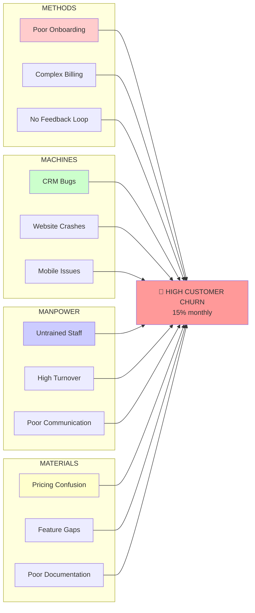

# Fishbone (Ishikawa) Diagram Framework

## Overview
The Fishbone Diagram, also known as the Ishikawa Diagram or Cause-and-Effect Diagram, is a visual tool for systematically identifying potential causes of a problem. Created by Kaoru Ishikawa in the 1960s, it resembles a fish skeleton with the problem as the "head" and causes as "bones."

## When to Use
- Complex problems with multiple potential causes
- Team brainstorming sessions
- When causes span different categories (people, process, technology)
- Problems requiring comprehensive cause analysis
- Quality control and improvement initiatives

## The 6 M Categories

### Traditional Manufacturing (6 Ms):
1. **Machine** - Equipment, technology, tools
2. **Method** - Processes, procedures, ways of working
3. **Material** - Inputs, supplies, information
4. **Manpower** - People, skills, training
5. **Measurement** - Metrics, monitoring, feedback
6. **Mother Nature** - Environment, conditions, external factors

### Service Industries (6 Ps):
1. **People** - Staff, customers, stakeholders
2. **Process** - Procedures, workflows, methods
3. **Policy** - Rules, regulations, guidelines
4. **Plant/Place** - Environment, location, layout
5. **Procedures** - Standard operating procedures
6. **Product** - Service offerings, outputs

## Visual Structure

```
                METHODS              MACHINES
                   │                    │
    Process A ──────┤                    ├────── Technology A
    Process B ──────┤                    ├────── Equipment B
    Training  ──────┤    PROBLEM         ├────── Tools C
                   │    STATEMENT        │
─────────────────────┼─────────────────────┼─────────────────
    Skill Gap ──────┤                    ├────── Data Quality
    Motivation ─────┤                    ├────── Suppliers
    Staffing   ─────┤                    ├────── Resources
                   │                    │
                MANPOWER              MATERIALS
```

## Step-by-Step Process

### 1. Define the Problem (Fish Head)
```
🐟 PROBLEM: Write clear, specific problem statement
   Example: "Customer satisfaction dropped 20% in Q3"
```

### 2. Draw the Fishbone Structure
- Draw a horizontal line (spine) pointing to the problem
- Add 6 diagonal lines (major bones) for categories
- Label each major bone with a category

### 3. Brainstorm Causes for Each Category
- Ask "What in this category could cause the problem?"
- Add sub-causes as smaller bones
- Dig deeper with "What causes this cause?"

### 4. Analyze and Prioritize
- Look for causes appearing in multiple categories
- Identify causes with strong evidence
- Prioritize based on impact and probability

## Detailed Example: "High Customer Churn"

```
                    METHODS                    MACHINES
                        │                          │
    Onboarding process ──┤                          ├── CRM system bugs
    Support procedures ──┤                          ├── Website crashes  
    Billing process    ──┤     HIGH CUSTOMER        ├── Mobile app issues
    Renewal process    ──┤         CHURN            ├── Server downtime
                        │         (15%/mo)          │
    ────────────────────┼─────────────────────────────┼────────────────────
    Poor communication ──┤                          ├── Pricing data
    Untrained staff    ──┤                          ├── Product quality
    High turnover      ──┤                          ├── Feature gaps
    No feedback loop   ──┤                          ├── Documentation
                        │                          │
                    MANPOWER                   MATERIALS

MEASUREMENT                      MOTHER NATURE
    │                                │
    ├── No churn metrics             ├── Economic downturn
    ├── Delayed reporting            ├── New competitors
    ├── Poor data quality            ├── Market changes
    ├── No early warning             ├── Regulatory changes
```

## Advanced Techniques

### 1. **Multi-Level Analysis**
```
Primary Cause: Poor onboarding
├── Secondary: Process unclear
│   ├── Tertiary: No documentation
│   └── Tertiary: Too many steps
└── Secondary: Staff undertrained
    ├── Tertiary: No training program
    └── Tertiary: High staff turnover
```

### 2. **Evidence Rating**
```
Cause                 | Evidence | Impact | Total
Poor communication    |     🟢   |   🔴   |  High
CRM system bugs      |     🔴   |   🟡   |  Med
Website crashes      |     🔴   |   🔴   |  High
Pricing issues       |     🟡   |   🔴   |  High
```

### 3. **Cross-Category Connections**
```
Methods (Process) ←→ Manpower (Training)
Machines (System) ←→ Materials (Data Quality)
```

## Digital Tools and Templates

### ASCII Template:
```
                    CATEGORY 1            CATEGORY 2
                        │                      │
         Cause A ───────┤                      ├─────── Cause E
         Cause B ───────┤                      ├─────── Cause F
         Cause C ───────┤      PROBLEM         ├─────── Cause G
         Cause D ───────┤                      ├─────── Cause H
                        │                      │
    ────────────────────┼──────────────────────┼─────────────────
         Cause I ───────┤                      ├─────── Cause M
         Cause J ───────┤                      ├─────── Cause N
         Cause K ───────┤                      ├─────── Cause O
         Cause L ───────┤                      ├─────── Cause P
                        │                      │
                   CATEGORY 3            CATEGORY 4
```

### Mermaid Diagram:


## Best Practices

### ✅ Do:
- Include diverse team perspectives
- Be specific with cause descriptions
- Dig deeper than surface causes
- Look for evidence to support causes
- Focus on processes, not people blame
- Use data when possible

### ❌ Don't:
- Stop at obvious causes
- Include solutions in the diagram
- Make it too complex initially
- Assign blame to individuals
- Skip the validation step
- Use vague cause descriptions

## Integration with Other Tools

### Before Fishbone:
- **Pareto Analysis**: Identify which problems to analyze
- **Data Collection**: Gather baseline metrics
- **Stakeholder Input**: Get multiple perspectives

### After Fishbone:
- **5 Whys**: Drill deeper on priority causes
- **Action Planning**: Address high-priority causes
- **Root Cause Analysis**: Validate true root causes
- **Solution Design**: Create targeted interventions

## Team Facilitation Guide

### Preparation (15 minutes):
1. Define problem clearly
2. Assemble diverse team (5-8 people)
3. Prepare categories (6 Ms or 6 Ps)
4. Set up whiteboard or digital tool

### Brainstorming (30 minutes):
1. Start with one category
2. Generate causes rapidly (no criticism)
3. Ask "What else?" repeatedly
4. Move through all categories
5. Add sub-causes where helpful

### Analysis (15 minutes):
1. Look for patterns
2. Identify evidence for causes
3. Prioritize high-impact causes
4. Plan next steps

## Common Variations

### 4 Ps (Service-Focused):
- **Policies** - Rules and procedures
- **Procedures** - Work methods
- **People** - Human factors
- **Plant** - Physical environment

### 8 Ms (Comprehensive):
- Add **Management** and **Maintenance** to 6 Ms

### Custom Categories:
- **Technology, Process, People, External** (Software)
- **Content, Design, Technical, Marketing** (Digital products)

## Success Metrics
- ✅ All team members contribute causes
- ✅ Multiple causes identified per category
- ✅ Evidence supports major causes
- ✅ Patterns emerge across categories
- ✅ Priority causes are actionable
- ✅ Team agrees on top 3-5 causes to investigate

---

*"The fishbone diagram doesn't give you the answer, but it organizes your thinking to find the answer." - Kaoru Ishikawa*