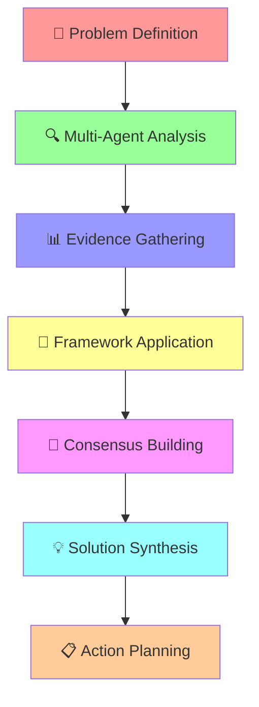
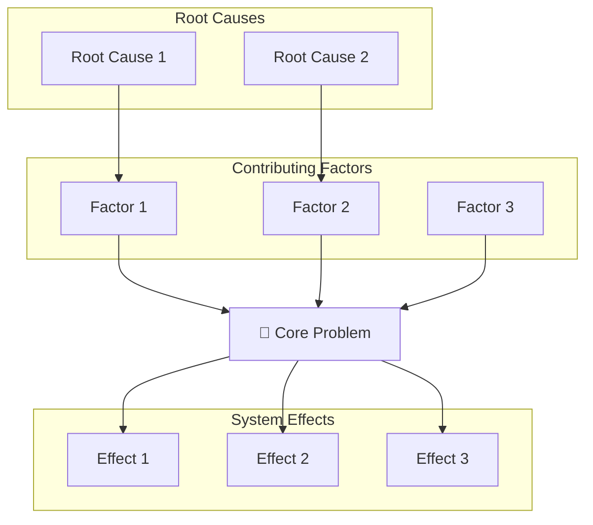

# Comprehensive Problem Analysis Task

## Task Configuration
```yaml
id: comprehensive-problem-analysis
name: Comprehensive Problem Analysis
pack: bmad-problem-solver
version: 1.1.0
elicit: true
description: >
  Interactive multi-agent problem analysis using visualization and consensus-building.
  Guides users through systematic problem exploration with all 5 problem-solving agents.
deliverable: Problem Analysis Report with actionable insights and solution pathways
template: problem-analysis-report
```

## Overview

This interactive task orchestrates all 5 problem-solving agents to conduct a comprehensive analysis of complex business or operational problems. Using structured frameworks, visual thinking, and consensus-building, it transforms unclear challenges into actionable insights.

## Process Flow



## Interactive Steps

### Step 1: Problem Intake & Clarity 🎯

**System Prompt:**
```
I'll help you analyze your problem comprehensively using our team of specialist agents. 
First, let's get crystal clear on what we're dealing with.
```

**User Interaction:**
```yaml
elicit:
  - id: initial_problem
    prompt: |
      Please describe the problem you're facing. Be as specific as possible:
      
      • What is happening (or not happening)?
      • When did you first notice this?
      • Who is affected?
      • What impact is it having?
    type: textarea
    required: true
    
  - id: problem_context
    prompt: |
      What's the broader context?
      
      • What type of organization/situation is this?
      • What constraints are you working within?
      • What's your role in addressing this?
    type: textarea
    required: true
    
  - id: previous_attempts
    prompt: |
      What have you tried already?
      
      • Previous solutions attempted
      • What worked/didn't work
      • Current working theories about the cause
    type: textarea
    required: false
    
  - id: success_criteria
    prompt: |
      How will you know when this problem is solved?
      
      • Specific metrics or outcomes
      • Stakeholder satisfaction measures
      • Timeline expectations
    type: textarea
    required: true
```

### Step 2: Agent Activation & Initial Assessment 🔍

**System Action:**
```
Based on your problem description, I'm activating our specialist team:

🔬 Dr. Sarah Chen (Systems Thinker) - Mapping interconnections
🎯 Marcus Reid (First Principles) - Questioning assumptions  
🧠 Dr. Angela Foster (Critical Analyst) - Validating logic
💡 Jordan Park (Creative Solver) - Generating alternatives
🔍 Kenji Tanaka (Root Cause) - Finding true origins

Each agent will analyze your problem from their specialty perspective.
```

**User Interaction:**
```yaml
elicit:
  - id: complexity_level
    prompt: |
      How would you rate your familiarity with problem-solving frameworks?
      
      This helps us adjust our explanations and visualizations.
    type: select
    options:
      - value: beginner
        label: "Beginner - I'm new to structured problem-solving"
      - value: intermediate  
        label: "Intermediate - I know some frameworks"
      - value: advanced
        label: "Advanced - I'm experienced with multiple approaches"
    required: true
    
  - id: time_availability
    prompt: |
      How much time can you dedicate to this analysis?
    type: select
    options:
      - value: quick
        label: "30 minutes - Quick insights"
      - value: standard
        label: "1-2 hours - Thorough analysis"
      - value: deep
        label: "Half day - Comprehensive deep dive"
    required: true
```

### Step 3: Multi-Framework Analysis 📊

**System Action:**
```
Our agents are now applying multiple frameworks to your problem:

┌─────────────────────┬──────────────────────────────┐
│ 🔬 Systems Analysis │ Mapping feedback loops and   │
│                     │ system dynamics              │
├─────────────────────┼──────────────────────────────┤
│ 🎯 First Principles │ Breaking down to fundamental │
│                     │ assumptions                  │
├─────────────────────┼──────────────────────────────┤
│ 🧠 Critical Review  │ Identifying logical gaps and │
│                     │ biases                       │
├─────────────────────┼──────────────────────────────┤
│ 💡 Creative Reframe │ Generating alternative       │
│                     │ perspectives                 │
├─────────────────────┼──────────────────────────────┤
│ 🔍 Root Cause Hunt  │ Systematic cause             │
│                     │ investigation                │
└─────────────────────┴──────────────────────────────┘
```

**User Interaction:**
```yaml
elicit:
  - id: additional_info
    prompt: |
      As our agents work, is there any additional information that might be helpful?
      
      • Recent changes in your environment
      • Stakeholder perspectives you haven't mentioned
      • Data or metrics you have available
      • Constraints we should know about
    type: textarea
    required: false
    
  - id: focus_areas
    prompt: |
      Which aspects would you like our agents to focus on most?
      (Select up to 3)
    type: checkbox
    options:
      - value: root_causes
        label: "Finding the true root causes"
      - value: system_dynamics
        label: "Understanding system interactions"
      - value: creative_solutions
        label: "Generating innovative alternatives"
      - value: implementation
        label: "Practical implementation strategies"
      - value: risk_assessment
        label: "Identifying potential risks"
      - value: stakeholder_impact
        label: "Understanding stakeholder effects"
    required: true
```

### Step 4: Evidence Validation & Gap Analysis 🧪

**System Action:**
```
Dr. Angela Foster is now validating our analysis:

🔍 EVIDENCE REVIEW:
✅ Strong Evidence: [Findings with solid support]
⚠️  Moderate Evidence: [Areas needing more data]
❓ Weak Evidence: [Assumptions to test]

🧠 BIAS CHECK:
[Identifying potential cognitive biases affecting the analysis]

📊 GAP ANALYSIS:
[What additional information would strengthen our conclusions]
```

**User Interaction:**
```yaml
elicit:
  - id: evidence_availability
    prompt: |
      Our critical analyst has identified some evidence gaps. 
      What additional data or information do you have access to?
      
      • Metrics, reports, or analytics
      • Stakeholder feedback or surveys
      • Historical data or trends
      • Financial or operational data
    type: textarea
    required: false
    
  - id: stakeholder_input
    prompt: |
      Which stakeholders could provide valuable perspectives on this problem?
      
      • Who is most affected?
      • Who has decision-making authority?
      • Who has tried to solve this before?
    type: textarea
    required: false
```

### Step 5: Consensus Building & Synthesis 🤝

**System Action:**
```
🤝 AGENT CONSENSUS MEETING:

Our five agents are now comparing their findings and building consensus:

┌─────────────────────────────────────────────────────┐
│                AGENT PERSPECTIVES                   │
├─────────────────┬───────────────────────────────────┤
│ Systems Thinker │ "This is a reinforcing loop..."   │
│ First Principles│ "The fundamental issue is..."     │
│ Critical Analyst│ "The evidence suggests..."        │
│ Creative Solver │ "What if we tried..."             │
│ Root Cause      │ "The true origin appears to be..."│
└─────────────────┴───────────────────────────────────┘

🎯 CONSENSUS POINTS:
[Areas where agents agree]

⚖️  DEBATE AREAS:
[Areas where agents have different views]

🔍 SYNTHESIS:
[Integrated understanding combining all perspectives]
```

**User Interaction:**
```yaml
elicit:
  - id: consensus_feedback
    prompt: |
      Our agents have reached some consensus points and identified some debate areas.
      
      • Do the consensus points align with your experience?
      • For the debate areas, what's your perspective?
      • Are there any agent viewpoints that particularly resonate?
    type: textarea
    required: true
    
  - id: priority_factors
    prompt: |
      Given the analysis, what factors are most important to you?
      
      Rate by importance (1-5 scale):
    type: rating_grid
    items:
      - Speed of resolution
      - Cost of solution
      - Stakeholder acceptance
      - Long-term sustainability
      - Risk mitigation
      - Innovation opportunity
    required: true
```

### Step 6: Solution Pathway Development 💡

**System Action:**
```
💡 SOLUTION SYNTHESIS:

Based on our comprehensive analysis, here are the solution pathways:

🎯 PRIMARY PATHWAY:
[Main recommended approach with rationale]

🔄 ALTERNATIVE PATHWAYS:
[Alternative approaches for different scenarios]

⚡ QUICK WINS:
[Immediate actions that can be taken]

🏗️ LONG-TERM STRATEGY:
[Comprehensive solution architecture]

⚠️ RISK MITIGATION:
[Key risks and mitigation strategies]
```

**User Interaction:**
```yaml
elicit:
  - id: solution_preferences
    prompt: |
      Which solution pathway interests you most and why?
      
      • What appeals to you about this approach?
      • What concerns do you have?
      • What modifications would you suggest?
    type: textarea
    required: true
    
  - id: implementation_readiness
    prompt: |
      What's your implementation context?
    type: select
    options:
      - value: immediate
        label: "Ready to start immediately"
      - value: planning
        label: "Need to plan and get approval first"
      - value: future
        label: "Looking ahead to future implementation"
      - value: testing
        label: "Want to pilot test first"
    required: true
```

### Step 7: Action Planning & Next Steps 📋

**System Action:**
```
📋 ACTION PLAN DEVELOPMENT:

🎯 IMMEDIATE ACTIONS (Next 48 hours):
[Specific steps to begin]

📅 SHORT-TERM MILESTONES (Next 30 days):
[Key accomplishments to achieve]

🏗️ LONG-TERM OBJECTIVES (Next 90 days):
[Major outcomes to deliver]

📊 SUCCESS METRICS:
[How to measure progress and success]

🤝 STAKEHOLDER ENGAGEMENT:
[Who to involve and how]

⚠️ POTENTIAL OBSTACLES:
[Anticipated challenges and responses]
```

**User Interaction:**
```yaml
elicit:
  - id: action_commitment
    prompt: |
      What specific actions will you commit to taking in the next week?
    type: textarea
    required: true
    
  - id: support_needed
    prompt: |
      What support or resources would be most helpful?
      
      • Additional expertise needed
      • Tools or systems required
      • Stakeholder buy-in needed
      • Budget or resource requirements
    type: textarea
    required: false
    
  - id: follow_up
    prompt: |
      Would you like to schedule a follow-up analysis session?
    type: select
    options:
      - value: week
        label: "In 1 week - Quick progress check"
      - value: month
        label: "In 1 month - Implementation review"
      - value: quarter
        label: "In 3 months - Results assessment"
      - value: none
        label: "No follow-up needed"
    required: true
```

## Visualization Elements

Throughout the analysis, the system generates:

### System Maps:


### Decision Matrix:
```
┌─────────────────┬─────────┬─────────┬─────────┬─────────┐
│ Solution Option │ Impact  │ Effort  │ Risk    │ Score   │
├─────────────────┼─────────┼─────────┼─────────┼─────────┤
│ Option A        │ High    │ Medium  │ Low     │ 8.5     │
│ Option B        │ Medium  │ Low     │ Low     │ 7.2     │
│ Option C        │ High    │ High    │ Medium  │ 6.8     │
└─────────────────┴─────────┴─────────┴─────────┴─────────┘
```

### Timeline Visualization:
```
    IMMEDIATE    │    SHORT-TERM     │    LONG-TERM
    (Week 1)     │    (Month 1)      │    (Quarter 1)
    ─────────────┼───────────────────┼──────────────────
    • Action 1   │    • Milestone 1  │    • Objective 1
    • Action 2   │    • Milestone 2  │    • Objective 2
    • Action 3   │    • Milestone 3  │    • Objective 3
```

## Output Generation

The task generates a comprehensive **Problem Analysis Report** including:

1. **Executive Summary** - Key findings and recommendations
2. **Problem Definition** - Clarified problem statement
3. **Multi-Agent Analysis** - Findings from each specialist
4. **Evidence Assessment** - Supporting data and gaps
5. **Root Cause Analysis** - True origins identified
6. **Solution Pathways** - Multiple approaches evaluated
7. **Action Plan** - Specific next steps with timeline
8. **Risk Assessment** - Potential obstacles and mitigation
9. **Success Metrics** - How to measure progress
10. **Follow-up Plan** - Continued support and review

## Success Criteria

- ✅ Problem clearly defined and validated
- ✅ Multiple perspectives synthesized
- ✅ Evidence-based conclusions reached
- ✅ Actionable solutions identified
- ✅ Implementation plan created
- ✅ Success metrics established
- ✅ User confident in next steps

---

*This task transforms complex problems into clear pathways forward through systematic analysis and collaborative intelligence.*