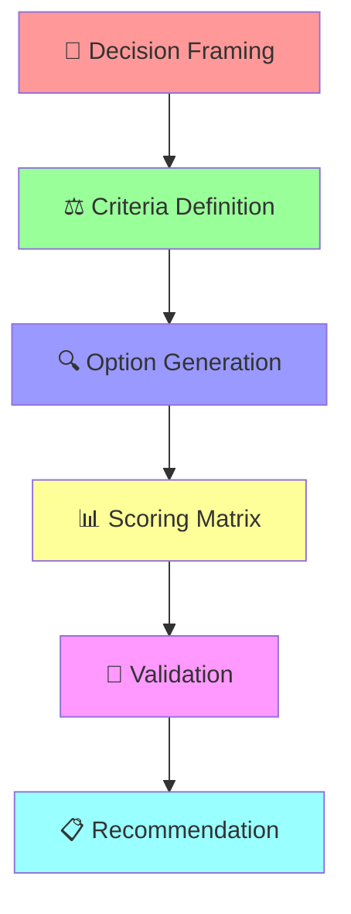

# Decision Analysis Matrix Task

## Task Configuration
```yaml
id: decision-analysis-matrix
name: Decision Analysis Matrix
pack: bmad-problem-solver
version: 1.1.0
elicit: true
description: >
  Interactive multi-criteria decision analysis using visualization and expert judgment.
  Helps evaluate complex decisions with multiple options and competing criteria.
deliverable: Decision Analysis Report with ranked recommendations
template: decision-analysis-report
```

## Overview

This interactive task guides users through a structured decision-making process using multi-criteria analysis, expert frameworks, and visual tools. It's designed for complex decisions where multiple options must be evaluated against competing criteria.

## Decision Analysis Process



## Interactive Steps

### Step 1: Decision Framing 🎯

**System Prompt:**
```
I'll help you make a well-structured decision using multiple criteria analysis.
Our Critical Analyst and Systems Thinker will ensure we consider all angles.
```

**User Interaction:**
```yaml
elicit:
  - id: decision_context
    prompt: |
      What decision are you trying to make?
      
      Be specific about:
      • The choice you're facing
      • Why this decision is important
      • What happens if you delay or don't decide
    type: textarea
    required: true
    
  - id: decision_timeline
    prompt: |
      What's your timeline for making this decision?
    type: select
    options:
      - value: urgent
        label: "Urgent - Need to decide within days"
      - value: soon
        label: "Soon - Need to decide within weeks"
      - value: planned
        label: "Planned - Have months to decide"
      - value: strategic
        label: "Strategic - Long-term planning decision"
    required: true
    
  - id: stakeholders
    prompt: |
      Who are the key stakeholders affected by this decision?
      
      • Who has input into the decision?
      • Who will be impacted by the outcome?
      • Who has veto power or final approval?
    type: textarea
    required: true
    
  - id: constraints
    prompt: |
      What constraints or limitations should we consider?
      
      • Budget limitations
      • Time constraints  
      • Regulatory requirements
      • Technical limitations
      • Political considerations
    type: textarea
    required: false
```

### Step 2: Criteria Definition ⚖️

**System Action:**
```
⚖️ CRITERIA DEVELOPMENT:

Dr. Angela Foster (Critical Analyst) is helping identify evaluation criteria.
Dr. Sarah Chen (Systems Thinker) is ensuring we consider system-wide impacts.

🎯 CRITERIA CATEGORIES:
• Financial Impact
• Strategic Alignment  
• Implementation Feasibility
• Risk Level
• Stakeholder Acceptance
• Time to Value
```

**User Interaction:**
```yaml
elicit:
  - id: criteria_importance
    prompt: |
      What factors are most important in making this decision?
      
      Rate each factor's importance (1-5 scale, 5 = extremely important):
    type: rating_grid
    items:
      - Financial impact/ROI
      - Strategic alignment
      - Implementation ease
      - Risk level
      - Speed of results
      - Stakeholder acceptance
      - Innovation potential
      - Competitive advantage
      - Scalability
      - Reversibility
    required: true
    
  - id: custom_criteria
    prompt: |
      Are there other criteria specific to your situation that we should include?
      
      • Industry-specific factors
      • Organizational priorities
      • Personal preferences
      • Unique constraints
    type: textarea
    required: false
    
  - id: criteria_weights
    prompt: |
      How would you distribute 100 points across your top 5 most important criteria?
      
      This helps us weight the analysis appropriately.
    type: textarea
    required: true
```

### Step 3: Option Generation 🔍

**System Action:**
```
🔍 OPTION EXPLORATION:

Jordan Park (Creative Solver) is helping generate comprehensive options.
Marcus Reid (First Principles) is ensuring we consider fundamental alternatives.

💡 OPTION CATEGORIES:
• Status Quo (do nothing)
• Incremental improvements
• Bold new approaches
• Hybrid solutions
• Phased implementations
```

**User Interaction:**
```yaml
elicit:
  - id: known_options
    prompt: |
      What options are you already considering?
      
      List each option with a brief description:
      • Option 1: [Description]
      • Option 2: [Description]
      • etc.
    type: textarea
    required: true
    
  - id: option_constraints
    prompt: |
      Are there any options that are definitely off the table? Why?
      
      • Regulatory constraints
      • Budget limitations
      • Technical impossibilities
      • Political considerations
    type: textarea
    required: false
    
  - id: creative_options
    prompt: |
      Our Creative Solver suggests considering these types of alternatives:
      
      • What if you did the opposite of conventional wisdom?
      • What if you combined two existing options?
      • What if you phased the implementation differently?
      • What if you partnered with someone else?
      
      Do any of these spark new option ideas?
    type: textarea
    required: false
```

### Step 4: Scoring Matrix Development 📊

**System Action:**
```
📊 DECISION MATRIX CONSTRUCTION:

Creating a weighted scoring matrix with your criteria and options:

┌─────────────────┬─────────┬─────────┬─────────┬─────────┐
│ CRITERIA        │ Weight  │ Option A│ Option B│ Option C│
├─────────────────┼─────────┼─────────┼─────────┼─────────┤
│ Financial (30%) │   0.30  │   7.5   │   6.0   │   8.5   │
│ Strategic (25%) │   0.25  │   8.0   │   9.0   │   6.0   │
│ Risk (20%)      │   0.20  │   6.0   │   8.0   │   7.0   │
│ Speed (15%)     │   0.15  │   9.0   │   5.0   │   7.0   │
│ Accept (10%)    │   0.10  │   7.0   │   8.0   │   6.0   │
├─────────────────┼─────────┼─────────┼─────────┼─────────┤
│ TOTAL SCORE     │         │   7.4   │   7.2   │   7.1   │
└─────────────────┴─────────┴─────────┴─────────┴─────────┘
```

**User Interaction:**
```yaml
elicit:
  - id: scoring_approach
    prompt: |
      How would you like to score each option against the criteria?
    type: select
    options:
      - value: simple
        label: "Simple (1-10 scale for each option vs criteria)"
      - value: comparative
        label: "Comparative (rank options against each other)"
      - value: detailed
        label: "Detailed (specific metrics where possible)"
    required: true
    
  - id: option_scoring
    prompt: |
      For each of your top criteria, rate how well each option performs:
      
      Use a 1-10 scale where:
      • 1-3 = Poor performance
      • 4-6 = Average performance  
      • 7-8 = Good performance
      • 9-10 = Excellent performance
      
      Please score each option you're considering.
    type: scoring_matrix
    required: true
    
  - id: scoring_confidence
    prompt: |
      How confident are you in your scoring?
      
      • Which scores are you most confident about?
      • Which scores are rough estimates?
      • What additional information would improve accuracy?
    type: textarea
    required: true
```

### Step 5: Sensitivity Analysis 🔬

**System Action:**
```
🔬 SENSITIVITY ANALYSIS:

Dr. Angela Foster is testing the robustness of our analysis:

📊 WHAT-IF SCENARIOS:
• If Financial weight increases 10%: Option C moves to #1
• If Risk weight doubles: Option B becomes clear winner
• If Speed becomes less important: Option A drops to #3

🎯 ROBUST CHOICE ANALYSIS:
• Option A: Wins in 3/6 scenarios
• Option B: Wins in 2/6 scenarios
• Option C: Wins in 4/6 scenarios

⚠️ CLOSE CALL ALERT:
Options A and C are within 0.3 points - consider additional factors
```

**User Interaction:**
```yaml
elicit:
  - id: scenario_testing
    prompt: |
      Our analysis shows the decision is sensitive to criteria weights.
      
      • How might your priorities change over time?
      • What external factors could shift the importance of criteria?
      • Are there scenarios where a different option would be clearly better?
    type: textarea
    required: true
    
  - id: deal_breakers
    prompt: |
      Are there any deal-breakers or minimum requirements?
      
      • Must-have features or capabilities
      • Absolute budget limits
      • Non-negotiable timeline requirements
      • Regulatory compliance needs
    type: textarea
    required: false
    
  - id: regret_minimization
    prompt: |
      Imagine looking back in 2 years - which choice would you most regret?
      
      • What if Option A failed to deliver expected results?
      • What if Option B took much longer than expected?
      • What if Option C created unexpected problems?
    type: textarea
    required: true
```

### Step 6: Stakeholder Perspective Analysis 👥

**System Action:**
```
👥 STAKEHOLDER IMPACT ANALYSIS:

Dr. Sarah Chen is mapping how each option affects different stakeholders:

┌─────────────────┬─────────┬─────────┬─────────┐
│ Stakeholder     │ Option A│ Option B│ Option C│
├─────────────────┼─────────┼─────────┼─────────┤
│ Executive Team  │   +2    │   +1    │   +3    │
│ Operations      │    0    │   -1    │   +1    │
│ Customers       │   +1    │   +2    │    0    │
│ IT Team         │   -2    │   +1    │   -1    │
│ Finance         │   +3    │    0    │   +2    │
└─────────────────┴─────────┴─────────┴─────────┘

🎯 CONSENSUS ANALYSIS:
• Option A: Mixed reactions, strong finance support
• Option B: Moderate support across groups
• Option C: Executive favorite, operational concerns
```

**User Interaction:**
```yaml
elicit:
  - id: stakeholder_concerns
    prompt: |
      Which stakeholder concerns are most important to address?
      
      • Whose buy-in is absolutely critical?
      • Which groups could sabotage implementation?
      • How might you address the main objections?
    type: textarea
    required: true
    
  - id: communication_strategy
    prompt: |
      How will you communicate the decision to stakeholders?
      
      • What's your key message for each group?
      • How will you address anticipated objections?
      • What support will you provide during transition?
    type: textarea
    required: false
```

### Step 7: Risk Assessment & Mitigation 🛡️

**System Action:**
```
🛡️ RISK ANALYSIS:

Kenji Tanaka (Root Cause Analyst) is identifying implementation risks:

⚠️ RISK REGISTER:

Option A Risks:
• High: Technical complexity may cause delays
• Medium: Staff resistance to change
• Low: Budget overrun potential

Option B Risks:
• High: Market timing sensitivity
• Medium: Competitor response
• Low: Regulatory changes

Option C Risks:
• High: Execution capability gap
• High: Integration complexity
• Medium: Stakeholder alignment

🎯 MITIGATION STRATEGIES:
[Specific risk mitigation plans for each option]
```

**User Interaction:**
```yaml
elicit:
  - id: risk_tolerance
    prompt: |
      What's your risk tolerance for this decision?
    type: select
    options:
      - value: conservative
        label: "Conservative - Minimize risks, accept lower returns"
      - value: balanced
        label: "Balanced - Accept moderate risks for good returns"
      - value: aggressive
        label: "Aggressive - Accept high risks for high returns"
    required: true
    
  - id: risk_priorities
    prompt: |
      Which types of risks concern you most?
      
      Rank from 1 (most concerning) to 5 (least concerning):
      • Financial losses
      • Timeline delays
      • Quality/performance issues
      • Stakeholder dissatisfaction
      • Competitive disadvantage
    type: ranking
    required: true
    
  - id: contingency_planning
    prompt: |
      How much contingency planning are you willing to invest in?
      
      • Simple backup plans
      • Detailed risk mitigation strategies
      • Full contingency scenarios with triggers
    type: select
    required: true
```

### Step 8: Final Recommendation 🎯

**System Action:**
```
🎯 FINAL RECOMMENDATION:

Based on comprehensive analysis by our expert team:

🥇 PRIMARY RECOMMENDATION: Option C
Score: 7.8/10 | Confidence: High

RATIONALE:
• Highest weighted score across criteria
• Strong executive alignment
• Manageable risk profile with mitigation
• Best long-term strategic fit

🥈 ALTERNATIVE: Option A
Score: 7.4/10 | Confidence: Medium

CONSIDER IF:
• Risk tolerance is lower
• Implementation speed is critical
• Financial constraints tighten

📋 IMPLEMENTATION ROADMAP:
[30-60-90 day plan for recommended option]

⚠️ SUCCESS FACTORS:
[Critical elements for successful execution]
```

**User Interaction:**
```yaml
elicit:
  - id: recommendation_reaction
    prompt: |
      What's your reaction to our recommendation?
      
      • Does it align with your intuition?
      • What concerns or questions do you have?
      • What would change your mind?
    type: textarea
    required: true
    
  - id: decision_commitment
    prompt: |
      Are you ready to make a decision, or do you need additional analysis?
    type: select
    options:
      - value: ready
        label: "Ready to decide - this analysis is sufficient"
      - value: more_info
        label: "Need more information - specify what's missing"
      - value: more_time
        label: "Need more time - want to reflect on the analysis"
      - value: more_input
        label: "Need more input - want to consult with others"
    required: true
    
  - id: next_steps
    prompt: |
      What are your immediate next steps?
      
      • Who do you need to consult with?
      • What additional information do you need?
      • When will you make the final decision?
      • How will you communicate the decision?
    type: textarea
    required: true
```

## Visualization Elements

### Decision Matrix Heatmap:
```
📊 DECISION HEATMAP:

            Option A  Option B  Option C
Financial     🟨        🟧        🟩
Strategic     🟩        🟩        🟧
Risk          🟧        🟩        🟨
Speed         🟩        🟥        🟨
Accept        🟨        🟩        🟧

🟩 Excellent  🟨 Good  🟧 Average  🟥 Poor
```

### Spider Diagram:
```mermaid
radar
    title Decision Comparison
    Financial : [8, 6, 9]
    Strategic : [8, 9, 6]
    Risk : [6, 8, 7]
    Speed : [9, 5, 7]
    Accept : [7, 8, 6]
```

### Implementation Timeline:
```
IMPLEMENTATION TIMELINE:

Phase 1 (0-30 days)   │ Phase 2 (30-60 days) │ Phase 3 (60-90 days)
• Decision approval   │ • Resource allocation │ • Full implementation
• Stakeholder comm.   │ • Team formation      │ • Performance monitoring
• Risk mitigation     │ • Pilot launch        │ • Adjustment/optimization
```

## Output Generation

The task generates a **Decision Analysis Report** including:

1. **Executive Summary** - Key recommendation and rationale
2. **Decision Framework** - Criteria, weights, and methodology
3. **Option Analysis** - Detailed evaluation of each option
4. **Scoring Matrix** - Quantitative comparison
5. **Sensitivity Analysis** - Robustness testing
6. **Stakeholder Impact** - Effects on different groups
7. **Risk Assessment** - Risks and mitigation strategies
8. **Implementation Plan** - Next steps and timeline
9. **Decision Rationale** - Supporting logic and evidence
10. **Monitoring Plan** - Success metrics and checkpoints

## Success Criteria

- ✅ Decision criteria clearly defined and weighted
- ✅ All viable options thoroughly evaluated
- ✅ Quantitative analysis completed with confidence scores
- ✅ Stakeholder impacts assessed
- ✅ Risks identified with mitigation plans
- ✅ Clear recommendation with implementation roadmap
- ✅ User confident in decision-making process

---

*This task transforms complex multi-criteria decisions into clear, data-driven recommendations through systematic analysis and expert judgment.*