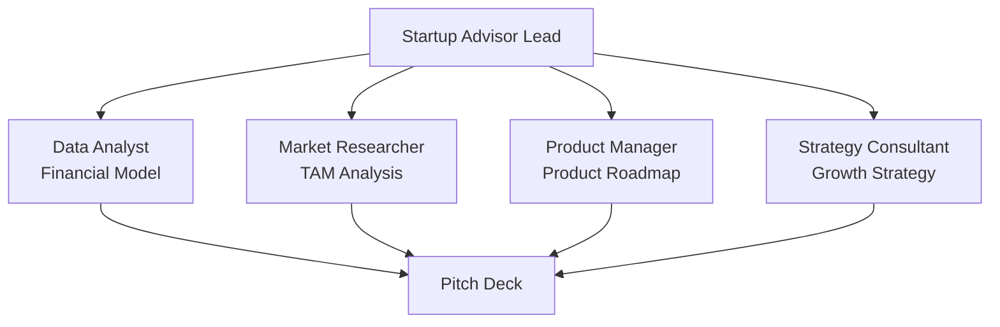
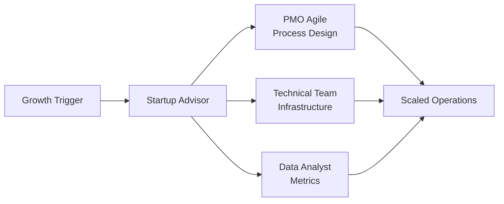

# Startup Advisor Pack Integration Guide

## Overview
This guide explains how the Startup Advisor pack integrates with other BMAD expansion packs to provide comprehensive startup guidance and execution support.

## Integration Philosophy
```yaml
principles:
  - complementary_expertise: Each pack brings specialized knowledge
  - seamless_handoffs: Clear transition points between packs
  - unified_experience: Consistent interfaces and data flow
  - multiplier_effect: Combined value > sum of parts
```

## Core Integration Points

### 1. PMO Agile Pack Integration
**Purpose**: Structured project management for startup initiatives

#### Integration Patterns
```markdown
## When to Integrate
- Building products with agile methodology
- Managing complex initiatives (fundraising, product launches)
- Scaling engineering teams
- Implementing OKRs with sprint planning

## Key Handoffs
Startup Advisor → PMO Agile:
- Product roadmap → Sprint planning
- Growth experiments → Agile workflows  
- Scaling plans → Team structures
- Technical debt → Backlog management

PMO Agile → Startup Advisor:
- Sprint metrics → Growth metrics
- Team velocity → Scaling decisions
- Risk logs → Pivot analysis
- Retrospectives → Strategy adjustments

## Shared Workflows
1. Product Development Cycle
   - @serial-entrepreneur defines vision
   - @agile-coach implements process
   - @release-train-engineer manages delivery
   - @vc-advisor tracks metrics

2. Scaling Operations
   - @portfolio-manager handles initiatives
   - @vc-advisor provides benchmarks
   - @metrics-analyst tracks KPIs
```

### 2. Product Manager Pack Integration
**Purpose**: Deep product development and user experience

#### Integration Patterns
```markdown
## When to Integrate
- Validating product-market fit
- Designing user experiences
- Building product roadmaps
- Analyzing user behavior

## Key Handoffs
Startup Advisor → Product Manager:
- Business model → Product strategy
- Customer segments → User personas
- Value props → Feature priorities
- Growth metrics → Product metrics

Product Manager → Startup Advisor:
- User research → Market validation
- Feature adoption → Business metrics
- Product roadmap → Fundraising deck
- Retention data → PMF analysis

## Collaborative Tasks
- Customer discovery sessions
- MVP definition and validation
- Pricing strategy development
- Product-led growth planning
```

### 3. Market Researcher Pack Integration
**Purpose**: Market intelligence and competitive analysis

#### Integration Patterns
```markdown
## When to Integrate
- Analyzing TAM/SAM/SOM
- Competitive landscaping
- Market entry strategies
- Industry trend analysis

## Key Handoffs
Startup Advisor → Market Researcher:
- Business hypothesis → Market validation
- Growth plans → Market sizing
- Expansion ideas → Opportunity analysis
- Exit planning → Buyer research

Market Researcher → Startup Advisor:
- Market data → Business model
- Competitive intel → Positioning
- Industry trends → Pivot decisions
- Customer insights → Product strategy

## Joint Deliverables
- Market opportunity slides for pitch deck
- Competitive analysis for investors
- Industry reports for board meetings
- Market expansion playbooks
```

### 4. Technical Specialists Pack Integration
**Purpose**: Technical architecture and implementation

#### Integration Patterns
```markdown
## When to Integrate
- Technical due diligence
- Architecture decisions
- Security assessments
- Scalability planning

## Key Handoffs
Startup Advisor → Technical Specialists:
- Business requirements → Technical specs
- Growth projections → Infrastructure needs
- Security requirements → Implementation
- Budget constraints → Tech choices

Technical Specialists → Startup Advisor:
- Technical debt → Financial planning
- Architecture decisions → Hiring needs
- Security posture → Customer trust
- Performance metrics → User experience

## Synchronized Activities
- Technical roadmap planning
- Cost optimization initiatives
- Security audit preparation
- Infrastructure scaling
```

### 5. Strategy Consultant Pack Integration
**Purpose**: Strategic planning and business model innovation

#### Integration Patterns
```markdown
## When to Integrate
- Business model pivots
- Strategic partnerships
- Market positioning
- Competitive strategy

## Key Handoffs
Startup Advisor → Strategy Consultant:
- Current state → Strategic options
- Growth barriers → Strategic solutions
- Market feedback → Strategy pivots
- Resource constraints → Prioritization

Strategy Consultant → Startup Advisor:
- Strategic framework → Execution plan
- Market analysis → Go-to-market
- Partnership strategies → Growth tactics
- Positioning → Messaging

## Collaborative Frameworks
- Business model canvas workshops
- Strategic planning sessions
- Competitive response planning
- Partnership evaluation
```

### 6. Data Analyst Pack Integration
**Purpose**: Metrics, analytics, and data-driven decisions

#### Integration Patterns
```markdown
## When to Integrate
- Building metrics dashboards
- Analyzing cohort behavior
- Financial modeling
- Experiment analysis

## Key Handoffs
Startup Advisor → Data Analyst:
- Business questions → Data queries
- KPI definitions → Dashboard design
- Growth hypotheses → A/B tests
- Financial projections → Models

Data Analyst → Startup Advisor:
- Data insights → Business decisions
- Metric trends → Strategy adjustments
- Experiment results → Product changes
- Predictive models → Planning

## Shared Dashboards
- Investor metrics dashboard
- Product-market fit scorecard
- Financial model with scenarios
- Growth experiment tracker
```

### 7. UX Designer Pack Integration
**Purpose**: User experience and design excellence

#### Integration Patterns
```markdown
## When to Integrate
- MVP design and prototyping
- User onboarding optimization
- Conversion rate optimization
- Brand identity development

## Key Handoffs
Startup Advisor → UX Designer:
- Value proposition → Design language
- User segments → Design personas
- Business goals → UX metrics
- Brand strategy → Visual identity

UX Designer → Startup Advisor:
- Design prototypes → User testing
- UX metrics → Business impact
- User feedback → Product strategy
- Design system → Scaling efficiency

## Joint Initiatives
- Landing page optimization
- Onboarding flow design
- Conversion funnel improvement
- Brand guideline creation
```

### 8. Quality Assurance Pack Integration
**Purpose**: Product quality and reliability

#### Integration Patterns
```markdown
## When to Integrate
- Pre-launch testing
- Quality metrics establishment
- Customer satisfaction improvement
- Technical debt assessment

## Key Handoffs
Startup Advisor → QA:
- Quality standards → Test plans
- Customer expectations → QA metrics
- Launch timeline → Testing schedule
- Risk tolerance → Coverage levels

QA → Startup Advisor:
- Quality metrics → Customer satisfaction
- Bug reports → Product priorities
- Performance data → User experience
- Testing results → Launch decisions

## Coordinated Efforts
- Launch readiness assessments
- Quality metric definition
- Customer feedback loops
- Performance optimization
```

## Integration Workflows

### 1. Integrated Product Launch


### 2. Fundraising Preparation


### 3. Scaling Operations


## Communication Protocols

### 1. Regular Sync Meetings
```markdown
Weekly Startup Sync:
- Participants: Lead agents from each active pack
- Duration: 30 minutes
- Agenda:
  1. Metrics review (5 min)
  2. Cross-pack updates (10 min)
  3. Blocker resolution (10 min)
  4. Next week planning (5 min)
```

### 2. Handoff Documentation
```markdown
Standard Handoff Template:
---
From: [Pack/Agent]
To: [Pack/Agent]
Date: [Date]
Re: [Project/Initiative]

Context:
- Background: [Brief history]
- Current State: [Where we are]
- Objective: [What needs to happen]

Deliverables Expected:
1. [Specific deliverable]
2. [Specific deliverable]

Timeline: [Expected completion]
Success Criteria: [How we measure success]

Resources:
- [Link to relevant docs]
- [Access credentials if needed]
---
```

### 3. Shared Data Formats
```yaml
# Standard metric exchange format
metrics:
  timestamp: ISO-8601
  source_pack: string
  metric_type: enum[business, product, technical, financial]
  values:
    - name: string
    - value: number
    - unit: string
    - confidence: 0-100
  metadata:
    calculation: string
    notes: string
```

## Best Practices

### 1. Clear Ownership
- One pack leads each initiative
- Other packs provide support
- Decisions escalate to startup advisor agents

### 2. Unified Reporting
- Single source of truth for metrics
- Consistent formatting across packs
- Regular consolidated updates

### 3. Seamless Experience
- User shouldn't feel pack boundaries
- Smooth transitions between specialists
- Coherent narrative throughout

### 4. Continuous Learning
- Document integration patterns
- Share successful workflows
- Iterate on processes

## Common Integration Scenarios

### Scenario 1: Pre-Seed to Seed
```markdown
Primary Pack: Startup Advisor
Supporting Packs:
- Market Researcher (40%) - validation
- Product Manager (30%) - MVP
- UX Designer (20%) - prototypes
- Data Analyst (10%) - metrics
```

### Scenario 2: Seed to Series A
```markdown
Primary Pack: Startup Advisor  
Supporting Packs:
- PMO Agile (30%) - scaling processes
- Product Manager (25%) - product evolution
- Data Analyst (25%) - metrics & modeling
- Market Researcher (20%) - expansion
```

### Scenario 3: Series A to B
```markdown
Primary Pack: Startup Advisor
Supporting Packs:
- PMO Agile (35%) - operational excellence
- Strategy Consultant (25%) - market domination
- Data Analyst (20%) - advanced analytics
- Technical Specialists (20%) - architecture
```

## Troubleshooting

### Common Integration Issues

1. **Conflicting Recommendations**
   - Solution: Startup advisor agents make final call
   - Escalation: Document reasoning for future

2. **Data Format Mismatches**
   - Solution: Use standardized formats
   - Tool: Transformation templates provided

3. **Timeline Conflicts**
   - Solution: PMO Agile coordinates schedules
   - Priority: Fundraising > Product > Operations

4. **Resource Contention**
   - Solution: Clear priority matrix
   - Decision: Impact on runway is key factor

## Success Metrics

### Integration Effectiveness
- Time to complete cross-pack workflows
- Quality of integrated deliverables
- User satisfaction scores
- Reduced duplicate efforts

### Business Impact
- Faster time to market
- Higher fundraising success rate
- Better product-market fit scores
- Improved operational efficiency

---

*Great startups are built by great teams. These packs work together like a world-class startup team - each expert in their domain, all aligned on the mission.*