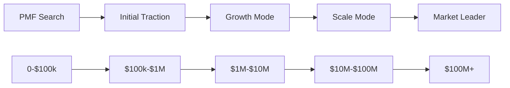

# Growth Model Framework

## Framework Overview
```yaml
framework:
  id: growth-model
  name: Startup Growth Model Framework
  purpose: Systematic approach to scaling after product-market fit
  core_models:
    - product_led_growth
    - sales_led_growth
    - marketing_led_growth
    - community_led_growth
    - partner_led_growth
  focus: Sustainable and efficient growth
```

## Growth Fundamentals

### Growth Equation
```markdown
Growth = (Acquisition × Activation × Retention) × Referral - Churn

Where:
- Acquisition = New users/customers
- Activation = % who experience value
- Retention = % who continue using
- Referral = Users brought by users
- Churn = Users lost

Sustainable Growth Rate = (1 + Organic Growth) × (1 - Churn Rate)
```

### Growth Stages


## Growth Models Deep Dive

### 1. Product-Led Growth (PLG)
```markdown
Overview: Product drives acquisition, conversion, and expansion

Key Characteristics:
- Self-serve onboarding
- Free trial or freemium
- In-product virality
- Usage-based expansion
- Low-touch sales

Success Metrics:
- Time to Value: <10 minutes
- Free-to-Paid: >3%
- Product Qualified Leads (PQLs)
- Feature Adoption Rate
- Expansion Revenue >30%

Implementation:
Week 1-2: Onboarding Optimization
- Reduce steps to first value
- Add progress indicators
- Implement tooltips
- Track drop-off points

Week 3-4: Activation Focus
- Define "Aha moment"
- Guide users to it faster
- Remove friction
- Celebrate success

Week 5-6: Virality Features
- Collaboration invites
- Sharing mechanisms
- Network effects
- Referral incentives

Examples: Slack, Zoom, Figma, Notion
```

#### PLG Playbook
```markdown
1. Nail the Onboarding
   - 3-click signup
   - Instant value delivery
   - Interactive tutorials
   - Quick wins

2. Build Growth Loops
   - User invites team → Team sees value → Team invites more
   - Create content → Share publicly → Viewers sign up
   - Use product → Generate results → Share results

3. Expansion Triggers
   - Usage limits
   - Team features
   - Advanced functionality
   - Priority support

4. Metrics to Track
   Daily: Signups, Activation Rate
   Weekly: PQLs, Feature Usage
   Monthly: Expansion Revenue, Churn
```

### 2. Sales-Led Growth (SLG)
```markdown
Overview: Human-driven sales process for complex/enterprise deals

Key Characteristics:
- High-touch sales
- Longer sales cycles
- Larger contract values
- Custom implementations
- Account-based approach

Success Metrics:
- Pipeline Velocity
- Average Contract Value (ACV)
- Sales Cycle Length
- Win Rate
- Net Revenue Retention >110%

Implementation:
Month 1: Sales Foundation
- Define ICP precisely
- Create sales playbook
- Build email sequences
- Set up CRM properly

Month 2: Outbound Machine
- Hire first SDR
- Launch campaigns
- Book demos
- Refine messaging

Month 3: Closing Process
- Demo optimization
- Proposal templates
- Negotiation tactics
- Contract streamlining

Examples: Salesforce, Workday, Palantir
```

#### SLG Playbook
```markdown
1. Ideal Customer Profile (ICP)
   Industry: [Specific verticals]
   Company Size: [Employee range]
   Pain Points: [Top 3]
   Budget: [Range]
   Decision Makers: [Titles]

2. Sales Process Stages
   - Prospecting (2 weeks)
   - Discovery (1 week)
   - Demo (1 week)
   - Proposal (1 week)
   - Negotiation (2 weeks)
   - Close (1 week)

3. Sales Stack
   - CRM: Salesforce/HubSpot
   - Outreach: Outreach/Apollo
   - Intelligence: ZoomInfo
   - Calling: Gong/Chorus
   - Contracts: DocuSign

4. Team Structure
   - SDRs: Booking meetings
   - AEs: Closing deals
   - Sales Engineers: Technical demos
   - Customer Success: Post-sale
```

### 3. Marketing-Led Growth (MLG)
```markdown
Overview: Content and brand drive inbound demand

Key Characteristics:
- Content marketing focus
- SEO/SEM investment
- Brand building
- Thought leadership
- Marketing automation

Success Metrics:
- Organic Traffic Growth
- Content Conversion Rate
- Marketing Qualified Leads (MQLs)
- CAC by Channel
- Brand Awareness Lift

Implementation:
Quarter 1: Content Foundation
- Keyword research
- Content calendar
- Blog launch
- SEO optimization

Quarter 2: Paid Acquisition
- Google Ads setup
- Facebook/LinkedIn ads
- Retargeting campaigns
- Landing page optimization

Quarter 3: Brand Building
- Thought leadership
- PR campaigns
- Speaking engagements
- Partnership marketing

Examples: HubSpot, Drift, Buffer
```

### 4. Community-Led Growth (CLG)
```markdown
Overview: Community becomes growth engine

Key Characteristics:
- User-generated content
- Peer-to-peer support
- Events and meetups
- Ambassador programs
- Open source approach

Success Metrics:
- Community Size
- Engagement Rate
- User-Generated Content
- Community-Sourced Leads
- NPS Score >70

Implementation:
Month 1: Community Platform
- Choose platform (Discord/Slack/Forum)
- Seed initial content
- Recruit first members
- Set community guidelines

Month 2: Engagement Programs
- Weekly events
- Recognition system
- Content challenges
- Expert AMAs

Month 3: Scaling
- Ambassador program
- Local chapters
- User conference
- Certification program

Examples: Notion, Figma, GitHub
```

### 5. Partner-Led Growth
```markdown
Overview: Grow through strategic partnerships

Key Characteristics:
- Channel partnerships
- Technology integrations
- Co-marketing
- Reseller networks
- Marketplace presence

Success Metrics:
- Partner-Sourced Revenue %
- Partner Activation Rate
- Integration Usage
- Co-Marketing ROI
- Partner NPS

Implementation:
Phase 1: Integration Partners
- API development
- Key integrations
- Joint solutions
- Technical documentation

Phase 2: Channel Partners
- Partner program design
- Recruitment strategy
- Training materials
- Commission structure

Phase 3: Strategic Alliances
- Enterprise partnerships
- Co-innovation
- Joint go-to-market
- Global expansion

Examples: Stripe, Shopify, Twilio
```

## Growth Model Selection

### Decision Matrix
```markdown
Choose PLG when:
✓ Simple product with quick value
✓ Individual users can start
✓ Natural virality exists
✓ Low price point
✓ B2C or SMB focus

Choose SLG when:
✓ Complex implementation
✓ High price point (>$20k ACV)
✓ Multiple stakeholders
✓ Enterprise focus
✓ Custom requirements

Choose MLG when:
✓ Crowded market
✓ Education needed
✓ Search volume exists
✓ Content moat possible
✓ Brand matters

Choose CLG when:
✓ Passionate users
✓ Complex use cases
✓ Network effects
✓ User-generated value
✓ Category creation

Choose Partner-Led when:
✓ Ecosystem play
✓ Geographic expansion
✓ Enterprise distribution
✓ Platform strategy
✓ Integration value
```

## Growth Loops

### Viral Loops
```markdown
1. Collaboration Loop
   User → Invites Team → Team Uses → More Invites

2. Content Loop
   Create → Share → Discover → Sign Up → Create

3. Network Loop
   User Joins → Value Increases → Attracts Users → Network Grows

4. Data Loop
   Users Generate Data → Insights Created → Value Increases → More Users
```

### Monetization Loops
```markdown
1. Land & Expand
   Free User → Paid User → Team Plan → Enterprise

2. Usage Growth
   Initial Usage → Hit Limits → Upgrade → More Usage

3. Feature Adoption
   Core Feature → Advanced Need → Premium Feature → Sticky User
```

## Growth Tactics by Stage

### $0-$1M ARR
```markdown
Focus: Find repeatable growth channel

Tactics:
- Manual outreach to ideal customers
- Content marketing foundation
- Product Hunt launch
- Founder-led sales
- Early user community

Metrics:
- 20-30% MoM growth
- CAC < $1,000
- Sales cycle < 30 days
```

### $1M-$10M ARR
```markdown
Focus: Scale what works

Tactics:
- First sales hires
- Paid acquisition channels
- Partner program launch
- Customer success team
- International expansion

Metrics:
- T2D3 growth path
- CAC payback < 12 months
- NRR > 110%
```

### $10M+ ARR
```markdown
Focus: Multi-channel growth

Tactics:
- Multi-product strategy
- Enterprise sales team
- Brand campaigns
- M&A opportunities
- Platform ecosystem

Metrics:
- Rule of 40
- Market leadership
- Category creation
```

## Growth Team Structure

### Early Stage (Seed-Series A)
```markdown
Growth Lead (Founder)
├── Part-time Growth Marketer
├── Part-time Data Analyst
└── Engineering Support
```

### Growth Stage (Series B-C)
```markdown
VP Growth
├── Growth Product Manager
├── Growth Engineers (2-3)
├── Growth Marketer
├── Data Scientist
└── Growth Designer
```

### Scale Stage (Series D+)
```markdown
Chief Growth Officer
├── Director of Growth Product
│   ├── Growth PMs
│   └── Growth Engineers
├── Director of Growth Marketing
│   ├── Acquisition Team
│   └── Retention Team
└── Director of Analytics
    ├── Data Scientists
    └── Analysts
```

## Growth Experiments

### Experiment Framework
```markdown
1. Hypothesis
   "We believe [change] will cause [outcome] because [reasoning]"

2. Design
   - Control vs variant
   - Success metrics
   - Sample size
   - Duration

3. Execute
   - Launch test
   - Monitor daily
   - Check significance
   - Document results

4. Learn
   - Analyze data
   - Extract insights
   - Share learnings
   - Plan next test
```

### High-Impact Experiments
```markdown
Acquisition:
- Headline testing
- Pricing page optimization
- Channel expansion
- Referral programs

Activation:
- Onboarding flow
- Time to value
- Feature discovery
- Welcome sequences

Retention:
- Engagement features
- Re-engagement campaigns
- Churn prevention
- Success metrics

Revenue:
- Pricing tests
- Upsell timing
- Plan structures
- Payment optimization
```

## Common Growth Mistakes

### Mistake 1: Premature Scaling
**Symptom**: Hiring growth team before PMF
**Solution**: Validate retention first

### Mistake 2: Channel Dependence
**Symptom**: 80%+ from one channel
**Solution**: Diversify before saturating

### Mistake 3: Vanity Metrics
**Symptom**: Celebrating signups, not revenue
**Solution**: Focus on unit economics

### Mistake 4: Growth Hacking
**Symptom**: Tricks over sustainable systems
**Solution**: Build real value and moats

### Mistake 5: Ignoring Churn
**Symptom**: Leaky bucket growth
**Solution**: Fix retention before acquisition

## Growth Stack

### Analytics
- Amplitude/Mixpanel - Product analytics
- Google Analytics - Web analytics
- Segment - Data pipeline
- Looker/Mode - Business intelligence

### Marketing
- HubSpot - Marketing automation
- Intercom - Customer communication
- Optimizely - A/B testing
- Hotjar - User behavior

### Sales
- Salesforce - CRM
- Outreach - Sales engagement
- Gong - Conversation intelligence
- Clearbit - Data enrichment

### Product
- LaunchDarkly - Feature flags
- Pendo - Product adoption
- FullStory - Session replay
- Appcues - User onboarding

## Key Takeaways

1. **Match Model to Market**
   - Don't force PLG in enterprise
   - Don't use SLG for consumer
   - Hybrid models often win

2. **Focus on Sustainable Growth**
   - LTV > CAC is minimum
   - Organic growth compounds
   - Retention before acquisition

3. **Build Growth Loops**
   - Linear growth doesn't scale
   - Loops create compounding
   - Every user should bring users

4. **Measure What Matters**
   - Revenue, not vanity metrics
   - Cohort retention curves
   - Unit economics by channel

5. **Never Stop Experimenting**
   - 10% improvement weekly = 142% annually
   - Document all learnings
   - Share across organization

---

*Great growth is built on great products. Focus on value creation, and value capture follows.*