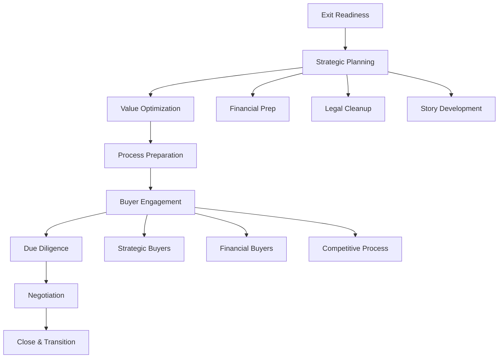

# Exit Preparation Workflow

## Workflow Metadata
```yaml
workflow:
  id: exit-preparation
  name: Strategic Exit Planning & Execution
  duration: 12-18 months
  complexity: high
  agents_involved:
    - vc-advisor (lead)
    - serial-entrepreneur
  prerequisites:
    - strong_growth_metrics
    - market_leadership
    - clean_operations
```

## Workflow Overview



## Phase 1: Exit Readiness Assessment (Month 1)

### Step 1.1: Exit Triggers & Timing
**Agent:** vc-advisor
**Duration:** 1 week

```markdown
Exit Readiness Signals:

Market Timing:
□ Market consolidation happening
□ Strategic buyers active
□ Valuations at peak
□ Competition intensifying
□ Next growth stage capital-intensive

Business Metrics:
□ ARR >$20M (strategic) or >$50M (PE)
□ Growth >50% YoY
□ Gross margins >70%
□ Rule of 40 >40%
□ Market leadership position

Operational Readiness:
□ Management team complete
□ Systems scalable
□ Clean financials
□ Low customer concentration
□ Predictable revenue

Strategic Considerations:
□ Founders ready to exit
□ Investors seeking liquidity
□ Better owner identified
□ Synergy opportunities clear
□ Team incentives aligned

Readiness Score: {{X}}/20
Optimal exit window: {{timeframe}}
```

### Step 1.2: Exit Options Analysis
**Agent:** vc-advisor
**Duration:** 1 week

```markdown
Exit Strategy Options:

1. Strategic Acquisition
Pros:
- Highest valuations
- Synergy premiums
- Faster process
- Clear integration

Cons:
- Limited buyers
- Cultural fit risk
- Job redundancies
- Earnout risk

Potential Buyers:
- {{company_1}}: Strategic fit: {{analysis}}
- {{company_2}}: Strategic fit: {{analysis}}
- {{company_3}}: Strategic fit: {{analysis}}

2. Financial Buyer (PE)
Pros:
- Professional process
- Growth capital
- Management retention
- Operational expertise

Cons:
- Lower valuations
- Leverage concerns
- Exit pressure later
- Performance targets

Potential Buyers:
- {{firm_1}}: Thesis fit: {{analysis}}
- {{firm_2}}: Thesis fit: {{analysis}}

3. IPO
Pros:
- Liquidity option
- Independence
- Currency for M&A
- Brand elevation

Cons:
- Market dependent
- Expensive process
- Ongoing requirements
- Lock-up periods

Requirements:
- $100M+ revenue
- 3 years audited financials
- Strong governance
- Predictable growth

Recommended Path: {{strategic/financial/ipo}}
Target Valuation: ${{range}}M
Timeline: {{months}} months
```

## Phase 2: Strategic Planning (Months 2-3)

### Step 2.1: Value Creation Plan
**Agent:** serial-entrepreneur
**Duration:** 2 weeks

```markdown
Value Maximization Initiatives:

Revenue Optimization:
1. Accelerate enterprise deals
   - Impact: +${{amount}} ARR
   - Timeline: 3 months
   - Investment: ${{amount}}

2. Launch new product line
   - Impact: +{} TAM
   - Timeline: 6 months
   - Investment: ${{amount}}

Operational Excellence:
1. Gross margin improvement
   - Current: {}
   - Actions: {{list}}

2. Sales efficiency
   - Current CAC: ${{amount}}
   - Target CAC: ${{amount}}
   - Actions: {{list}}

Strategic Positioning:
1. Market leadership proof
   - Analyst reports
   - Customer awards
   - Case studies
   - PR campaign

2. Competitive moats
   - Patents filed
   - Exclusive partnerships
   - Network effects
   - Switching costs

Total Value Impact: +{{%}} on valuation
```

### Step 2.2: Financial Preparation
**Agent:** vc-advisor
**Duration:** 3 weeks

```markdown
Financial House Cleaning:

Historical Financials:
□ 3 years audited statements
□ Monthly P&L statements
□ Revenue recognition policy
□ Customer cohort analysis
□ Unit economics detail

Revenue Quality:
□ Recurring revenue %: {{%}}
□ Contract length analysis
□ Churn/retention metrics
□ Customer concentration
□ Pricing evolution

Clean-up Items:
1. Revenue recognition
   - Issue: {{description}}
   - Resolution: {{action}}
   - Timeline: {{weeks}}

2. Stock options
   - Issue: {{description}}
   - Resolution: {{action}}
   - Timeline: {{weeks}}

3. Working capital
   - Normalize: {{adjustments}}
   - Optimize: {{actions}}

Quality of Earnings Prep:
- Adjusted EBITDA calculation
- One-time items identified
- Pro-forma adjustments
- Management adjustments
- Run-rate analysis
```

### Step 2.3: Legal & IP Cleanup
**Agent:** vc-advisor
**Duration:** 2 weeks

```markdown
Legal Diligence Preparation:

Corporate Structure:
□ Cap table clean
□ All options documented
□ Board minutes complete
□ Shareholder agreements
□ No side letters

Intellectual Property:
□ Patents filed/pending
□ Trademarks registered
□ Code ownership clean
□ Employee IP assignments
□ No open source issues

Contracts Review:
□ Customer contracts standardized
□ Vendor agreements documented
□ Employment agreements signed
□ Non-competes enforceable
□ Change of control provisions

Litigation Check:
□ No active litigation
□ No threatened claims
□ Clean regulatory record
□ Compliance documented
□ Insurance adequate

Issues to Resolve:
1. {{issue_1}}: {{resolution_plan}}
2. {{issue_2}}: {{resolution_plan}}
3. {{issue_3}}: {{resolution_plan}}
```

## Phase 3: Process Preparation (Months 4-5)

### Step 3.1: Advisory Team Assembly
**Agent:** vc-advisor
**Duration:** 1 week

```markdown
Deal Team Formation:

Investment Banker:
- Firm: {{name}}
- Why chosen: {{reasons}}
- Fee structure: {{details}}
- Deal experience: {{relevant_deals}}

Legal Counsel:
- Firm: {{name}}
- Lead partner: {{name}}
- Specialization: M&A
- Recent deals: {{examples}}

Accounting/Tax:
- Firm: {{name}}
- Services: QoE, Tax structure
- Team size: {{number}}

Other Advisors:
- PR firm: {{name}}
- HR consultant: {{name}}
- Integration advisor: {{name}}

Internal Team:
- Executive sponsor: CEO
- Deal lead: CFO
- Workstream leads: {{assignments}}
- Board committee: {{members}}

Total Advisory Costs: ${{amount}}
(Typically 3-5% of deal value)
```

### Step 3.2: Marketing Materials
**Agent:** vc-advisor
**Duration:** 3 weeks

```markdown
Deal Marketing Package:

1. Teaser (1-2 pages)
- Company description (disguised)
- Financial highlights
- Growth trajectory
- Investment highlights
- Process timeline

2. CIM (40-60 pages)
Executive Summary
- Investment highlights
- Company overview
- Market opportunity
- Products & technology
- Go-to-market strategy
- Financial overview
- Growth opportunities
- Transaction structure

3. Management Presentation
- Vision & strategy (CEO)
- Product demo (CPO)
- Financial deep dive (CFO)
- Sales overview (CRO)
- Technology architecture (CTO)
- Q&A preparation

4. Data Room Setup
Structure:
📁 Business
📁 Financial  
📁 Legal
📁 Technology
📁 Commercial
📁 HR

Access controls:
- Watermarking
- Download restrictions
- Time limitations
- Activity tracking
```

### Step 3.3: Buyer Research
**Agent:** vc-advisor
**Integration:** @market-researcher
**Duration:** 2 weeks

```markdown
Buyer Landscape Analysis:

Strategic Buyers:
| Company | Strategic Fit | Financial Capacity | Recent Deals | Contact |
|---------|--------------|-------------------|--------------|---------|
| {{company_1}} | {{High/Med/Low}} | ${{B}} market cap | {{deals}} | {{name}} |
| {{company_2}} | {{High/Med/Low}} | ${{B}} market cap | {{deals}} | {{name}} |
| {{company_3}} | {{High/Med/Low}} | ${{B}} market cap | {{deals}} | {{name}} |

Financial Buyers:
| Firm | Fund Size | Check Size | Portfolio Fit | Contact |
|------|-----------|------------|---------------|---------|
| {{firm_1}} | ${{B}} | ${{M}} | {{fit}} | {{name}} |
| {{firm_2}} | ${{B}} | ${{M}} | {{fit}} | {{name}} |

Buyer Motivations:
Strategic:
- Market expansion
- Product completion  
- Talent acquisition
- Competitive defense

Financial:
- Platform investment
- Roll-up strategy
- Operational improvement
- Multiple arbitrage

Target Buyer List: {{number}} total
- Tier 1: {{number}} (perfect fit)
- Tier 2: {{number}} (good fit)
- Tier 3: {{number}} (possible fit)
```

## Phase 4: Market Engagement (Months 6-8)

### Step 4.1: Process Launch
**Agent:** vc-advisor
**Duration:** 2 weeks

```markdown
Go-to-Market Strategy:

Process Type: {{Broad auction/Targeted/Bilateral}}

Timeline:
- Week 1-2: Teaser distribution
- Week 3-4: NDA execution
- Week 5-6: CIM distribution
- Week 7-8: Initial meetings
- Week 9-10: Management meetings
- Week 11-12: Initial bids
- Week 13-16: Due diligence
- Week 17-18: Final bids
- Week 19-20: Negotiations
- Week 21-24: Close

Outreach Sequence:
1. Tier 3 buyers (practice)
2. Tier 2 buyers (momentum)
3. Tier 1 buyers (competition)

Process Rules:
- No exclusivity until final bid
- Standardized information access
- Coordinated Q&A
- Bid deadline enforcement
```

### Step 4.2: Management Meetings
**Agent:** serial-entrepreneur
**Duration:** 4 weeks

```markdown
Meeting Preparation:

Presentation Training:
- Story arc development
- Slide rehearsal
- Q&A practice
- Body language coaching
- Energy management

Common Questions Prep:
Strategic:
- "Integration approach?"
- "Revenue synergies?"
- "Cost synergies?"
- "Cultural fit?"
- "Retention plans?"

Financial:
- "Growth sustainability?"
- "Margin expansion?"
- "Working capital needs?"
- "Capex requirements?"
- "Management rollover?"

Meeting Best Practices:
- 2 hour sessions max
- Demo in first 30 min
- Break every 45 min
- All execs participate
- Follow up within 24hr

Success Metrics:
- Buyer engagement level
- Follow-up questions
- Speed of response
- Bid participation rate
```

### Step 4.3: Bid Management
**Agent:** vc-advisor
**Duration:** 2 weeks

```markdown
Initial Bids Analysis:

Bid Summary:
| Buyer | Valuation | Structure | Certainty | Conditions |
|-------|-----------|-----------|-----------|------------|
| {{buyer_1}} | ${{M}} | {{cash/stock}} | {{High/Med/Low}} | {{list}} |
| {{buyer_2}} | ${{M}} | {{cash/stock}} | {{High/Med/Low}} | {{list}} |
| {{buyer_3}} | ${{M}} | {{cash/stock}} | {{High/Med/Low}} | {{list}} |

Evaluation Criteria:
1. Headline value (30%)
2. Deal certainty (25%)
3. Structure/terms (20%)
4. Cultural fit (15%)
5. Employee impact (10%)

Shortlist Decision:
Selected for DD: {{3-5 buyers}}
Rationale: {{explanation}}

Feedback to Losers:
- Thank for interest
- Valuation gap
- Keep warm for future
```

## Phase 5: Due Diligence Management (Months 9-10)

### Step 5.1: DD Orchestration
**Agent:** vc-advisor
**Duration:** 4-6 weeks

```markdown
Diligence Work Streams:

Business DD:
Lead: CEO/COO
□ Market analysis
□ Competitive position
□ Customer references
□ Product roadmap
□ Growth strategy

Financial DD:
Lead: CFO
□ Quality of earnings
□ Working capital
□ Debt-like items
□ Tax structure
□ Management adjustments

Legal DD:
Lead: General Counsel
□ Corporate structure
□ Material contracts
□ Litigation review
□ Regulatory compliance
□ IP verification

Technical DD:
Lead: CTO
□ Architecture review
□ Code quality
□ Security assessment
□ Scalability analysis
□ Technical debt

Commercial DD:
Lead: CRO
□ Sales pipeline
□ Customer concentration
□ Pricing analysis
□ Churn analysis
□ Channel review

DD Management:
- Daily stand-ups
- Buyer Q&A log
- Expert sessions scheduled
- Data room updates
- Issue escalation process
```

### Step 5.2: Expert Sessions
**Agent:** serial-entrepreneur
**Duration:** 2 weeks

```markdown
Deep Dive Sessions:

Customer Calls:
- Select 10-15 references
- Mix of segments/sizes
- Brief customers ahead
- Monitor calls
- Address concerns quickly

Technical Review:
- Architecture walkthrough
- Security demonstration
- Roadmap discussion
- Integration planning
- Team assessment

Financial Deep Dive:
- Monthly walk-through
- Cohort analysis
- Unit economics
- Scenario planning
- Synergy validation

Culture & Team:
- Leadership interviews
- Culture assessment
- Retention planning
- Integration approach
- Compensation review

Red Flags Management:
Issue: {{description}}
Impact: {{assessment}}
Mitigation: {{strategy}}
Communication: {{approach}}
```

## Phase 6: Final Negotiations (Months 11-12)

### Step 6.1: Final Bids & Selection
**Agent:** vc-advisor
**Duration:** 1 week

```markdown
Final Bid Evaluation:

Bid Comparison:
| Buyer | Enterprise Value | Structure | Escrow | Earnout | Close Date |
|-------|-----------------|-----------|---------|---------|------------|
| {{buyer_1}} | ${{M}} | {{details}} | {} | {{terms}} | {{date}} |

Key Terms Analysis:
Purchase Price:
- Base: ${{amount}}
- Escrow: {{%}} for {{months}}
- Earnout: ${{amount}} if {{metrics}}
- Working capital: {{adjustment}}

Employee Terms:
- Retention pool: ${{amount}}
- Vesting: {{schedule}}
- Severance: {{terms}}
- Benefits continuation

Governance:
- Board representation
- Consent rights
- Information rights
- Non-compete terms

Selection Criteria:
1. Total consideration
2. Deal certainty  
3. Cultural fit
4. Employee outcome
5. Founder preferences

Recommended Buyer: {{name}}
Rationale: {{explanation}}
```

### Step 6.2: Deal Negotiation
**Agent:** vc-advisor
**Duration:** 2-3 weeks

```markdown
Negotiation Strategy:

Priority Issues:
1. Purchase price
   - Current: ${{amount}}
   - Target: ${{amount}}
   - BATNA: ${{amount}}

2. Escrow terms
   - Current: {} for {{months}}
   - Industry standard: {{benchmark}}

3. Earnout structure
   - Current: {{structure}}
   - Issues: {{concerns}}
   - Proposed: {{alternative}}

4. Employee retention
   - Pool size: ${{amount}}
   - Allocation method
   - Vesting schedule
   - Acceleration triggers

Negotiation Tactics:
- Create competition
- Use advisors effectively
- Package concessions
- Focus on total value
- Maintain momentum

Walk-away Points:
- Price below ${{amount}}
- Escrow >{} of value
- Unacceptable employment terms
```

## Phase 7: Closing & Transition (Months 13-14)

### Step 7.1: Final Documentation
**Agent:** vc-advisor
**Duration:** 3-4 weeks

```markdown
Closing Documents:

Primary Agreements:
□ Stock Purchase Agreement
□ Escrow Agreement
□ Employment Agreements
□ Non-Competition Agreements
□ Transition Services Agreement

Disclosure Schedules:
□ Exceptions to representations
□ Material contracts
□ Litigation disclosure
□ Employee/benefit plans
□ Tax matters

Closing Conditions:
□ Regulatory approvals
□ Third-party consents
□ No material adverse change
□ Minimum cash balance
□ Key employee retention

Closing Mechanics:
- Signing: {{date}}
- Regulatory filing: {{date}}
- Closing: {{date}}
- Wire instructions confirmed
- Stock certificates ready
- Resignation letters signed
```

### Step 7.2: Announcement & Integration
**Agent:** serial-entrepreneur
**Duration:** 1 week

```markdown
Communication Plan:

Internal Announcement:
Timing: Morning of signing
Format: All-hands meeting
Key Messages:
- Exciting next chapter
- Strong cultural fit
- Growth opportunities
- Job security
- Retention details

Customer Communication:
Timing: After employee announcement
Format: Email + calls for key accounts
Key Messages:
- Continued commitment
- Enhanced capabilities
- Same team serving them
- Improved resources

Public Announcement:
- Press release drafted
- Media interviews scheduled
- Social media coordinated
- Investor notifications
- Website updates

Integration Planning:
Week 1:
- Leadership meetings
- System access
- Benefit transitions
- Office visits

Month 1:
- Team integration
- Process alignment
- Customer transitions
- Cultural activities

Quarter 1:
- Full integration
- Synergy capture
- Success metrics
- Celebration events
```

## Success Metrics

### Exit Success KPIs
```markdown
Financial Success:
- Valuation achieved: ${{amount}}
- Multiple on revenue: {{X}}x
- Return to investors: {{X}}x
- Founder outcomes: ${{amounts}}

Process Success:
- Time to close: {{months}}
- Competitive tension: {{#}} bidders
- Deal certainty: No re-trading
- Clean close: No post-close issues

People Success:
- Employee retention: {}
- Founder satisfaction: {{rating}}
```

### Common Exit Pitfalls

1. **Poor Preparation**
   - Sign: DD surprises
   - Fix: 6-month preparation minimum

2. **Unrealistic Expectations**
   - Sign: No bidders at price
   - Fix: Market feedback early

3. **Process Fatigue**
   - Sign: Team burnout
   - Fix: Dedicated deal team

4. **Negotiation Mistakes**
   - Sign: Value destruction
   - Fix: Experienced advisors

## Integration Points

### With Other Packs
- Market Researcher: Buyer landscape
- Product Manager: Roadmap planning
- PMO Agile: Operations excellence
- Strategy Consultant: Positioning

## Completion Criteria

```markdown
Exit Process Complete:
□ Deal closed successfully
□ Funds transferred
□ Team transitioned
□ Customers retained
□ Integration started
□ Earnouts tracked
□ Escrow managed
□ Success celebrated
```

---

*A great exit is one where everyone wins - founders, team, investors, and the acquirer. Plan accordingly.*