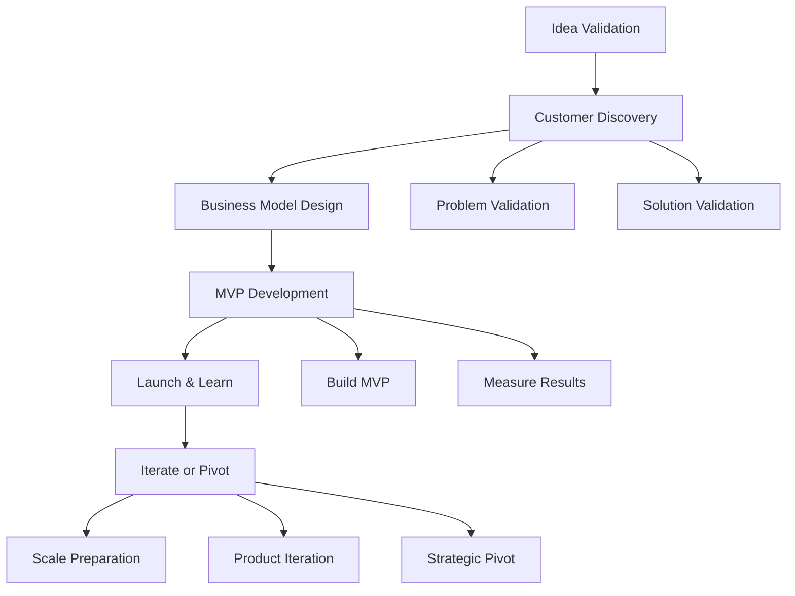

# Startup Launch Workflow (0 to 1)

## Workflow Metadata
```yaml
workflow:
  id: startup-launch
  name: Zero to One Startup Journey
  duration: 3-6 months
  complexity: high
  agents_involved:
    - serial-entrepreneur (lead)
    - vc-advisor
  dependencies:
    - bmad-product-manager
    - bmad-market-researcher
    - bmad-pmo-agile
```

## Workflow Overview



## Phase 1: Idea Validation (Weeks 1-2)

### Step 1.1: Problem Hypothesis
**Agent:** serial-entrepreneur
**Duration:** 3 days

```markdown
Activities:
1. Define the problem clearly
2. Identify target customer
3. Estimate market size
4. Research existing solutions
5. Form initial hypothesis

Deliverables:
- Problem statement (1 paragraph)
- Target customer profile
- TAM/SAM/SOM estimates
- Competitive landscape
- Hypothesis to test

Success Criteria:
- Problem affects >1M people
- Current solutions inadequate
- Customers willing to pay
- Founding team passionate
```

### Step 1.2: Quick Validation
**Agent:** serial-entrepreneur
**Duration:** 1 week

```markdown
Validation Methods:
1. Online research
   - Reddit discussions
   - Forum complaints
   - Review sites
   - Search volume

2. Quick surveys
   - Target: 100 responses
   - Questions: 5 max
   - Focus: Problem severity

3. Competitor analysis
   - Who's solving this?
   - How well?
   - What's missing?

Gate Decision:
- Problem validated? → Proceed
- Weak signal? → Pivot problem
- No validation? → New idea
```

## Phase 2: Customer Discovery (Weeks 3-6)

### Step 2.1: Interview Sprint
**Agent:** serial-entrepreneur
**Task:** conduct-customer-discovery
**Duration:** 2 weeks

```markdown
Interview Goals:
- 30+ customer interviews
- 3+ customer segments
- Deep problem understanding
- Solution requirements
- Pricing validation

Process:
Week 1: 
- Schedule interviews
- Conduct 15 interviews
- Document insights

Week 2:
- Complete 15+ interviews
- Synthesize findings
- Identify patterns
- Define personas
```

### Step 2.2: Problem-Solution Fit
**Agent:** serial-entrepreneur
**Duration:** 1 week

```markdown
Validation Criteria:
□ >40% say problem is severe
□ Current solutions failing
□ Clear value proposition
□ Willing to pay target price
□ Excited about solution

Outputs:
- Validated problem
- Solution requirements
- Pricing range
- Go/no-go decision
```

## Phase 3: Business Model Design (Weeks 7-8)

### Step 3.1: Model Selection
**Agent:** vc-advisor
**Task:** validate-business-model
**Duration:** 3 days

```markdown
Model Options:
1. Evaluate fit:
   - SaaS subscription
   - Marketplace
   - Freemium
   - Direct sales
   - Platform

2. Unit economics:
   - CAC estimates
   - LTV projections
   - Gross margins
   - Payback period

3. Growth model:
   - Acquisition channels
   - Viral potential
   - Retention mechanics
```

### Step 3.2: Financial Modeling
**Agent:** vc-advisor
**Duration:** 4 days

```markdown
Build Models:
1. Revenue projections
   - Conservative case
   - Base case
   - Optimistic case

2. Cost structure
   - Development costs
   - Operating expenses
   - Marketing spend
   - Team costs

3. Funding needs
   - Runway calculation
   - Milestone planning
   - Buffer requirements
```

## Phase 4: MVP Development (Weeks 9-14)

### Step 4.1: MVP Definition
**Agent:** serial-entrepreneur
**Integration:** @product-manager
**Duration:** 1 week

```markdown
MVP Planning:
1. Core features only
   - Must solve main problem
   - Maximum 3 features
   - 4-week build max

2. Success metrics
   - Activation rate
   - Retention target
   - Usage frequency
   - Satisfaction score

3. Development approach
   - No-code first
   - Rapid prototyping
   - Daily iterations
```

### Step 4.2: Build Sprint
**Agent:** serial-entrepreneur
**Integration:** @pmo-agile
**Duration:** 4 weeks

```markdown
Week 1: Foundation
- Basic infrastructure
- Core feature #1
- Initial UI/UX

Week 2: Core Features
- Complete feature #1
- Build feature #2
- Basic analytics

Week 3: Polish
- Bug fixes
- UI improvements
- Onboarding flow

Week 4: Launch Prep
- Beta testing
- Final fixes
- Launch materials
```

### Step 4.3: Measurement Setup
**Agent:** vc-advisor
**Duration:** 3 days

```markdown
Analytics Implementation:
1. Event tracking
   - Signup flow
   - Activation events
   - Core actions
   - Retention signals

2. Dashboards
   - Daily active users
   - Conversion funnel
   - Cohort retention
   - Feature usage

3. Feedback loops
   - In-app surveys
   - User interviews
   - Support tickets
   - Social monitoring
```

## Phase 5: Launch & Learn (Weeks 15-18)

### Step 5.1: Beta Launch
**Agent:** serial-entrepreneur
**Duration:** 1 week

```markdown
Beta Strategy:
1. Recruit 50-100 users
   - From interviews
   - Warm network
   - Early interest list

2. Onboarding
   - Personal outreach
   - Guided setup
   - Daily check-ins
   - Rapid support

3. Data collection
   - Usage analytics
   - Feedback calls
   - Feature requests
   - Bug reports
```

### Step 5.2: Iterate Based on Feedback
**Agent:** serial-entrepreneur
**Duration:** 2 weeks

```markdown
Daily Routine:
Morning:
- Review metrics
- Read feedback
- Prioritize fixes

Afternoon:
- Ship improvements
- Test changes
- Update users

Weekly:
- User interviews
- Metric analysis
- Team planning
- Investor update
```

### Step 5.3: Public Launch
**Agent:** serial-entrepreneur
**Integration:** @market-researcher
**Duration:** 1 week

```markdown
Launch Channels:
1. Product Hunt
   - Asset preparation
   - Community building
   - Launch day plan

2. Social Media
   - Twitter thread
   - LinkedIn post
   - Reddit (relevant subs)

3. Press Outreach
   - Tech press
   - Industry publications
   - Podcast pitches

4. Content Marketing
   - Launch blog post
   - Customer stories
   - How-to guides
```

## Phase 6: Iterate or Pivot (Weeks 19-20)

### Step 6.1: Data Analysis
**Agent:** vc-advisor
**Task:** analyze-product-market-fit
**Duration:** 3 days

```markdown
PMF Assessment:
1. Quantitative
   - Retention curves
   - Growth rate
   - Engagement depth
   - Revenue metrics

2. Qualitative
   - User feedback
   - NPS scores
   - Feature requests
   - Churn reasons

3. Market signals
   - Competitive response
   - Investor interest
   - Press coverage
   - Organic growth
```

### Step 6.2: Strategic Decision
**Agent:** serial-entrepreneur
**Task:** execute-pivot-analysis
**Duration:** 4 days

```markdown
Decision Framework:
Strong PMF (>60% retention):
→ Double down
→ Raise funding
→ Scale team
→ Growth focus

Weak PMF (20-60% retention):
→ Iterate product
→ Focus segment
→ Improve activation
→ Extend runway

No PMF (<20% retention):
→ Consider pivot
→ New customer segment
→ Different problem
→ Change approach
```

## Phase 7: Scale Preparation (Weeks 21-24)

### Step 7.1: Growth Foundation
**Agent:** vc-advisor
**Task:** plan-growth-strategy
**Duration:** 1 week

```markdown
Growth Planning:
1. Channel strategy
   - Test channels
   - Measure CAC
   - Find scalable channel
   - Build playbook

2. Team planning
   - First hires
   - Role definition
   - Culture foundation
   - Equity planning

3. Systems setup
   - Customer support
   - Analytics stack
   - Financial tracking
   - Legal foundation
```

### Step 7.2: Fundraising Prep
**Agent:** vc-advisor
**Task:** prepare-fundraising
**Duration:** 2 weeks

```markdown
If raising capital:
1. Materials preparation
   - Pitch deck
   - Financial model
   - Data room
   - References

2. Investor outreach
   - Target list
   - Warm intros
   - Initial meetings
   - Due diligence

3. Process management
   - Pipeline tracking
   - Meeting prep
   - Follow-ups
   - Negotiation
```

### Step 7.3: Next Phase Planning
**Agent:** serial-entrepreneur
**Duration:** 1 week

```markdown
Set foundation for scale:
1. OKRs for next quarter
2. Hiring plan
3. Product roadmap
4. Growth experiments
5. Culture principles

Handoff to growth phase →
```

## Key Milestones & Gates

### Week 2 Gate: Problem Validation
- Clear problem identified? ✓/✗
- Target market defined? ✓/✗
- Size sufficient? ✓/✗
- **Decision:** Proceed/Pivot/Stop

### Week 6 Gate: Customer Validation  
- 30+ interviews done? ✓/✗
- Problem validated? ✓/✗
- Solution excitement? ✓/✗
- **Decision:** Build/Pivot/Stop

### Week 14 Gate: MVP Complete
- Core features built? ✓/✗
- Metrics tracking? ✓/✗
- Beta users ready? ✓/✗
- **Decision:** Launch/Iterate/Rebuild

### Week 20 Gate: PMF Assessment
- Retention >40%? ✓/✗
- Growth positive? ✓/✗
- Unit economics work? ✓/✗
- **Decision:** Scale/Iterate/Pivot

## Success Patterns

### Pattern 1: Speed Wins
```markdown
- 2-week discovery sprints
- 4-week MVP maximum
- Daily customer feedback
- Weekly iteration cycles
- Quick decisions
```

### Pattern 2: Customer Obsession
```markdown
- Talk to users daily
- Build what they need
- Measure what matters
- Iterate based on data
- Celebrate their wins
```

### Pattern 3: Focus Focus Focus
```markdown
- One customer segment
- One core problem
- One key metric
- One growth channel
- Until PMF achieved
```

## Common Pitfalls

1. **Building Too Much**
   - Sign: 6+ month MVP
   - Fix: Cut to 3 features max

2. **Avoiding Customers**
   - Sign: <10 interviews
   - Fix: 5 interviews/week minimum

3. **Premature Scaling**
   - Sign: Hiring before PMF
   - Fix: Stay lean until retention proven

4. **Ignoring Data**
   - Sign: "Feels right"
   - Fix: Let metrics decide

## Resource Requirements

### Minimum Team
- Founder/CEO (product + sales)
- Technical co-founder
- Part-time designer
- Advisor network

### Budget Guidelines
- Pre-seed: $50-250k
- Runway: 12-18 months
- Burn: <$20k/month
- Marketing: 20% of burn

### Tools (Free/Cheap)
- Development: GitHub, Vercel
- Analytics: Mixpanel, Google Analytics
- Communication: Slack, Notion
- Design: Figma
- Customer: Intercom, Typeform

## Integration Checkpoints

### With Product Manager Pack
- Week 9: MVP requirements
- Week 11: Feature prioritization
- Week 17: Roadmap planning

### With Market Researcher Pack
- Week 1: Market sizing
- Week 5: Competitive analysis
- Week 18: Launch strategy

### With PMO Agile Pack
- Week 9-14: Sprint planning
- Week 15-20: Daily standups
- Week 21+: Scale processes

## Completion Criteria

```markdown
Launch Phase Complete When:
□ 100+ active users
□ Clear value prop validated
□ Business model proven
□ Growth channel identified
□ Team ready to scale
□ Metrics tracking solid
□ Next phase planned
□ Funding secured (optional)
```

---

*The hardest part of starting a startup is starting. Everything else is iteration.*