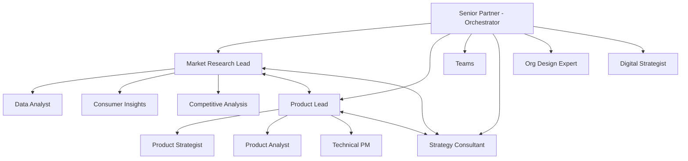
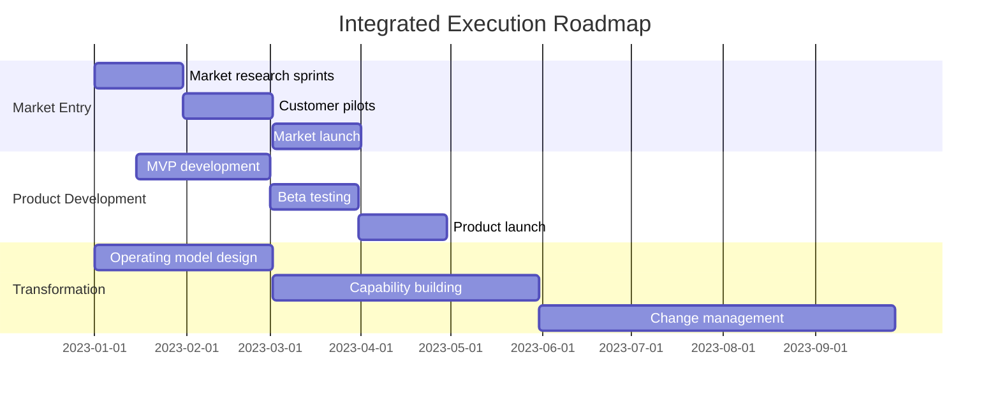

# Integrated Business Strategy Workflow

## Overview
A comprehensive workflow that orchestrates all three expansion packs (Market Research, Product Management, Strategy Consulting) to deliver end-to-end business solutions.

## Workflow Metadata
```yaml
workflow:
  id: integrated-business-strategy
  name: Full Stack Business Strategy Development
  type: adaptive-integrated
  duration: 12-26 weeks
  primary_agents:
    - senior-partner (Strategy Lead)
    - market-research-lead (Market Intelligence)
    - product-lead (Product Strategy)
  supporting_agents:
    - All specialists from three packs
  use_cases:
    - New market entry
    - Digital transformation
    - Product portfolio strategy
    - Competitive response
    - Business model innovation
```

## Integration Architecture

### Agent Collaboration Model


### Data Flow Architecture
```yaml
data_flow:
  market_research:
    outputs:
      - market_size_data.json
      - customer_insights.yaml
      - competitive_landscape.md
      - opportunity_matrix.csv
    consumers:
      - product_manager: All outputs
      - strategy_consultant: Market dynamics

  product_manager:
    outputs:
      - product_strategy.yaml
      - feature_roadmap.json
      - platform_decisions.md
      - launch_plans.yaml
    consumers:
      - strategy_consultant: Strategic alignment
      - market_researcher: Validation needs

  strategy_consultant:
    outputs:
      - transformation_strategy.md
      - operating_model.yaml
      - investment_priorities.json
      - governance_structure.md
    consumers:
      - All: Strategic direction
```

## Phase 0: Integrated Discovery (Week 1)

### Step 0.1: Opportunity Framing
**Lead:** senior-partner
**Participants:** All pack leads

**Adaptive Questions:**
1. **What's the strategic opportunity?**
   - Market expansion → Market-led path
   - Product innovation → Product-led path
   - Business transformation → Strategy-led path
   - Competitive threat → Integrated response path

2. **What's the primary constraint?**
   - Time pressure → Parallel workstreams
   - Resource limits → Phased approach
   - Uncertainty high → Sequential discovery
   - All constraints → Agile sprints

3. **What's the success criteria?**
   - Revenue growth → Commercial focus
   - Market position → Competitive focus
   - Innovation → Product focus
   - Efficiency → Operational focus

### Step 0.2: Workstream Design
**Adaptive Orchestration:**
```python
def design_workstreams(opportunity_type, constraints, criteria):
    if opportunity_type == "market_expansion":
        return {
            'lead': 'market_researcher',
            'sequence': ['market_analysis', 'product_fit', 'entry_strategy'],
            'parallel_work': ['competitive_intel', 'capability_assessment']
        }
    elif opportunity_type == "product_innovation":
        return {
            'lead': 'product_manager',
            'sequence': ['jobs_analysis', 'platform_decision', 'roadmap'],
            'parallel_work': ['market_validation', 'tech_feasibility']
        }
    elif opportunity_type == "transformation":
        return {
            'lead': 'strategy_consultant',
            'sequence': ['current_state', 'future_vision', 'roadmap'],
            'parallel_work': ['market_scan', 'product_implications']
        }
```

## Phase 1: Integrated Analysis (Weeks 2-6)

### Workstream A: Market Intelligence
**Lead:** market-research-lead
**Duration:** 4 weeks

**Week 1-2: Market Landscape**
```yaml
activities:
  - trigger: PESTEL analysis
  - trigger: Market sizing (TAM/SAM/SOM)
  - trigger: Customer journey mapping
  outputs_to:
    product_manager:
      - market_segments.yaml
      - opportunity_sizes.json
    strategy_consultant:
      - market_dynamics.md
      - growth_projections.csv
```

**Week 3-4: Competitive Intelligence**
```yaml
activities:
  - trigger: Competitive landscape mapping
  - trigger: Value chain analysis
  - trigger: Differentiation opportunities
outputs_to:
    product_manager:
      - feature_gaps.yaml
      - positioning_options.md
    strategy_consultant:
      - competitive_threats.json
      - strategic_moves.yaml
```

### Workstream B: Product Strategy
**Lead:** product-lead
**Duration:** 4 weeks (starts week 2)

**Week 2-3: Product Definition**
```yaml
dependencies:
  from_market_research:
    - wait_for: Initial market segments
    - wait_for: Customer needs data
activities:
  - trigger: Jobs-to-be-done analysis
  - trigger: Platform vs feature decisions
  - trigger: North Star metric definition
outputs_to:
    strategy_consultant:
      - product_vision.md
      - capability_needs.yaml
    market_researcher:
      - validation_requirements.json
```

**Week 4-5: Product Roadmap**
```yaml
dependencies:
  from_strategy:
    - wait_for: Strategic priorities
    - wait_for: Investment envelope
activities:
  - trigger: Feature prioritization (RICE)
  - trigger: OKR framework setup
  - trigger: Launch strategy development
outputs_to:
    all_teams:
      - product_roadmap.json
      - resource_requirements.yaml
      - success_metrics.md
```

### Workstream C: Strategic Framework
**Lead:** senior-partner
**Duration:** Continuous orchestration

**Continuous Activities:**
```yaml
orchestration:
  daily:
    - Workstream sync
    - Issue resolution
    - Decision escalation
  
  weekly:
    - Integration workshop
    - Insight synthesis
    - Strategy refinement
    - Stakeholder updates
  
  phase_gates:
    - Week 2: Market opportunity validation
    - Week 4: Product-market fit confirmation
    - Week 6: Strategic option selection
```

### Integration Workshops
**Weekly Cross-Pack Sessions:**

**Workshop 1: Opportunity Alignment (Week 2)**
```
Participants: All leads + specialists
Agenda:
  1. Market insights share-out (30 min)
  2. Initial product hypotheses (30 min)
  3. Strategic implications (30 min)
  4. Alignment on focus areas (30 min)
Output: Unified opportunity definition
```

**Workshop 2: Solution Synthesis (Week 4)**
```
Participants: All leads + key stakeholders
Agenda:
  1. Competitive positioning options (45 min)
  2. Product strategy proposals (45 min)
  3. Operating model implications (45 min)
  4. Integration planning (45 min)
Output: Integrated solution options
```

## Phase 2: Strategy Integration (Weeks 7-10)

### Step 2.1: Strategic Option Development
**Lead:** strategy-consultant
**Participants:** All teams

**Integrated Options Framework:**
```python
def develop_strategic_options():
    market_insights = market_researcher.get_insights()
    product_strategy = product_manager.get_strategy()
    org_capabilities = strategy_consultant.assess_capabilities()
    
    options = []
    for opportunity in market_insights.opportunities:
        for product_approach in product_strategy.approaches:
            if org_capabilities.can_support(product_approach):
                option = {
                    'market_play': opportunity,
                    'product_play': product_approach,
                    'capability_play': org_capabilities.enhancement_plan,
                    'value_potential': calculate_value(opportunity, product_approach),
                    'investment_required': estimate_investment(product_approach),
                    'time_to_market': estimate_timeline(all_factors)
                }
                options.append(option)
    
    return rank_options(options)
```

### Step 2.2: Business Case Development
**Collaborative Modeling:**

```yaml
financial_model:
  inputs:
    from_market_research:
      - market_size_evolution
      - price_points
      - adoption_curves
      - competitive_response
    
    from_product_management:
      - development_costs
      - launch_costs
      - operational_costs
      - platform_economics
    
    from_strategy_consulting:
      - transformation_costs
      - capability_investments
      - risk_factors
      - synergy_potential
  
  outputs:
    - 5_year_financial_projection
    - scenario_analysis
    - sensitivity_analysis
    - investment_recommendation
```

### Step 2.3: Risk Integration
**Comprehensive Risk Assessment:**

```markdown
Risk Matrix Integration:

Market Risks (from Market Research):
- Market size uncertainty
- Customer adoption risk
- Competitive response risk
- Regulatory change risk

Product Risks (from Product Management):
- Technical feasibility risk
- Time-to-market risk
- Feature-market fit risk
- Platform scalability risk

Strategic Risks (from Strategy Consulting):
- Execution capability risk
- Change management risk
- Resource availability risk
- Strategic coherence risk

Integrated Mitigation Plan:
- Cross-functional risk owners
- Integrated monitoring dashboard
- Coordinated response protocols
- Scenario-based contingencies
```

## Phase 3: Execution Planning (Weeks 11-14)

### Step 3.1: Integrated Roadmap
**Master Plan Development:**



### Step 3.2: Governance Integration
**Unified Governance Structure:**

```yaml
governance_model:
  steering_committee:
    chair: CEO/Business Unit Leader
    members:
      - Senior Partner (Strategy)
      - Market Research Lead
      - Product Lead
      - CFO/Finance Lead
      - Operations Lead
    
    cadence: Bi-weekly
    decisions:
      - Go/no-go gates
      - Resource allocation
      - Priority trade-offs
      - Risk escalations
  
  working_committee:
    chair: Senior Partner
    members: All workstream leads
    cadence: Weekly
    focus: Execution coordination
  
  pmo_structure:
    lead: Program Manager
    teams:
      - Market workstream
      - Product workstream
      - Transformation workstream
    tools:
      - Integrated dashboard
      - Shared workspace
      - Decision log
      - Risk register
```

### Step 3.3: Communication Integration
**Unified Messaging:**

```markdown
Stakeholder Communication Matrix:

| Stakeholder | Message Focus | Channel | Frequency | Owner |
|-------------|---------------|---------|-----------|-------|
| Board | Strategic progress | Presentation | Monthly | Senior Partner |
| Leadership | Execution status | Dashboard | Weekly | PMO |
| Employees | Change story | Town halls | Bi-weekly | All Leads |
| Customers | Value proposition | Various | Continuous | Product Lead |
| Partners | Collaboration | Meetings | Monthly | Market Lead |
| Investors | Value creation | Reports | Quarterly | Strategy Lead |
```

## Phase 4: Integrated Launch (Weeks 15-20)

### Step 4.1: Coordinated Go-to-Market
**Integrated Launch Sequence:**

```python
def orchestrate_launch():
    market_readiness = market_researcher.assess_readiness()
    product_readiness = product_manager.assess_readiness()
    org_readiness = strategy_consultant.assess_readiness()
    
    if all([market_readiness, product_readiness, org_readiness]) > 0.8:
        launch_mode = "full_integrated_launch"
    elif market_readiness > 0.8 and product_readiness > 0.6:
        launch_mode = "soft_launch_with_learning"
    else:
        launch_mode = "pilot_and_iterate"
    
    return execute_launch_plan(launch_mode)
```

### Step 4.2: Performance Monitoring
**Integrated Metrics Dashboard:**

```yaml
metrics_framework:
  market_metrics:
    - Market share capture
    - Customer acquisition rate
    - Competitive win rate
    - Brand awareness lift
  
  product_metrics:
    - Product adoption rate
    - Feature usage depth
    - User satisfaction score
    - Platform growth rate
  
  strategy_metrics:
    - Revenue growth rate
    - Profitability improvement
    - Capability maturity score
    - Transformation milestones
  
  integrated_metrics:
    - Overall value creation
    - ROI achievement
    - Strategic objective attainment
    - Synergy realization
```

### Step 4.3: Learning Integration
**Continuous Improvement Loop:**

```yaml
learning_protocol:
  capture:
    - Daily: Operational learnings
    - Weekly: Tactical adjustments
    - Monthly: Strategic insights
    - Quarterly: Model refinements
  
  share:
    across_packs:
      - Best practices
      - Failure points
      - Success patterns
      - Innovation ideas
    
    to_organization:
      - Knowledge repository
      - Training materials
      - Playbook updates
      - Case studies
  
  apply:
    - Real-time adjustments
    - Next phase planning
    - Capability building
    - Future strategy
```

## Phase 5: Value Optimization (Weeks 21+)

### Continuous Integration Cycles
**Adaptive Optimization:**

```yaml
optimization_cycles:
  month_1:
    focus: Quick wins and fixes
    activities:
      - Performance bottleneck resolution
      - Customer feedback integration
      - Competitive response adjustment
      - Process optimization
  
  quarter_1:
    focus: Scale and efficiency
    activities:
      - Market expansion evaluation
      - Product enhancement prioritization
      - Operating model refinement
      - Capability gap closure
  
  year_1:
    focus: Strategic evolution
    activities:
      - Market position assessment
      - Product portfolio evolution
      - Transformation sustainability
      - Next horizon planning
```

## Integration Success Factors

### Critical Success Factors
1. **Aligned Leadership:** All three pack leads working as one team
2. **Integrated Planning:** Unified roadmaps and milestones
3. **Seamless Handoffs:** Clear protocols between packs
4. **Shared Metrics:** Common success measures
5. **Unified Communication:** One voice to stakeholders

### Common Pitfalls to Avoid
1. **Silo Working:** Packs operating independently
2. **Sequential Thinking:** Not leveraging parallel work
3. **Handoff Delays:** Poor coordination between phases
4. **Metric Conflicts:** Competing success measures
5. **Communication Gaps:** Mixed messages to stakeholders

## Templates and Tools

### Integration Charter Template
```markdown
# Integrated Business Strategy Charter

## Opportunity Statement
[Unified description of the opportunity across all three domains]

## Strategic Intent
- Market Play: [From market research]
- Product Play: [From product management]
- Transformation Play: [From strategy consulting]

## Success Metrics
- Integrated North Star: [Metric]
- Market Success: [Metrics]
- Product Success: [Metrics]
- Strategic Success: [Metrics]

## Team Structure
- Executive Sponsor: [Name]
- Integration Lead: [Senior Partner]
- Market Lead: [Market Research Lead]
- Product Lead: [Product Lead]
- Workstream Leads: [Names]

## Key Milestones
| Phase | Deliverable | Date | Owner | Dependencies |
|-------|-------------|------|-------|--------------|

## Decision Rights
[RACI matrix for key decisions across packs]

## Risk Management
[Integrated risk register with cross-pack dependencies]
```

### Integration Scorecard
```markdown
# Weekly Integration Scorecard

## Overall Health: 🟢/🟡/🔴

### Progress by Pack
| Pack | On Track | At Risk | Blocked | Health |
|------|----------|---------|---------|---------|
| Market Research | X% | Y% | Z% | 🟢/🟡/🔴 |
| Product Management | X% | Y% | Z% | 🟢/🟡/🔴 |
| Strategy Consulting | X% | Y% | Z% | 🟢/🟡/🔴 |

### Integration Points
| Handoff | Status | Next Action | Owner |
|---------|--------|-------------|-------|

### Key Decisions Needed
1. [Decision]: [Context] - By [Date]
2. [Decision]: [Context] - By [Date]

### Risks & Issues
| Risk/Issue | Impact | Owner | Mitigation | Status |
|------------|--------|-------|------------|--------|

### Next Week Focus
- Market Research: [Priority]
- Product Management: [Priority]
- Strategy Consulting: [Priority]
- Integration: [Priority]
```

## Conclusion

This integrated workflow demonstrates how the three expansion packs work together to deliver comprehensive business solutions. The key is maintaining strong orchestration while allowing each pack to contribute its unique expertise.

Success comes from:
- Clear role definition
- Seamless data flow
- Synchronized timing
- Unified communication
- Shared accountability

When executed well, this integrated approach delivers significantly more value than any pack working alone.