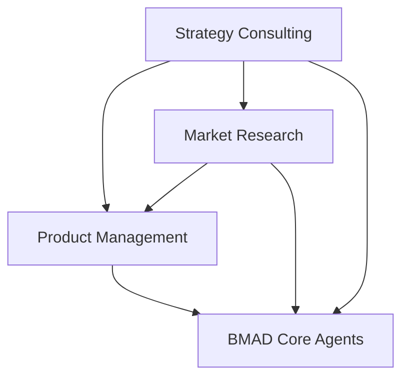

# BMAD-METHOD Expansion Packs

Professional expansion packs for [BMAD-METHOD](https://github.com/bmadcode/BMAD-METHOD) that extend its capabilities beyond software development into business strategy, product management, and market research.

## 🚀 Overview

This repository contains three comprehensive expansion packs that transform BMAD-METHOD into a complete business analysis and strategy platform:

### 📊 Market Researcher Pack
Transform your AI agents into a professional market research team capable of conducting comprehensive market analysis, consumer insights, and competitive intelligence.

### 🎯 Product Manager Pack  
Equip your agents with industry-standard product management frameworks including Jobs-to-be-Done (JTBD), OKRs, and RICE prioritization for full product lifecycle management.

### 🏛️ Strategy Consulting Pack
Access McKinsey, BCG, and Bain-level strategic consulting capabilities with elite strategy agents, proven frameworks, and executive-ready deliverables.

## 📦 What's Included

### Expansion Pack Contents
- **12 Specialized Agents**: From market researchers to senior strategy partners
- **11 Strategic Tasks**: Interactive, framework-based analysis procedures
- **8 Professional Templates**: Executive-ready reports and presentations
- **Complete Frameworks**: JTBD, OKR, RICE, McKinsey 7S, Three Horizons
- **Knowledge Bases**: Deep domain expertise for each pack

## 🛠️ Installation

### Prerequisites
- BMAD-METHOD installed in your project
- Access to AI agent platform (Cursor, Windsurf, etc.)

### Installation Steps

1. **Clone this repository**:
```bash
git clone https://github.com/bookmark/BMAD-METHOD-EXP.git
```

2. **Copy expansion packs to your BMAD installation**:
```bash
cp -r BMAD-METHOD-EXP/expansion-packs/* /path/to/your/project/BMAD-METHOD/expansion-packs/
```

3. **Verify installation**:
Check that the following directories exist:
- `expansion-packs/bmad-market-researcher/`
- `expansion-packs/bmad-product-manager/`
- `expansion-packs/bmad-strategy-consulting/`

## 💡 Usage Examples

### Market Research Example
```
Load agent: market-research-lead

Agent: "Hello! I'm Maya, your Senior Market Research Strategist. Let's analyze your market opportunity."

User: "I need to understand the market for a new fintech app"

Agent: *Initiates comprehensive market analysis with TAM/SAM/SOM calculations*
```

### Product Management Example
```
Load agent: product-lead

Agent: "I'm Alex Chen, your Senior Product Manager. I'll help you build the right product using JTBD, OKR, and RICE frameworks."

User: "Help me prioritize features for our roadmap"

Agent: *Runs RICE prioritization analysis*
```

### Strategy Consulting Example
```
Load agent: senior-partner

Agent: "I'm Victoria Sterling, Senior Partner. I've advised Fortune 500 CEOs for 25+ years. Let's develop your strategy."

User: "We need a digital transformation strategy"

Agent: *Conducts strategic situation assessment and builds transformation roadmap*
```

## 🔗 Integration with BMAD Ecosystem

These expansion packs are designed to work seamlessly together and with core BMAD agents:



### Cross-Pack Collaboration
- **Market Research** provides insights for Product and Strategy decisions
- **Product Management** bridges business strategy and development
- **Strategy Consulting** provides overarching direction for all agents

## 📋 Expansion Pack Details

### Market Researcher Pack

**Agents**:
- Maya - Market Research Lead
- Alex - Data Analyst  
- Sofia - Consumer Insights Specialist
- Marcus - Competitive Intelligence Analyst

**Key Capabilities**:
- Market sizing (TAM/SAM/SOM)
- Consumer behavior analysis
- Competitive landscape mapping
- Persona development
- Trend analysis

### Product Manager Pack

**Agents**:
- Alex Chen - Product Lead
- Sarah Kim - Product Strategist
- David Park - Product Analyst
- Maya Patel - Technical PM

**Key Frameworks**:
- Jobs-to-be-Done (JTBD)
- Objectives & Key Results (OKR)
- RICE Prioritization
- Platform vs Feature Analysis

### Strategy Consulting Pack

**Agents**:
- Victoria Sterling - Senior Partner
- Marcus Chen - Strategy Consultant
- Dr. Sarah Mitchell - Org Design Expert
- Alex Kumar - Digital Strategist

**Key Frameworks**:
- McKinsey 7S Analysis
- Three Horizons Planning
- Strategic Situation Assessment
- Transformation Roadmaps

## 🤝 Contributing

Contributions are welcome! If you'd like to add new expansion packs or improve existing ones:

1. Fork this repository
2. Create your feature branch (`git checkout -b feature/amazing-pack`)
3. Commit your changes (`git commit -m 'Add amazing expansion pack'`)
4. Push to the branch (`git push origin feature/amazing-pack`)
5. Open a Pull Request

### Creating New Expansion Packs

Follow the BMAD-METHOD structure:
```
expansion-packs/
└── your-pack-name/
    ├── agents/       # Agent definitions
    ├── tasks/        # Reusable tasks
    ├── templates/    # Output templates
    ├── workflows/    # Multi-step processes
    ├── data/         # Knowledge bases
    └── config.yaml   # Pack configuration
```

## 📄 License

This project follows the same license as BMAD-METHOD. See the [original repository](https://github.com/bmadcode/BMAD-METHOD) for details.

## 🙏 Acknowledgments

- [Brian Madison (BMad)](https://github.com/bmadcode) for creating BMAD-METHOD
- The BMAD community for inspiration and support
- McKinsey, BCG, and Bain for strategic frameworks and methodologies

## 📞 Support

- **BMAD Discord**: [Join the community](https://discord.gg/gk8jAdXWmj)
- **Issues**: Open an issue in this repository
- **Discussions**: Use GitHub Discussions for questions and ideas

---

**Made with ❤️ for the BMAD community**

*Extending AI agents beyond code into complete business solutions*