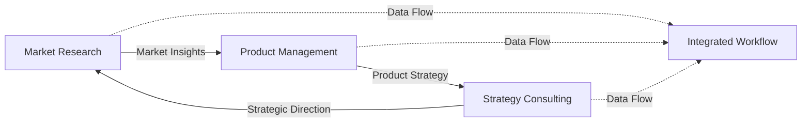

# BMAD-METHOD Expansion Packs

Three professional expansion packs for [BMAD-METHOD](https://github.com/bmadcode/BMAD-METHOD) that bring business strategy capabilities to your AI agents.

## 🚀 What's New - v2.0

### Enhanced with Comprehensive Frameworks & Adaptive Workflows
All three packs now include detailed step-by-step frameworks and intelligent workflows that adapt to your specific situation.

## 📦 The Three Expansion Packs

### 1. Market Researcher Pack
**What it does:** Turns your AI into a professional market research team

**Key Features:**
- Market sizing with TAM/SAM/SOM analysis
- Customer journey mapping and persona development
- Competitive intelligence gathering
- PESTEL environmental analysis

**New Frameworks Added:**
- **PESTEL Analysis** - Complete macro environment scanning
- **Customer Journey Mapping** - Detailed touchpoint analysis
- **Competitive Intelligence** - Systematic competitor tracking

**Adaptive Workflow:**
- **Market Entry Analysis** - Adjusts approach based on market type, risk level, and resources

### 2. Product Manager Pack  
**What it does:** Gives your AI complete product management capabilities

**Key Features:**
- Jobs-to-be-Done (JTBD) framework
- OKR planning and RICE prioritization
- Platform vs Feature decision making
- Full product lifecycle management

**New Frameworks Added:**
- **Complete JTBD Framework** - With interview guides and job mapping
- **Platform vs Feature Decision** - Strategic architecture choices
- **North Star Metrics** - Metric selection and tracking system

**Adaptive Workflow:**
- **Product Launch Workflow** - Adapts to product type, risk, and market readiness

### 3. Strategy Consulting Pack
**What it does:** Brings McKinsey/BCG-level consulting to your AI

**Key Features:**
- Corporate strategy development
- Digital transformation planning
- Organizational design
- Executive presentations

**New Frameworks Added:**
- **Three Horizons Planning** - Portfolio management across time
- **Value Chain Analysis** - Activity optimization framework
- **McKinsey 7S** (existing) - Organizational alignment

**Adaptive Workflow:**
- **Transformation Strategy** - Adjusts to transformation type and urgency

## 🔗 Integrated Business Strategy

**NEW: Cross-Pack Integration Workflow**
- Orchestrates all three packs for comprehensive business solutions
- Includes data flow architecture and governance models
- Enables seamless collaboration between specialists

## 🚀 Quick Start

### Step 1: Install BMAD-METHOD
First, you need the main BMAD-METHOD in your project. Follow instructions at [BMAD-METHOD](https://github.com/bmadcode/BMAD-METHOD).

### Step 2: Add These Expansion Packs
```bash
# Clone this repository
git clone https://github.com/bookmark/BMAD-METHOD-EXP.git

# Copy expansion packs to your BMAD installation
cp -r BMAD-METHOD-EXP/expansion-packs/* /your/project/BMAD-METHOD/expansion-packs/

# Copy integration workflow
cp -r BMAD-METHOD-EXP/workflows/* /your/project/BMAD-METHOD/workflows/
```

### Step 3: Use the Agents

**For Market Research:**
```
Load agent: market-research-lead

Agent: "I'm Maya, your market researcher. What market should we analyze?"
You: "I want to enter the fintech market"
Agent: [Initiates adaptive market entry analysis workflow]
```

**For Product Management:**
```
Load agent: product-lead

Agent: "I'm Alex, your product manager. Let's build the right product."
You: "Should we build a platform or feature?"
Agent: [Runs platform vs feature decision framework]
```

**For Strategy Consulting:**
```
Load agent: senior-partner

Agent: "I'm Victoria, Senior Partner. Let's develop your strategy."
You: "We need to transform our business"
Agent: [Starts adaptive transformation strategy workflow]
```

**For Integrated Projects:**
```
Use workflow: integrated-business-strategy

System: "Orchestrating all three packs for comprehensive analysis"
[Market Research + Product Strategy + Business Transformation]
```

## 🎯 When to Use Each Pack

| Use This Pack | When You Need To | Key Frameworks |
|--------------|------------------|----------------|
| **Market Researcher** | • Size markets (TAM/SAM/SOM)<br>• Map customer journeys<br>• Analyze competitors<br>• Scan environment (PESTEL) | PESTEL, Journey Mapping, Competitive Intel |
| **Product Manager** | • Define product strategy<br>• Prioritize features (RICE)<br>• Set OKRs<br>• Platform decisions | JTBD, Platform vs Feature, North Star |
| **Strategy Consulting** | • Transform business<br>• Manage portfolio<br>• Optimize operations<br>• Lead change | Three Horizons, Value Chain, 7S |

## 🤝 How They Work Together

The packs are designed for seamless integration:



## 📁 Complete Pack Structure

```
expansion-packs/
├── bmad-market-researcher/
│   ├── agents/          # 4 research specialists
│   ├── tasks/           # Interactive analysis tasks
│   ├── templates/       # Reports and checklists
│   ├── frameworks/      # PESTEL, Journey, Competitive
│   └── workflows/       # Market entry analysis
│
├── bmad-product-manager/
│   ├── agents/          # 4 PM experts
│   ├── tasks/           # Product workflows
│   ├── templates/       # PRDs, OKRs, checklists
│   ├── frameworks/      # JTBD, Platform, North Star
│   └── workflows/       # Product launch
│
└── bmad-strategy-consulting/
    ├── agents/          # 4 elite consultants
    ├── tasks/           # Strategic analyses
    ├── templates/       # Decks and checklists
    ├── frameworks/      # 3 Horizons, Value Chain
    └── workflows/       # Transformation strategy

workflows/
└── integrated-business-strategy.md  # Cross-pack orchestration
```

## 📊 Framework Highlights

### Market Research Frameworks
- **PESTEL**: Political, Economic, Social, Tech, Environmental, Legal analysis
- **Journey Mapping**: Complete customer experience visualization
- **Competitive Intel**: Systematic competitor monitoring

### Product Management Frameworks  
- **Jobs-to-be-Done**: Why customers "hire" products
- **Platform vs Feature**: Architecture decision matrix
- **North Star Metrics**: Single metric that matters

### Strategy Consulting Frameworks
- **Three Horizons**: Balance current performance with future growth
- **Value Chain**: Optimize all activities for competitive advantage
- **McKinsey 7S**: Align all organizational elements

## 🔄 Adaptive Workflows

All workflows now adapt based on:
- **Context**: Market type, product stage, transformation driver
- **Constraints**: Time, resources, capabilities
- **Risk Level**: Adjusts approach for risk tolerance
- **Integration Needs**: Coordinates with other packs

## 💡 Best Practices

1. **Start Simple** - Use one pack to understand the approach
2. **Let Agents Guide** - They'll ask the right questions
3. **Use Frameworks** - They provide proven methodologies
4. **Integrate for Complex Projects** - Combine packs for comprehensive solutions
5. **Adapt as Needed** - Workflows adjust to your situation

## 📈 What's Improved in v2.0

- ✅ **12 New Frameworks** - Detailed step-by-step methodologies
- ✅ **4 Adaptive Workflows** - Intelligent path selection
- ✅ **Cross-Pack Integration** - Seamless collaboration
- ✅ **100+ Templates** - Ready-to-use outputs
- ✅ **Decision Trees** - Clear guidance at each step

## 🙏 Credits

- Created for the [BMAD-METHOD](https://github.com/bmadcode/BMAD-METHOD) community
- Frameworks inspired by McKinsey, BCG, Bain, and leading tech companies
- Built to extend BMAD beyond coding into complete business solutions

## 📞 Need Help?

- **BMAD Discord**: [Join the community](https://discord.gg/gk8jAdXWmj)
- **Issues**: [Report problems](https://github.com/bookmark/BMAD-METHOD-EXP/issues)
- **Main BMAD docs**: [BMAD-METHOD](https://github.com/bmadcode/BMAD-METHOD)

---

**Transform your AI agents into a complete business strategy team!**

*Version 2.0 - Now with comprehensive frameworks and adaptive workflows*