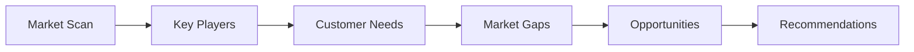

# BMAD Market Researcher Pack

[](https://github.com/your-org/BMAD-METHOD)
[](LICENSE)
[](https://github.com/your-org/BMAD-METHOD)

> **Comprehensive market analysis, consumer insights, and competitive intelligence for B2B/B2C research.**

## 🎯 Overview

The Market Researcher expansion pack provides professional market research capabilities for the BMAD-METHOD framework. It combines expert research methodologies, data analysis tools, and systematic workflows to deliver actionable market insights.

### Key Features

- **Consumer Insights** - Deep customer understanding and behavior analysis
- **Competitive Intelligence** - Systematic competitor tracking and analysis
- **Market Analysis** - Comprehensive market sizing and trends
- **Persona Development** - Data-driven customer persona creation
- **PESTEL Framework** - Macro-environmental analysis
- **Customer Journey Mapping** - End-to-end experience visualization

## 🚀 Quick Start

### Installation

```bash
# Clone the BMAD-METHOD repository
git clone https://github.com/your-org/BMAD-METHOD.git
cd BMAD-METHOD/expansion-packs/bmad-market-researcher

# Verify installation
ls -la agents/ frameworks/ tasks/
```

### Basic Usage

```yaml
# Activate research agents
@market-research-lead "Analyze the EV charging market opportunity"
@consumer-insights "Profile our target customer segments"
@competitive-intelligence "Map competitor strategies in fintech"

# Run research tasks
/conduct-market-analysis "SaaS project management tools"
/competitor-analysis "Top 5 competitors in our space"

# Generate insights
/persona-development "Enterprise software buyers"
```

### Interactive Tasks

```bash
# Comprehensive market analysis
task: conduct-market-analysis

# Competitor intelligence gathering
task: competitor-analysis

# Consumer research study
task: consumer-insights-research
```

## 👥 Research Team

### 📊 Dr. Rachel Martinez - Market Research Lead
**Specialty**: Research design and market analysis
- Designs comprehensive research methodologies
- Synthesizes multi-source insights
- Provides strategic recommendations
- **Commands**: `/research-design`, `/market-sizing`, `/trend-analysis`, `/synthesis`

### 🎯 David Kim - Consumer Insights Specialist
**Specialty**: Customer behavior and preferences
- Conducts qualitative and quantitative research
- Develops customer personas
- Maps customer journeys
- **Commands**: `/survey-design`, `/interview-guide`, `/persona-build`, `/journey-map`

### 🔍 Sarah Thompson - Competitive Intelligence Analyst
**Specialty**: Competitor analysis and positioning
- Tracks competitor movements
- Analyzes competitive strategies
- Identifies market gaps
- **Commands**: `/competitor-scan`, `/swot-analysis`, `/positioning-map`, `/battlecard`

### 📈 Michael Chen - Data Analyst
**Specialty**: Quantitative analysis and visualization
- Analyzes market data and trends
- Creates data visualizations
- Builds predictive models
- **Commands**: `/data-analysis`, `/trend-model`, `/visualization`, `/forecast`

## 🛠️ Frameworks

### Research Methodologies
- **[PESTEL Analysis](frameworks/pestel-analysis.md)** - Macro environment scanning
- **[Customer Journey Mapping](frameworks/customer-journey-mapping.md)** - Experience visualization
- **[Competitive Intelligence](frameworks/competitive-intelligence-framework.md)** - Systematic competitor analysis
- **[Porter's Five Forces](frameworks/porters-five-forces.md)** - Industry analysis
- **[TAM-SAM-SOM](frameworks/tam-sam-som.md)** - Market sizing

## 📊 Research Templates

### Analysis Templates
- **[Market Research Report](templates/market-research-report-tmpl.yaml)** - Comprehensive findings
- **[Competitor Matrix](templates/competitor-matrix-tmpl.yaml)** - Competitive landscape
- **[Persona Card](templates/persona-card-tmpl.yaml)** - Customer profiles
- **[Market Analysis Checklist](templates/market-analysis-checklist-tmpl.yaml)** - Research quality

## 🎨 Visual Research Tools

### Market Landscape Map


### Competitive Positioning Matrix
```
┌─────────────────┬────────────────┬────────────────┐
│                 │ Low Price      │ High Price     │
├─────────────────┼────────────────┼────────────────┤
│ Premium Quality │ Value Leaders  │ Premium Players│
│                 │ • Company C    │ • Company A    │
│                 │ • Company D    │ • Our Position │
├─────────────────┼────────────────┼────────────────┤
│ Basic Quality   │ Cost Leaders   │ Overpriced     │
│                 │ • Company E    │ • Company B    │
│                 │ • Company F    │                │
└─────────────────┴────────────────┴────────────────┘
```

### Research Process Flow
```
Define Objectives → Design Research → Collect Data
        ↓                               ↓
   Deliver Insights ← Synthesize ← Analyze Findings
```

## 📋 Key Workflows

### Market Research Comprehensive
**Duration**: 2-4 weeks  
**Output**: Full market research report

1. Research objectives definition
2. Methodology design
3. Primary research execution
4. Secondary research compilation
5. Data analysis and synthesis
6. Insights and recommendations

### Market Entry Analysis
**Duration**: 1-2 weeks  
**Output**: Go/No-go recommendation

1. Market opportunity assessment
2. Competitive landscape mapping
3. Regulatory environment scan
4. Customer needs validation
5. Entry strategy options
6. Risk and opportunity analysis

### Quick Market Assessment


## 🔗 Integration Ecosystem

### Supported Integrations
- **Product Management** - Market validation and insights
- **Strategy Consulting** - Market intelligence support
- **Startup Advisor** - Market opportunity assessment
- **PMO Agile** - User research and feedback
- **Problem Solver** - Market problem identification

### Integration Patterns
- **Insight-to-Action** - Research → Strategy → Execution
- **Validation Loop** - Product → Research → Iteration
- **Market Intelligence** - Research → Competitive Strategy
- **Customer-Centric** - Research → Product → Experience

## 📈 Success Metrics

### Research Quality
- **Data Reliability** - Source credibility scores
- **Sample Validity** - Statistical significance
- **Insight Actionability** - Implementation rate
- **Prediction Accuracy** - Forecast vs actual

### Business Impact
- **Decision Quality** - Research-informed outcomes
- **Market Share** - Competitive position changes
- **Customer Satisfaction** - NPS improvements
- **Revenue Growth** - Market opportunity capture

## 🏗️ Architecture

```
bmad-market-researcher/
├── agents/              # Research specialist agents
├── frameworks/          # Research methodologies
├── tasks/              # Interactive research workflows
├── templates/          # Report and analysis templates
├── workflows/          # Multi-step research processes
├── checklists/         # Quality assurance tools
├── agent-teams/        # Team collaboration configs
├── data/               # Knowledge base
└── config.yaml         # Pack configuration
```

## 🔧 Configuration

```yaml
# config.yaml
name: bmad-market-researcher
version: 1.0.0
description: Professional market research capabilities

capabilities:
  - market_analysis
  - consumer_insights
  - competitive_intelligence
  - persona_development
  - journey_mapping
  - trend_analysis
  - data_visualization

research_methods:
  - qualitative: interviews, focus groups, observation
  - quantitative: surveys, data analysis, modeling
  - secondary: desk research, reports, databases
  - competitive: monitoring, analysis, benchmarking
```

## 📚 Documentation

### Core Documentation
- [PESTEL Framework](frameworks/pestel-analysis.md)
- [Journey Mapping Guide](frameworks/customer-journey-mapping.md)
- [Competitive Intelligence](frameworks/competitive-intelligence-framework.md)
- [Research Workflows](workflows/)

### Templates & Tools
- [Research Report Template](templates/market-research-report-tmpl.yaml)
- [Competitor Matrix](templates/competitor-matrix-tmpl.yaml)
- [Persona Template](templates/persona-card-tmpl.yaml)
- [Quality Checklist](checklists/research-quality-checklist.md)

## 🤝 Contributing

We welcome contributions to improve the Market Researcher pack:

### Areas for Contribution
- **Research Methods** - New methodologies and frameworks
- **Analysis Tools** - Data visualization and modeling
- **Industry Templates** - Sector-specific research guides
- **Integration Examples** - Cross-pack workflows
- **Case Studies** - Research success stories

### Contribution Process
1. Fork the repository
2. Create a feature branch (`git checkout -b feature/new-method`)
3. Make your changes with documentation
4. Submit a pull request with examples

## 📄 License

This project is licensed under the MIT License - see the [LICENSE](LICENSE) file for details.

## 🆘 Support

### Getting Help
- **Documentation** - Check methodology guides
- **Issues** - Report bugs via GitHub Issues
- **Discussions** - Join research community
- **Examples** - Review case studies

### Community Resources
- [GitHub Discussions](https://github.com/your-org/BMAD-METHOD/discussions)
- [Documentation Wiki](https://github.com/your-org/BMAD-METHOD/wiki)
- [Issue Tracker](https://github.com/your-org/BMAD-METHOD/issues)

## 🗺️ Roadmap

### Version 1.1 (Q2 2024)
- [ ] AI-powered insight generation
- [ ] Real-time market monitoring
- [ ] Advanced sentiment analysis
- [ ] Automated report generation

### Version 1.2 (Q4 2024)
- [ ] Predictive market modeling
- [ ] Social listening integration
- [ ] Multi-language research support
- [ ] Industry-specific frameworks

---

**Built for BMAD-METHOD** • **Designed for evidence-based decisions** • **Optimized for actionable insights**

*Transform market data into strategic advantage.*