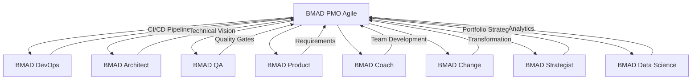

# PMO Agile Pack Integration Guide

## Overview
The PMO Agile expansion pack integrates with multiple other BMAD packs to provide comprehensive project and portfolio management capabilities. This guide details integration points, workflows, and best practices.

## Integration Map



## Core Integrations

### 1. BMAD DevOps Integration

#### Integration Points
```yaml
integration:
  pack: bmad-devops
  type: technical-delivery
  frequency: continuous
  
touchpoints:
  - ci_cd_pipeline
  - deployment_automation
  - infrastructure_management
  - monitoring_setup
  - security_scanning
```

#### Shared Workflows
1. **Continuous Delivery Flow**
   - PMO: Coordinates release planning
   - DevOps: Implements pipeline
   - Joint: Quality gates definition

2. **Environment Management**
   - PMO: Defines environment needs
   - DevOps: Provisions infrastructure
   - Joint: Access management

#### Data Exchange
```markdown
PMO → DevOps:
- Release schedule
- Feature flags requirements
- Environment specifications
- Quality criteria

DevOps → PMO:
- Build status
- Deployment metrics
- System health
- Performance data
```

#### Example Integration
```markdown
Sprint Planning:
1. PMO defines sprint goals
2. DevOps ensures CI/CD ready
3. Teams plan with deployment in mind
4. Joint review of technical dependencies
```

### 2. BMAD Architect Integration

#### Integration Points
```yaml
integration:
  pack: bmad-architect
  type: technical-alignment
  frequency: weekly
  
touchpoints:
  - architecture_reviews
  - technical_roadmap
  - design_decisions
  - pattern_library
  - technical_debt
```

#### Collaborative Processes
1. **Architecture Governance**
   - Weekly architecture sync meetings
   - Design review checkpoints
   - Technical decision records
   - Pattern compliance checks

2. **Technical Planning**
   - Architect provides technical vision
   - PMO aligns with delivery capacity
   - Joint prioritization of enablers

#### Communication Protocol
```markdown
Regular Sync Topics:
- Architectural runway status
- Technical debt prioritization
- New technology adoption
- Integration patterns
- Performance requirements
```

### 3. BMAD QA Integration

#### Integration Points
```yaml
integration:
  pack: bmad-qa
  type: quality-assurance
  frequency: continuous
  
touchpoints:
  - test_strategy
  - quality_gates
  - defect_management
  - test_automation
  - acceptance_criteria
```

#### Quality Framework
1. **Test Planning Integration**
   - PMO includes testing in sprint planning
   - QA defines test strategies
   - Joint definition of Done

2. **Quality Metrics Flow**
   - QA provides quality metrics
   - PMO includes in dashboards
   - Joint improvement actions

#### Shared Responsibilities
```markdown
PMO Responsibilities:
- Include test time in planning
- Track quality metrics
- Facilitate defect triage
- Ensure acceptance criteria

QA Responsibilities:
- Define test strategies
- Execute test plans
- Report quality status
- Maintain test automation

Joint Activities:
- Quality gate definition
- Risk assessment
- Release decisions
- Process improvement
```

### 4. BMAD Product Integration

#### Integration Points
```yaml
integration:
  pack: bmad-product
  type: value-delivery
  frequency: continuous
  
touchpoints:
  - product_backlog
  - feature_definition
  - priority_alignment
  - customer_feedback
  - value_metrics
```

#### Value Stream Alignment
1. **Backlog Management**
   - Product defines what
   - PMO defines how
   - Joint planning sessions

2. **Feature Delivery**
   - Product provides requirements
   - PMO coordinates delivery
   - Joint value validation

#### Collaboration Model
```markdown
PI Planning Integration:
Day 0: Product prepares vision
Day 1: Joint context setting
Day 2: Team planning alignment
Post-PI: Regular sync on progress

Sprint Integration:
- Product joins sprint planning
- PMO facilitates delivery
- Joint sprint reviews
- Shared metrics tracking
```

### 5. BMAD Coach Integration

#### Integration Points
```yaml
integration:
  pack: bmad-coach
  type: team-development
  frequency: regular
  
touchpoints:
  - team_assessments
  - skill_development
  - agile_maturity
  - coaching_plans
  - team_dynamics
```

#### Development Partnership
1. **Team Coaching**
   - Coach develops capabilities
   - PMO provides framework
   - Joint improvement plans

2. **Agile Maturity**
   - Regular assessments
   - Targeted interventions
   - Progress tracking

### 6. BMAD Change Integration

#### Integration Points
```yaml
integration:
  pack: bmad-change
  type: transformation
  frequency: ongoing
  
touchpoints:
  - change_strategy
  - communication_plans
  - stakeholder_engagement
  - resistance_management
  - adoption_tracking
```

#### Transformation Alignment
1. **Change Management**
   - Change manages people side
   - PMO manages process side
   - Joint transformation plan

2. **Communication Strategy**
   - Aligned messaging
   - Coordinated updates
   - Shared success stories

### 7. BMAD Strategist Integration

#### Integration Points
```yaml
integration:
  pack: bmad-strategist
  type: portfolio-alignment
  frequency: quarterly
  
touchpoints:
  - strategic_themes
  - portfolio_priorities
  - investment_decisions
  - market_alignment
  - innovation_pipeline
```

#### Strategic Execution
1. **Portfolio Planning**
   - Strategy defines direction
   - PMO enables execution
   - Joint roadmap development

2. **Investment Alignment**
   - Strategic theme funding
   - Capacity allocation
   - Value measurement

### 8. BMAD Data Science Integration

#### Integration Points
```yaml
integration:
  pack: bmad-data-science
  type: analytics-insights
  frequency: continuous
  
touchpoints:
  - predictive_analytics
  - metric_analysis
  - trend_identification
  - optimization_models
  - decision_support
```

#### Analytics Partnership
1. **Metrics Intelligence**
   - Data Science provides models
   - PMO provides data
   - Joint insight generation

2. **Predictive Planning**
   - Velocity predictions
   - Risk forecasting
   - Resource optimization

## Integration Patterns

### Pattern 1: Hub and Spoke
```markdown
PMO as Central Hub:
- Coordinates across packs
- Maintains integrated view
- Facilitates communication
- Resolves conflicts

Benefits:
- Clear accountability
- Simplified coordination
- Consistent processes
- Unified reporting
```

### Pattern 2: Federated Model
```markdown
Distributed Ownership:
- Each pack owns domain
- PMO facilitates integration
- Shared ceremonies
- Joint metrics

Benefits:
- Domain expertise
- Faster decisions
- Reduced bottlenecks
- Scalable model
```

### Pattern 3: Matrix Integration
```markdown
Cross-Functional Teams:
- Representatives from each pack
- Integrated planning
- Shared execution
- Collective ownership

Benefits:
- Tight integration
- Rapid coordination
- Shared learning
- System thinking
```

## Communication Protocols

### Regular Sync Meetings
```markdown
Daily:
- Scrum of Scrums (with DevOps, QA)
- Impediment resolution

Weekly:
- Architecture sync (with Architect)
- Product alignment (with Product)
- Coaching check-in (with Coach)

Bi-Weekly:
- System demo (all packs)
- Metrics review (with Data Science)

Monthly:
- Portfolio sync (with Strategist)
- Change review (with Change)
```

### Information Sharing
```markdown
Shared Dashboards:
- Integrated metrics
- Cross-pack dependencies
- Combined roadmap
- Unified risks

Documentation:
- Shared wiki/confluence
- API documentation
- Process guides
- Decision records
```

### Escalation Paths
```markdown
Level 1: Team Level
- Direct pack-to-pack
- Scrum Master facilitated
- Quick resolution

Level 2: Program Level
- RTE coordination
- Cross-pack meeting
- Decision within day

Level 3: Portfolio Level
- Leadership involvement
- Strategic alignment
- Major decisions
```

## Implementation Guide

### Phase 1: Foundation (Weeks 1-2)
```markdown
Activities:
□ Identify integration points
□ Assign liaisons
□ Setup communication channels
□ Define shared metrics
□ Create integration calendar
```

### Phase 2: Pilot (Weeks 3-8)
```markdown
Activities:
□ Start with 2-3 pack integration
□ Run integrated ceremonies
□ Test information flow
□ Refine processes
□ Document learnings
```

### Phase 3: Scale (Weeks 9-12)
```markdown
Activities:
□ Add remaining packs
□ Automate data exchange
□ Standardize processes
□ Train all participants
□ Measure effectiveness
```

### Phase 4: Optimize (Ongoing)
```markdown
Activities:
□ Regular retrospectives
□ Process improvements
□ Tool optimization
□ Relationship building
□ Innovation experiments
```

## Success Metrics

### Integration Health Metrics
```markdown
Quantitative:
- Cross-pack dependency resolution time
- Integration point efficiency
- Information flow speed
- Decision turnaround time
- Value delivery acceleration

Qualitative:
- Stakeholder satisfaction
- Team collaboration rating
- Process effectiveness
- Communication quality
- Innovation level
```

### KPIs by Integration
| Integration | Primary KPI | Target |
|------------|-------------|---------|
| DevOps | Deployment frequency | Daily |
| Architect | Technical debt ratio | <20% |
| QA | Defect escape rate | <2% |
| Product | Feature cycle time | <2 weeks |
| Coach | Team maturity | Level 3+ |
| Change | Adoption rate | >80% |
| Strategist | Portfolio ROI | >300% |
| Data Science | Prediction accuracy | >85% |

## Common Challenges & Solutions

### Challenge 1: Communication Overload
**Solution:**
- Clear communication protocols
- Defined information needs
- Automated reporting
- Exception-based escalation

### Challenge 2: Role Confusion
**Solution:**
- RACI matrix for integrations
- Clear boundaries
- Regular role clarification
- Joint working agreements

### Challenge 3: Tool Proliferation
**Solution:**
- Integrated toolchain
- API-based connections
- Single source of truth
- Minimal tool set

### Challenge 4: Conflicting Priorities
**Solution:**
- Portfolio-level alignment
- Transparent prioritization
- Regular rebalancing
- Executive sponsorship

## Best Practices

1. **Start Small**
   - Begin with critical integrations
   - Build success stories
   - Scale gradually

2. **Automate Early**
   - Reduce manual handoffs
   - Enable real-time data
   - Free up coordination time

3. **Measure Everything**
   - Track integration effectiveness
   - Monitor value flow
   - Identify bottlenecks

4. **Continuous Improvement**
   - Regular retrospectives
   - Experiment with approaches
   - Share learnings

5. **Build Relationships**
   - Invest in trust
   - Create shared wins
   - Celebrate together

## Integration Maturity Model

### Level 1: Ad-hoc
- Reactive coordination
- Manual information sharing
- Unclear boundaries

### Level 2: Defined
- Documented processes
- Regular sync meetings
- Clear roles

### Level 3: Integrated
- Automated data flow
- Proactive coordination
- Shared metrics

### Level 4: Optimized
- Predictive insights
- Seamless collaboration
- Continuous innovation

### Level 5: Transformational
- New value creation
- Emergent capabilities
- Market leadership

---

*Successful integration creates value greater than the sum of individual packs*