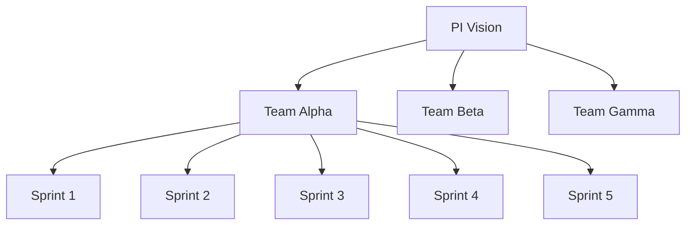
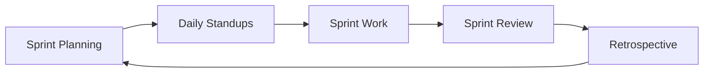

# BMAD PMO Agile Excellence Pack

[](https://github.com/your-org/BMAD-METHOD)
[](LICENSE)
[](https://github.com/your-org/BMAD-METHOD)

> **Professional PMO with agile mindset using SAFe methodology for project and portfolio management.**

## 🎯 Overview

The PMO Agile Excellence expansion pack brings enterprise-grade agile project management capabilities to the BMAD-METHOD framework. It combines SAFe (Scaled Agile Framework) methodologies with professional PMO practices to enable successful agile transformations.

### Key Features

- **SAFe Implementation** - Essential SAFe framework for scaling agile
- **PI Planning** - Program Increment planning and execution
- **Portfolio Management** - Strategic portfolio alignment and prioritization
- **ROAM Risk Management** - Resolved, Owned, Accepted, Mitigated risk tracking
- **Flow Metrics** - Lead time, cycle time, and throughput analytics
- **Agile Transformation** - Structured approach to organizational change

## 🚀 Quick Start

### Installation

```bash
# Clone the BMAD-METHOD repository
git clone https://github.com/your-org/BMAD-METHOD.git
cd BMAD-METHOD/expansion-packs/bmad-pmo-agile

# Verify installation
ls -la agents/ frameworks/ tasks/
```

### Basic Usage

```yaml
# Activate PMO agents
@agile-coach "Help us improve our sprint velocity"
@release-train-engineer "Plan our next PI"
@portfolio-manager "Prioritize our Q2 initiatives"

# Run agile assessments
/assess-agile-maturity "Current state of agile practices"
/generate-flow-metrics "Last quarter performance"

# Planning sessions
/conduct-pi-planning "Q2 2024 objectives"
```

### Interactive Tasks

```bash
# Agile maturity assessment
task: assess-agile-maturity

# PI planning facilitation
task: conduct-pi-planning

# Sprint coordination
task: manage-sprint-coordination
```

## 👥 Agile Team

### 🏃 Sarah Chen - Agile Coach
**Specialty**: Team coaching and agile transformation
- Guides teams in agile practices
- Facilitates retrospectives and improvements
- Coaches on agile mindset and values
- **Commands**: `/team-assessment`, `/retrospective`, `/coaching-plan`, `/maturity-roadmap`

### 🚂 Marcus Thompson - Release Train Engineer (RTE)
**Specialty**: SAFe implementation and PI execution
- Facilitates PI planning events
- Manages program-level risks and dependencies
- Coordinates cross-team collaboration
- **Commands**: `/pi-planning`, `/dependency-board`, `/program-board`, `/confidence-vote`

### 📊 Diana Rodriguez - Portfolio Manager
**Specialty**: Strategic portfolio alignment
- Manages portfolio Kanban
- Aligns initiatives with strategy
- Tracks portfolio metrics
- **Commands**: `/portfolio-review`, `/epic-prioritization`, `/capacity-planning`, `/roi-analysis`

### 📈 Kevin Park - Metrics Analyst
**Specialty**: Agile metrics and performance analytics
- Tracks flow metrics and KPIs
- Generates performance insights
- Identifies improvement opportunities
- **Commands**: `/flow-metrics`, `/velocity-trends`, `/burndown-analysis`, `/predictability-report`

## 🛠️ Frameworks

### Core Methodologies
- **[Essential SAFe](frameworks/essential-safe-framework.md)** - Scaled agile framework
- **[ROAM Risk Management](frameworks/roam-risk-management.md)** - Risk tracking methodology
- **[Agile Transformation Model](frameworks/agile-transformation-model.md)** - Change management approach
- **[Flow Framework](frameworks/flow-framework.md)** - Value stream optimization
- **[Team Topologies](frameworks/team-topologies.md)** - Organizational design patterns

## 📊 PMO Templates

### Planning Templates
- **[PI Planning Agenda](templates/pi-planning-agenda-tmpl.md)** - Event facilitation guide
- **[Sprint Ceremony Guides](templates/sprint-ceremony-guides-tmpl.md)** - Meeting templates
- **[Portfolio Kanban](templates/portfolio-kanban-tmpl.md)** - Strategic work visualization
- **[ROAM Board](templates/roam-board-tmpl.md)** - Risk management tracking

### Metrics & Reports
- **[Agile Metrics Dashboard](templates/agile-metrics-dashboard-tmpl.md)** - Performance visualization
- **[Retrospective Formats](templates/retrospective-formats-tmpl.md)** - Team improvement
- **[PMO Checklists](templates/pmo-checklists-tmpl.md)** - Quality assurance

## 🎨 Visual Management Tools

### Portfolio Kanban
```
┌─────────────┬──────────────┬──────────────┬──────────────┬─────────────┐
│   Funnel    │   Analyzing  │  Portfolio   │ Implementing │    Done     │
├─────────────┼──────────────┼──────────────┼──────────────┼─────────────┤
│ • Epic 101  │ • Epic 095   │ • Epic 089   │ • Epic 082   │ • Epic 075  │
│ • Epic 102  │ • Epic 096   │ • Epic 090   │ • Epic 083   │ • Epic 076  │
│ • Epic 103  │              │ • Epic 091   │ • Epic 084   │ • Epic 077  │
└─────────────┴──────────────┴──────────────┴──────────────┴─────────────┘
```

### PI Planning Board


### ROAM Risk Matrix
```
┌─────────────────┬────────────────────────────────────────┐
│ Risk Status     │ Description                            │
├─────────────────┼────────────────────────────────────────┤
│ Resolved ✅     │ Third-party API integration completed  │
│ Owned 👤        │ Performance optimization (Team Alpha)  │
│ Accepted 📋     │ Minor UI inconsistencies in edge cases│
│ Mitigated 🛡️    │ Backup datacenter for high availability│
└─────────────────┴────────────────────────────────────────┘
```

## 📋 Key Workflows

### PI Planning Process
**Duration**: 2 days  
**Output**: Committed PI objectives and plan

1. Business context and vision
2. Team breakouts and planning
3. Draft plan review
4. Management review and problem solving
5. Risk identification (ROAM)
6. Final plan presentation and confidence vote

### Agile Transformation Journey
**Duration**: 6-18 months  
**Output**: Mature agile organization

1. Current state assessment
2. Transformation roadmap creation
3. Pilot team selection
4. Training and coaching
5. Scaling and expansion
6. Continuous improvement

### Sprint Execution Flow


## 🔗 Integration Ecosystem

### Supported Integrations
- **Product Management** - Backlog refinement and prioritization
- **Strategy Consulting** - Strategic alignment and OKRs
- **Market Research** - Market insights for PI planning
- **Problem Solver** - Complex impediment resolution
- **Development Teams** - Sprint execution support

### Integration Patterns
- **Strategy-to-Execution** - OKRs to PI objectives
- **Product-to-Delivery** - Features to user stories
- **Risk-to-Resolution** - ROAM board management
- **Metrics-to-Insights** - Performance optimization

## 📈 Success Metrics

### Team Performance
- **Velocity Trend** - Sprint over sprint improvement
- **Predictability** - Planned vs delivered ratio
- **Flow Efficiency** - Active vs wait time
- **Quality Metrics** - Defect rates and escape rates

### Program Metrics
- **PI Predictability** - Objective achievement rate
- **Feature Cycle Time** - Ideation to production
- **Program Velocity** - Cross-team delivery rate
- **Dependency Health** - Resolution timeliness

## 🏗️ Architecture

```
bmad-pmo-agile/
├── agents/              # Agile specialist agents
├── frameworks/          # Agile and SAFe methodologies
├── tasks/              # Interactive PMO workflows
├── templates/          # Planning and tracking templates
├── workflows/          # Multi-step processes
├── data/               # Knowledge base
├── INTEGRATION_GUIDE.md # Cross-pack integration
├── PACK_STRUCTURE_GUIDE.md # Pack organization
└── config.yaml         # Pack configuration
```

## 🔧 Configuration

```yaml
# config.yaml
name: bmad-pmo-agile
version: 1.0.0
description: Professional PMO with agile mindset using SAFe

capabilities:
  - agile_transformation
  - safe_implementation
  - pi_planning
  - portfolio_management
  - risk_management
  - flow_metrics
  - sprint_coordination

methodologies:
  - safe: Essential SAFe framework
  - scrum: Team-level agile
  - kanban: Flow-based work management
  - roam: Risk management approach
```

## 📚 Documentation

### Core Documentation
- [Essential SAFe Guide](frameworks/essential-safe-framework.md)
- [ROAM Risk Framework](frameworks/roam-risk-management.md)
- [Agile Transformation](frameworks/agile-transformation-model.md)
- [Integration Guide](INTEGRATION_GUIDE.md)

### Templates & Tools
- [PI Planning Templates](templates/pi-planning-agenda-tmpl.md)
- [Metrics Dashboard](templates/agile-metrics-dashboard-tmpl.md)
- [Sprint Ceremonies](templates/sprint-ceremony-guides-tmpl.md)
- [PMO Checklists](templates/pmo-checklists-tmpl.md)

## 🤝 Contributing

We welcome contributions to improve the PMO Agile pack:

### Areas for Contribution
- **SAFe Practices** - Additional SAFe configurations
- **Metrics & Analytics** - New performance indicators
- **Templates** - Industry-specific adaptations
- **Integration Patterns** - Cross-team workflows
- **Case Studies** - Transformation success stories

### Contribution Process
1. Fork the repository
2. Create a feature branch (`git checkout -b feature/new-metric`)
3. Make your changes with documentation
4. Submit a pull request with examples

## 📄 License

This project is licensed under the MIT License - see the [LICENSE](LICENSE) file for details.

## 🆘 Support

### Getting Help
- **Documentation** - Check framework guides
- **Issues** - Report bugs via GitHub Issues
- **Discussions** - Join agile community
- **Examples** - Review workflow examples

### Community Resources
- [GitHub Discussions](https://github.com/your-org/BMAD-METHOD/discussions)
- [Documentation Wiki](https://github.com/your-org/BMAD-METHOD/wiki)
- [Issue Tracker](https://github.com/your-org/BMAD-METHOD/issues)

## 🗺️ Roadmap

### Version 1.1 (Q2 2024)
- [ ] Advanced SAFe configurations (Full SAFe)
- [ ] AI-powered impediment detection
- [ ] Real-time collaboration tools
- [ ] Enhanced dependency visualization

### Version 1.2 (Q4 2024)
- [ ] DevOps integration
- [ ] Value stream mapping
- [ ] Automated metric collection
- [ ] Multi-language support

---

**Built for BMAD-METHOD** • **Powered by SAFe** • **Designed for agile excellence**

*Scale agile practices with confidence and deliver value predictably.*