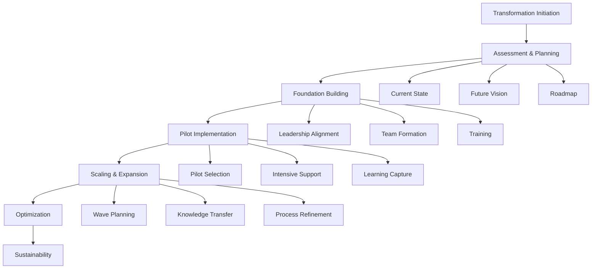

# Agile Transformation Workflow

## Workflow Metadata
```yaml
workflow:
  id: agile-transformation
  name: Enterprise Agile Transformation Journey
  duration: 12-24 months typical
  complexity: high
  agents_involved:
    - agile-coach (lead)
    - release-train-engineer
    - portfolio-manager
    - metrics-analyst
```

## Workflow Overview



## Phase 1: Transformation Initiation (Weeks 1-4)

### Step 1.1: Executive Alignment
**Agent:** agile-coach
**Duration:** 1 week

```markdown
Activities:
1. Executive briefing on agile transformation
2. Business case development
3. Success criteria definition
4. Investment approval
5. Sponsor identification

Deliverables:
- Transformation charter
- Executive commitment
- Budget allocation
- Communication plan
```

### Step 1.2: Transformation Team Formation
**Agent:** portfolio-manager
**Duration:** 1 week

```markdown
Activities:
1. Identify transformation team members
2. Define roles and responsibilities
3. Establish governance structure
4. Set meeting cadence
5. Create collaboration space

Team Composition:
- Executive sponsor
- Transformation lead
- Agile coaches
- Change agents from business
- HR representative
- IT representative
```

### Step 1.3: Initial Communication
**Agent:** agile-coach
**Duration:** 2 weeks

```markdown
Activities:
1. All-hands announcement
2. Vision communication
3. FAQ development
4. Feedback channels setup
5. Regular update schedule

Key Messages:
- Why transformation
- What will change
- Timeline expectations
- Support available
- Success measures
```

## Phase 2: Assessment & Planning (Weeks 5-8)

### Step 2.1: Current State Assessment
**Agent:** agile-coach
**Task:** assess-agile-maturity
**Duration:** 2 weeks

```markdown
Assessment Areas:
- Culture readiness
- Current practices
- Technical capabilities
- Leadership support
- Change capacity

Methods:
- Surveys
- Interviews
- Workshops
- Process observation
- Data analysis
```

### Step 2.2: Future State Design
**Agent:** agile-coach + portfolio-manager
**Duration:** 1 week

```markdown
Design Elements:
- Target operating model
- Organizational structure
- Role definitions
- Process framework
- Tool ecosystem

Outputs:
- Future state blueprint
- Gap analysis
- Transformation themes
```

### Step 2.3: Transformation Roadmap
**Agent:** portfolio-manager
**Duration:** 1 week

```markdown
Roadmap Components:
- Phase definitions
- Timeline milestones
- Resource requirements
- Risk mitigation
- Success metrics

Planning Horizons:
- 90-day immediate actions
- 6-month objectives
- 12-month vision
- 24-month aspirations
```

## Phase 3: Foundation Building (Weeks 9-16)

### Step 3.1: Leadership Development
**Agent:** agile-coach
**Duration:** 4 weeks

```markdown
Leadership Program:
Week 1-2: Leading SAFe certification
Week 3: Leadership workshop
Week 4: Coaching circles

Topics:
- Servant leadership
- Agile mindset
- Change leadership
- Psychological safety
- Innovation culture
```

### Step 3.2: Coach Development
**Agent:** agile-coach
**Duration:** 4 weeks (parallel)

```markdown
Coach Certification Path:
- SAFe certifications
- Coaching skills
- Facilitation training
- Change management
- Conflict resolution

Internal Coach Network:
- Selection criteria
- Training program
- Mentorship pairing
- Community of practice
```

### Step 3.3: Infrastructure Preparation
**Agent:** release-train-engineer
**Duration:** 4 weeks (parallel)

```markdown
Technical Infrastructure:
- ALM tool setup
- CI/CD pipeline
- Collaboration tools
- Metrics platform
- Communication channels

Process Infrastructure:
- Ceremony templates
- Role descriptions
- Working agreements
- Definition of Done
- Escalation paths
```

## Phase 4: Pilot Implementation (Weeks 17-32)

### Step 4.1: Pilot Selection
**Agent:** portfolio-manager
**Duration:** 1 week

```markdown
Selection Criteria:
- Business criticality (medium)
- Team readiness (high)
- Leadership support (strong)
- Technical complexity (moderate)
- Visibility (high)

Pilot Composition:
- 3-5 teams
- 1 value stream
- Clear boundaries
- Measurable outcomes
```

### Step 4.2: Pilot Launch
**Agent:** agile-coach + release-train-engineer
**Task:** implement-safe-practices
**Duration:** 2 weeks

```markdown
Launch Activities:
Week 1:
- Team training
- Role assignments
- Backlog preparation
- Tool setup

Week 2:
- First PI Planning
- Team launches
- Daily coaching
- Impediment resolution
```

### Step 4.3: Intensive Support
**Agent:** agile-coach
**Task:** conduct-pi-planning
**Duration:** 12 weeks (1 PI)

```markdown
Support Model:
Daily:
- Standup observation
- Impediment resolution
- Just-in-time coaching

Weekly:
- Team health checks
- Metrics review
- Leadership sync
- Adjustment planning

PI Cadence:
- System demos
- I&A workshops
- PI planning support
```

### Step 4.4: Learning Capture
**Agent:** metrics-analyst
**Task:** generate-flow-metrics
**Duration:** Ongoing

```markdown
Metrics Collection:
- Velocity trends
- Quality metrics
- Cycle time
- Team satisfaction
- Business value

Learning Documentation:
- Success patterns
- Challenge solutions
- Process adjustments
- Tool optimizations
- Cultural shifts
```

## Phase 5: Scaling & Expansion (Weeks 33-52)

### Step 5.1: Wave Planning
**Agent:** portfolio-manager
**Duration:** 2 weeks

```markdown
Expansion Strategy:
Wave 2: +5-8 teams
Wave 3: +10-15 teams
Wave 4: Remaining teams

Wave Preparation:
- Team identification
- Coach assignment
- Training schedule
- Launch planning
- Success criteria
```

### Step 5.2: Scaled Implementation
**Agent:** release-train-engineer
**Task:** manage-sprint-coordination
**Duration:** 16 weeks

```markdown
Scaling Activities:
- Multiple ART formation
- Cross-ART coordination
- Portfolio alignment
- Shared services setup
- Enterprise ceremonies

Coordination Mechanisms:
- Scrum of Scrums of Scrums
- RTE sync meetings
- Portfolio sync
- Dependency management
- Risk aggregation
```

### Step 5.3: Knowledge Transfer
**Agent:** agile-coach
**Duration:** Ongoing

```markdown
Knowledge Management:
- Best practices wiki
- Video library
- Template repository
- FAQ maintenance
- Success stories

Community Building:
- Community of practice
- Lunch and learns
- Agile champions
- Internal conferences
- External speakers
```

## Phase 6: Optimization (Weeks 53-78)

### Step 6.1: Advanced Practices
**Agent:** agile-coach
**Duration:** 12 weeks

```markdown
Practice Introduction:
- DevOps maturity
- Lean portfolio
- Design thinking
- Built-in quality
- Continuous exploration

Implementation Approach:
- Assess readiness
- Pilot with willing teams
- Measure impact
- Refine approach
- Scale successful practices
```

### Step 6.2: Metrics-Driven Improvement
**Agent:** metrics-analyst
**Duration:** Ongoing

```markdown
Advanced Metrics:
- Flow metrics
- Business value delivered
- Innovation metrics
- Employee engagement
- Customer satisfaction

Improvement Cycles:
- Monthly reviews
- Quarterly deep dives
- Experiment design
- A/B testing
- ROI calculation
```

### Step 6.3: Cultural Reinforcement
**Agent:** agile-coach + portfolio-manager
**Duration:** Ongoing

```markdown
Cultural Elements:
- Recognition programs
- Success celebrations
- Failure learning
- Innovation time
- Continuous learning

Reinforcement Mechanisms:
- Performance alignment
- Career pathways
- Hiring practices
- Onboarding updates
- Leadership behaviors
```

## Phase 7: Sustainability (Ongoing)

### Step 7.1: Governance Evolution
**Agent:** portfolio-manager
**Duration:** Continuous

```markdown
Governance Adaptation:
- Lean budgeting
- Decentralized decisions
- Guardrails vs gates
- Outcome focus
- Innovation funding

Maturity Indicators:
- Self-organizing teams
- Continuous improvement
- Business agility
- Market responsiveness
- Innovation culture
```

### Step 7.2: Continuous Assessment
**Agent:** metrics-analyst
**Duration:** Quarterly

```markdown
Health Checks:
- Team assessments
- Process effectiveness
- Business outcomes
- Cultural indicators
- Technical practices

Action Planning:
- Identify improvements
- Design experiments
- Implement changes
- Measure impact
- Scale successes
```

## Integration Points

### With Other Workflows
- **SAFe Implementation:** Provides framework
- **PI Execution:** Operational rhythm
- **Integrated Delivery:** Value delivery

### With External Packs
- **bmad-change:** Change management
- **bmad-coach:** Team coaching
- **bmad-strategist:** Strategic alignment
- **bmad-architect:** Technical practices

## Success Patterns

### Pattern 1: Leadership First
```markdown
Approach:
1. Secure executive commitment
2. Leaders model behaviors
3. Remove impediments
4. Celebrate successes
5. Stay the course

Why it works:
- Sets tone from top
- Removes barriers
- Provides air cover
- Sustains momentum
```

### Pattern 2: Start Small, Learn Fast
```markdown
Approach:
1. Small pilot group
2. Intensive support
3. Rapid iterations
4. Capture learnings
5. Apply to next wave

Why it works:
- Reduces risk
- Builds confidence
- Creates advocates
- Refines approach
```

### Pattern 3: Community-Driven
```markdown
Approach:
1. Build internal capability
2. Create communities
3. Share successes
4. Peer support
5. Organic growth

Why it works:
- Sustainable change
- Contextual solutions
- Ownership mindset
- Viral adoption
```

## Risk Mitigation

### Common Risks & Mitigations
1. **Leadership Turnover**
   - Mitigation: Multiple sponsors, succession planning

2. **Change Fatigue**
   - Mitigation: Phased approach, celebration milestones

3. **Tool Fixation**
   - Mitigation: Process first, tool second

4. **Cultural Resistance**
   - Mitigation: Address fears, show benefits

5. **Metric Gaming**
   - Mitigation: Outcome focus, balanced metrics

## Workflow Completion Criteria

```markdown
Transformation Success Indicators:
□ 80%+ teams using agile practices
□ Measurable business improvements
□ High team satisfaction scores
□ Reduced time to market
□ Increased innovation
□ Sustainable without external support
□ Continuous improvement culture
□ Business agility demonstrated
```

---

*Agile transformation is a journey of continuous improvement, not a destination*