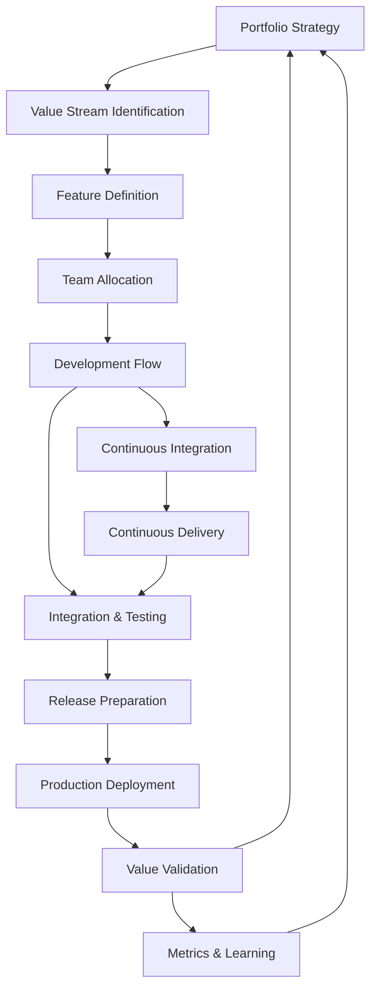

# Integrated Delivery Workflow

## Workflow Metadata
```yaml
workflow:
  id: integrated-delivery
  name: Cross-Team Integrated Value Delivery
  duration: Continuous flow
  complexity: high
  agents_involved:
    - release-train-engineer (lead)
    - portfolio-manager
    - metrics-analyst
    - agile-coach
  integrated_packs:
    - bmad-devops
    - bmad-architect
    - bmad-qa
    - bmad-product
```

## Workflow Overview



## Phase 1: Strategic Alignment

### Step 1.1: Portfolio Vision Translation
**Agent:** portfolio-manager
**Duration:** Quarterly

```markdown
Vision Breakdown:
Strategic Themes → Epics → Features → Stories

Theme: {{theme_name}}
Business Outcome: {{outcome}}
Success Metrics: {{metrics}}
Investment: ${{amount}}M

Epic Decomposition:
Epic 1: {{title}}
- Business value: {{description}}
- Features: {{count}}
- Duration: {{PIs}}

Epic 2: {{title}}
- Business value: {{description}}
- Features: {{count}}
- Duration: {{PIs}}

Validation:
□ Clear value proposition
□ Measurable outcomes
□ Feasible scope
□ Resource availability
```

### Step 1.2: Value Stream Mapping
**Agent:** portfolio-manager + release-train-engineer
**Duration:** 2 days workshop

```markdown
Current State Analysis:
Step | Activity | Time | Wait | Value
-----|----------|------|------|------
1 | Ideation | 2d | 5d | Define
2 | Approval | 1d | 10d | Decide
3 | Design | 5d | 3d | Create
4 | Development | 20d | 2d | Build
5 | Testing | 5d | 3d | Verify
6 | Deployment | 1d | 5d | Release

Total: 34d active, 28d wait
Efficiency: 55%

Future State Design:
- Parallel activities
- Automation points
- Wait reduction
- Batch size optimization

Target: 25d active, 5d wait
Efficiency: 83%
```

### Step 1.3: Capacity Planning
**Agent:** release-train-engineer
**Duration:** Before each PI

```markdown
Capacity Analysis:
Total Teams: {{count}}
Total Capacity: {{story_points}}

Allocation Strategy:
- Features: 60%
- Enablers: 20%
- Technical Debt: 10%
- Innovation: 10%

Team Assignments:
Feature 1: Teams A, B (shared)
Feature 2: Team C (dedicated)
Feature 3: Teams D, E (shared)
Enabler 1: Team F (spike)

Dependency Map:
A → B: API contract
C → D: Data model
E → External: Service
```

## Phase 2: Feature Development Flow

### Step 2.1: Feature Kickoff
**Agent:** agile-coach
**Duration:** 1/2 day per feature

```markdown
Feature Kickoff Agenda:
1. Vision & Value (30 min)
   - Business context
   - Customer impact
   - Success metrics

2. Technical Overview (45 min)
   - Architecture alignment
   - Integration points
   - Risk areas

3. Team Planning (90 min)
   - Story mapping
   - Dependency identification
   - Definition of Done
   - Communication plan

4. Commitment (15 min)
   - Team readiness
   - Support needs
   - Start criteria

Outputs:
□ Shared understanding
□ Technical approach
□ Team coordination plan
□ Risk mitigation plan
```

### Step 2.2: Cross-Team Coordination
**Agent:** release-train-engineer
**Task:** manage-sprint-coordination
**Duration:** Daily

```markdown
Coordination Mechanisms:

Daily:
- Team standups (9:00)
- Scrum of Scrums (10:00)
- Integration sync (14:00)

Weekly:
- Feature team sync
- Architecture review
- Dependency check
- Risk assessment

Integration Points:
┌────────┬────────┬─────────┬────────┐
│ Team A │ Team B │ Team C  │ Status │
├────────┼────────┼─────────┼────────┤
│ API v1 │   →    │ Consumer│ Ready  │
│ Events │   →    │ Handler │ In Dev │
│   ←    │ Config │    →    │ Blocked│
└────────┴────────┴─────────┴────────┘

Resolution Process:
1. Identify during SoS
2. Quick connect teams
3. Solution agreement
4. Update tracking
5. Monitor progress
```

### Step 2.3: Continuous Integration Flow
**Agent:** release-train-engineer + bmad-devops
**Duration:** Continuous

```markdown
CI Pipeline Stages:
Code Commit → Build → Unit Test → Integration Test → Deploy to Dev

Quality Gates:
- Code coverage >80%
- All tests passing
- No critical violations
- Performance benchmarks
- Security scan clean

Integration Schedule:
- Team branches: Continuous
- Feature branches: Daily
- Main branch: After review
- Production: Per release

Monitoring Dashboard:
Build Status: 🟢 Passing
Last Success: 12 minutes ago
Queue Depth: 3 builds
Average Time: 8 minutes

Failed Builds Today: 2
- Team A: Test failure (fixed)
- Team C: Compile error (fixing)
```

## Phase 3: System Integration

### Step 3.1: Integration Testing Strategy
**Agent:** release-train-engineer + bmad-qa
**Duration:** Throughout development

```markdown
Testing Layers:
1. Unit (Teams) - Continuous
2. Component (Team) - Daily
3. Integration (Cross-team) - Daily
4. System (End-to-end) - Weekly
5. Performance - Bi-weekly
6. Security - Weekly

Test Environment Management:
DEV: Continuous deployment
TEST: Daily refresh
STAGE: Weekly release
PROD: Planned release

Test Data Strategy:
- Synthetic data for DEV
- Anonymized prod for TEST
- Subset prod for STAGE
- Feature flags for PROD

Integration Test Suite:
- API contracts: 250 tests
- Event flows: 180 tests
- UI integration: 320 tests
- Performance: 50 scenarios
```

### Step 3.2: Progressive Delivery
**Agent:** portfolio-manager + bmad-devops
**Duration:** Per release

```markdown
Release Strategy:
1. Dark Launch
   - Code in production
   - Feature flags off
   - Monitor health

2. Internal Beta
   - Enable for employees
   - Gather feedback
   - Fix issues

3. Canary Release
   - 5% of users
   - Monitor metrics
   - Compare behavior

4. Progressive Rollout
   - 25% → 50% → 100%
   - Health checks
   - Rollback ready

5. General Availability
   - All users enabled
   - Support ready
   - Success metrics

Feature Flag Management:
Flag: {{feature_name}}
Status: 25% enabled
Health: All green
Rollback: Ready
Decision: Expand to 50%
```

### Step 3.3: System Demo Integration
**Agent:** release-train-engineer
**Duration:** Every 2 weeks

```markdown
Demo Orchestration:
Pre-Demo (Monday):
- Integration test run
- Demo path validation
- Data preparation
- Script finalization

Demo Prep (Wednesday):
- Dry run with teams
- Technical check
- Backup plans
- Speaker alignment

Demo Day (Friday):
Agenda:
1. Context setting (5 min)
2. Feature flow demo (20 min)
3. Value articulation (5 min)
4. Q&A (10 min)
5. Feedback capture (5 min)

Integration Showcase:
- User journey focus
- Cross-team handoffs
- Real data scenarios
- Business value clear
```

## Phase 4: Value Delivery & Validation

### Step 4.1: Release Coordination
**Agent:** release-train-engineer + portfolio-manager
**Duration:** Per release cycle

```markdown
Release Readiness Checklist:
Code:
□ Feature complete
□ Code reviewed
□ Tests passing
□ Performance validated
□ Security approved

Documentation:
□ Release notes
□ User guides
□ API documentation
□ Support runbooks
□ Training materials

Operations:
□ Deployment plan
□ Rollback procedure
□ Monitoring alerts
□ Support briefed
□ Communication sent

Business:
□ Stakeholder approval
□ Marketing ready
□ Support trained
□ Success metrics defined
□ Feedback channels open
```

### Step 4.2: Production Deployment
**Agent:** release-train-engineer + bmad-devops
**Duration:** Release window

```markdown
Deployment Sequence:
T-24h: Final go/no-go
T-2h: Pre-deployment checks
T-0: Deployment start

Step 1: Database updates
Step 2: Service deployment
Step 3: Configuration
Step 4: Health checks
Step 5: Smoke tests
Step 6: Monitor & verify

Rollback Triggers:
- Error rate >5%
- Response time >2s
- Key feature broken
- Data corruption
- Security issue

Post-Deployment:
□ All services healthy
□ Metrics normal
□ No critical alerts
□ Users accessing
□ Feedback positive
```

### Step 4.3: Value Measurement
**Agent:** metrics-analyst
**Task:** generate-flow-metrics
**Duration:** Continuous post-release

```markdown
Value Metrics Dashboard:

Business Metrics:
- Revenue impact: +{}
- Cost savings: ${{amount}}

Technical Metrics:
- Response time: {{ms}}
- Availability: {}
- Throughput: {{tps}}
- Resource usage: {}

Insights:
1. {{key_finding_1}}
2. {{key_finding_2}}
3. {{improvement_opportunity}}
```

## Phase 5: Continuous Improvement

### Step 5.1: Feedback Integration
**Agent:** agile-coach + portfolio-manager
**Duration:** Continuous

```markdown
Feedback Channels:
- User analytics
- Support tickets
- Direct feedback
- Social media
- Surveys

Feedback Triage:
Priority 1: Blocking issues
Priority 2: Major friction
Priority 3: Enhancements
Priority 4: Nice to have

Feedback Loop:
Capture → Analyze → Prioritize → Plan → Implement → Validate

Response SLA:
- Critical: 24 hours
- Major: 1 week
- Minor: Next PI
- Enhancement: Backlog
```

### Step 5.2: Retrospective Integration
**Agent:** agile-coach
**Duration:** After each release

```markdown
Multi-Level Retrospectives:

Team Level:
- What worked well?
- What was challenging?
- How to improve?

Feature Level:
- Integration success?
- Coordination effectiveness?
- Technical decisions?

Release Level:
- Value delivered?
- Process efficiency?
- Quality achieved?

Improvement Themes:
1. {{theme_1}}
   - Actions: {{list}}
   - Owner: {{name}}
   
2. {{theme_2}}
   - Actions: {{list}}
   - Owner: {{name}}
```

### Step 5.3: Process Evolution
**Agent:** release-train-engineer + metrics-analyst
**Duration:** Quarterly

```markdown
Process Metrics Review:
- Cycle time trends
- Quality indicators
- Team satisfaction
- Delivery predictability
- Value realization

Improvement Experiments:
Experiment 1: {{title}}
- Hypothesis: {{statement}}
- Method: {{approach}}
- Measure: {{metric}}
- Duration: {{time}}

Results Analysis:
- Data collected
- Statistical significance
- Business impact
- Team feedback
- Decision: Adopt/Adapt/Abandon

Process Updates:
□ Update workflows
□ Train teams
□ Monitor adoption
□ Measure impact
```

## Integration with Other Packs

### BMAD DevOps Integration
```markdown
Touchpoints:
- CI/CD pipeline
- Infrastructure automation
- Monitoring setup
- Security scanning
- Performance testing

Shared Responsibilities:
PMO: Process & coordination
DevOps: Technical implementation
Joint: Quality & delivery
```

### BMAD Architect Integration
```markdown
Touchpoints:
- Technical vision
- Architecture reviews
- Integration patterns
- Technology decisions
- Technical debt

Collaboration Model:
- Weekly architecture sync
- Design review gates
- Pattern library maintenance
- Technical roadmap alignment
```

### BMAD QA Integration
```markdown
Touchpoints:
- Test strategy
- Quality gates
- Test automation
- Defect management
- Performance criteria

Quality Partnership:
- Shift-left testing
- Continuous quality
- Automated validation
- Production monitoring
```

### BMAD Product Integration
```markdown
Touchpoints:
- Feature definition
- Priority alignment
- Customer feedback
- Value measurement
- Roadmap evolution

Value Stream:
Product: What to build
PMO: How to deliver
Together: Value realization
```

## Success Patterns

### Pattern 1: Value-First Thinking
```markdown
Principles:
- Start with why
- Measure outcomes
- Iterate based on learning
- Optimize whole system
- Celebrate value delivery

Implementation:
- Every feature has metrics
- Regular value reviews
- Fast feedback loops
- Pivot when needed
```

### Pattern 2: Integrated Teams
```markdown
Principles:
- Shared ownership
- Cross-functional skills
- Collective accountability
- Continuous communication
- System perspective

Implementation:
- Feature teams
- Rotating liaisons
- Shared ceremonies
- Integrated backlogs
```

### Pattern 3: Automated Everything
```markdown
Principles:
- Automate repetitive tasks
- Quality built-in
- Fast feedback
- Self-service capabilities
- Continuous improvement

Implementation:
- CI/CD pipelines
- Automated testing
- Monitoring alerts
- Deployment automation
- Metric dashboards
```

## Completion Indicators

```markdown
Integrated Delivery Maturity:
□ <2 week feature cycle time
□ <1 day production deployment
□ >99.9% availability
□ <2% defect escape rate
□ >90% customer satisfaction
□ Continuous value flow
□ Self-organizing teams
□ Data-driven decisions
□ Innovation culture
```

---

*Integrated delivery transforms individual team outputs into customer value through seamless coordination and continuous flow*