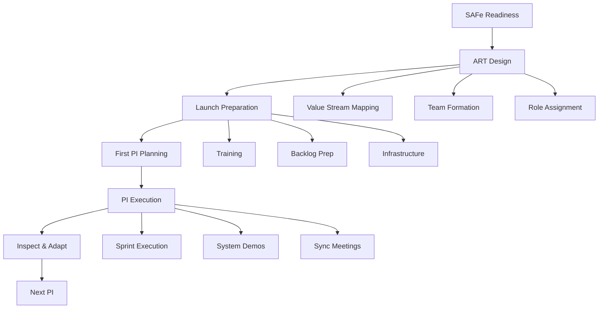

# SAFe Implementation Workflow

## Workflow Metadata
```yaml
workflow:
  id: safe-implementation
  name: Essential SAFe Implementation Journey
  duration: 3-6 months for first ART
  complexity: high
  agents_involved:
    - release-train-engineer (lead)
    - agile-coach
    - portfolio-manager
    - metrics-analyst
```

## Workflow Overview



## Phase 1: SAFe Readiness Assessment (Weeks 1-2)

### Step 1.1: Leadership Preparation
**Agent:** agile-coach
**Duration:** 3 days

```markdown
Activities:
1. SAFe overview for executives
2. Implementation approach discussion
3. Investment requirements
4. Success criteria alignment
5. Sponsor commitment

Deliverables:
- Leadership commitment document
- Budget approval
- Timeline agreement
- Communication plan
```

### Step 1.2: Organizational Readiness
**Agent:** release-train-engineer + agile-coach
**Duration:** 1 week

```markdown
Assessment Areas:
□ Current agile maturity
□ Technical practices
□ Organizational structure
□ Change capacity
□ Tool landscape

Readiness Checklist:
□ Some teams using Scrum
□ Leadership support strong
□ Budget allocated
□ Change agents identified
□ Basic CI/CD exists
```

### Step 1.3: Implementation Strategy
**Agent:** portfolio-manager
**Duration:** 2 days

```markdown
Strategy Decision:
□ Essential SAFe (recommended start)
□ Single ART pilot
□ 50-125 people scope
□ Clear value stream
□ Defined boundaries

Success Metrics:
- PI Predictability
- Time to Market
- Quality improvements
- Employee engagement
- Business value delivery
```

## Phase 2: ART Design (Weeks 3-4)

### Step 2.1: Value Stream Workshop
**Agent:** portfolio-manager + release-train-engineer
**Duration:** 2 days

```markdown
Workshop Agenda:
Day 1:
- Current state mapping
- Identify delays/waste
- Define boundaries
- Calculate metrics

Day 2:
- Future state design
- Team topology
- Dependency mapping
- Implementation plan

Outputs:
- Value stream definition
- ART boundary
- Team structure proposal
- Dependency matrix
```

### Step 2.2: Team Formation
**Agent:** release-train-engineer
**Duration:** 3 days

```markdown
Team Design Principles:
- 5-11 people per team
- Cross-functional
- Long-lived
- Self-organizing
- Clear mission

Team Formation:
Team 1: {{name}} - {{mission}}
Team 2: {{name}} - {{mission}}
Team 3: {{name}} - {{mission}}
Team 4: {{name}} - {{mission}}
Team 5: {{name}} - {{mission}}

Validation:
□ All skills covered
□ Dependencies minimized
□ Clear boundaries
□ Balanced capacity
```

### Step 2.3: Role Identification
**Agent:** release-train-engineer
**Duration:** 2 days

```markdown
Critical Roles:
Release Train Engineer: {{name}}
- SAFe RTE certified
- Servant leader
- Available full-time

Product Management: {{name}}
- Product vision owner
- Prioritization authority
- Customer connection

System Architect: {{name}}
- Technical vision
- Architecture decisions
- Enabler prioritization

Business Owners: {{names}}
- PI objective approval
- Business value assignment
- Impediment escalation

Scrum Masters: {{names}}
- One per team
- SAFe SM trained
- Coaching mindset
```

## Phase 3: Launch Preparation (Weeks 5-8)

### Step 3.1: Training Execution
**Agent:** agile-coach
**Task:** implement-safe-practices
**Duration:** 2 weeks

```markdown
Training Schedule:
Week 1:
- Leading SAFe (executives)
- SAFe RTE (RTE)
- SAFe Product Manager (PM)

Week 2:
- SAFe for Teams (all members)
- SAFe Scrum Master (SMs)
- SAFe DevOps (optional)

Training Logistics:
- Certified instructors
- In-person preferred
- Practical exercises
- Real examples
- Certification included
```

### Step 3.2: Program Backlog Preparation
**Agent:** portfolio-manager
**Duration:** 2 weeks

```markdown
Backlog Building:
Week 1:
- Feature identification
- Business value assignment
- Rough sizing (T-shirt)
- Dependency identification

Week 2:
- Feature refinement
- Acceptance criteria
- WSJF prioritization
- PI allocation planning

Target State:
- 10-15 features ready
- Clear value statements
- Dependencies mapped
- Enablers identified
- Risks documented
```

### Step 3.3: Infrastructure Setup
**Agent:** release-train-engineer
**Duration:** 1 week (parallel)

```markdown
Technical Infrastructure:
□ ALM tool configured
□ Team boards created
□ Program board ready
□ CI/CD pipeline base
□ Communication tools

Process Infrastructure:
□ Calendar scheduled
□ Meeting rooms booked
□ Facilitators assigned
□ Templates prepared
□ Supplies ordered

Virtual Setup (if needed):
□ Video platform tested
□ Breakout rooms configured
□ Collaboration boards ready
□ Recording capability
□ Backup plans
```

## Phase 4: First PI Planning (Week 9)

### Step 4.1: Pre-Planning Preparation
**Agent:** release-train-engineer
**Task:** conduct-pi-planning
**Duration:** 3 days before event

```markdown
Final Preparations:
Day -3:
- Management review
- Feature finalization
- Capacity confirmation

Day -2:
- Facilitator sync
- Tech check
- Material distribution

Day -1:
- Room setup
- Board preparation
- Welcome packets

Readiness Checklist:
□ All attendees confirmed
□ Business context ready
□ Architecture vision prepared
□ Teams know capacity
□ Success criteria clear
```

### Step 4.2: PI Planning Day 1
**Agent:** release-train-engineer
**Duration:** Day 1 of 2

```markdown
Day 1 Agenda:
8:00 - Opening & context
9:00 - Product vision
10:00 - Architecture vision
10:45 - Planning context
11:30 - Team breakouts begin
12:30 - Lunch
13:30 - Team planning continues
16:00 - Draft plan review
17:00 - Management review

Facilitation Keys:
- Energy management
- Time box enforcement
- Visible information
- Continuous circulation
- Issue resolution
```

### Step 4.3: PI Planning Day 2
**Agent:** release-train-engineer
**Duration:** Day 2 of 2

```markdown
Day 2 Agenda:
8:00 - Planning adjustments
10:00 - Team breakouts final
11:00 - Team presentations
12:00 - Lunch
13:00 - Final presentations
14:00 - Confidence vote
14:30 - PI risk (ROAM)
15:30 - Retrospective
16:00 - Close

Success Indicators:
□ All teams committed
□ Dependencies resolved
□ Risks identified
□ >75% confidence
□ Clear next steps
```

## Phase 5: PI Execution (Weeks 10-21)

### Step 5.1: Sprint Execution Cadence
**Agent:** release-train-engineer
**Task:** manage-sprint-coordination
**Duration:** 12 weeks (6 sprints)

```markdown
Sprint Rhythm:
Every Sprint:
- Team ceremonies
- Scrum of Scrums
- PO sync
- Architecture sync

Mid-Sprint:
- Dependency check
- Risk review
- Impediment resolution

End-Sprint:
- Team demos
- Retrospectives
- Metrics update

Support Model:
Week 1-2: Daily presence
Week 3-4: 3x per week
Week 5+: 2x per week
```

### Step 5.2: System Demo Preparation
**Agent:** release-train-engineer
**Duration:** Every 2 weeks

```markdown
Demo Coordination:
Week 1:
- Identify integrated stories
- Assign demo owners
- Environment prep

Week 2:
- Script development
- Practice runs
- Stakeholder invites

Demo Day:
- Integrated demonstration
- Business value focus
- Feedback capture
- Next steps

Success Pattern:
- Show real integration
- Business language
- Customer perspective
- Celebrate success
```

### Step 5.3: Progress Tracking
**Agent:** metrics-analyst
**Task:** generate-flow-metrics
**Task:** track-program-risks
**Duration:** Continuous

```markdown
Weekly Metrics:
- Feature progress
- Sprint burndown
- Dependency status
- Risk movement
- Team health

Tracking Tools:
- Program board
- Digital dashboards
- Risk ROAM board
- Impediment list
- Confidence trends

Communication:
- Weekly newsletter
- Stakeholder updates
- Team summaries
- Executive briefings
```

## Phase 6: Inspect & Adapt (Week 22)

### Step 6.1: I&A Preparation
**Agent:** release-train-engineer + metrics-analyst
**Duration:** 1 week before

```markdown
Data Collection:
- PI objectives achievement
- Velocity trends
- Quality metrics
- Cycle time analysis
- Team satisfaction

Preparation Tasks:
- Schedule participants
- Prepare metrics
- Plan facilitation
- Set improvement focus
- Communicate agenda
```

### Step 6.2: I&A Workshop
**Agent:** release-train-engineer + agile-coach
**Duration:** 3-4 hours

```markdown
Workshop Flow:
Part 1: PI System Demo (45 min)
- Integrated achievements
- Business value delivered
- Customer feedback

Part 2: Metrics Review (45 min)
- Predictability measure
- Flow metrics
- Quality indicators
- Team health

Part 3: Problem Solving (90 min)
- Identify problems
- Root cause analysis
- Improvement actions
- Owner assignment

Part 4: Wrap-up (30 min)
- Action commitment
- Communication plan
- Next PI preview
```

### Step 6.3: PI Improvement Actions
**Agent:** agile-coach
**Duration:** Between PIs

```markdown
Typical Improvements:
Process:
- Meeting efficiency
- Dependency handling
- Risk management
- Communication flow

Technical:
- Build times
- Test automation
- Architecture evolution
- Tool optimization

Cultural:
- Team collaboration
- Leadership support
- Innovation time
- Learning culture

Implementation:
- Quick wins first
- Measure impact
- Adjust if needed
- Share learnings
```

## Phase 7: Subsequent PIs (Ongoing)

### Step 7.1: Continuous Refinement
**Agent:** release-train-engineer
**Duration:** Each PI

```markdown
PI-over-PI Improvements:
PI 2:
- Smoother planning
- Better estimation
- Clearer dependencies

PI 3:
- Predictability improving
- Innovation increasing
- Quality focus

PI 4+:
- Mature practices
- Self-organization
- Continuous flow

Maturity Indicators:
□ Planning <1.5 days
□ Confidence >80%
□ Predictability >80%
□ Low ceremony overhead
□ High innovation
```

### Step 7.2: Scaling Considerations
**Agent:** portfolio-manager
**Duration:** After PI 3

```markdown
Scaling Options:
Option 1: Add teams to ART
- When: Clear value stream expansion
- How: Gradual addition
- Risk: Coordination complexity

Option 2: Launch second ART
- When: New value stream
- How: Apply learnings
- Risk: Resource split

Option 3: Solution Train
- When: Multiple ARTs coordinate
- How: Additional layer
- Risk: Overhead increase

Decision Criteria:
- Business need
- Current success
- Available coaches
- Leadership bandwidth
```

## Integration Points

### With Other Workflows
- **Agile Transformation:** Overall context
- **PI Execution:** Operational details
- **Integrated Delivery:** Cross-team coordination

### With Tasks
- **conduct-pi-planning:** Every PI
- **manage-sprint-coordination:** Daily execution
- **track-program-risks:** Continuous ROAM
- **generate-flow-metrics:** Performance tracking

## Success Patterns

### Pattern 1: Strong RTE Leadership
```markdown
Elements:
- Full-time dedication
- Servant leadership
- Quick decisions
- Visible presence
- Team advocate

Impact:
- Smooth coordination
- Fast impediment resolution
- High team morale
- Effective ceremonies
```

### Pattern 2: Business Engagement
```markdown
Elements:
- Active business owners
- Clear value definition
- Regular participation
- Quick decisions
- Celebrate successes

Impact:
- Clear priorities
- Fast pivots
- High motivation
- Business alignment
```

### Pattern 3: Technical Excellence
```markdown
Elements:
- Strong architecture
- CI/CD investment
- Quality practices
- Automation focus
- Continuous refactoring

Impact:
- Predictable delivery
- Low defects
- Fast feedback
- Sustainable pace
```

## Common Pitfalls & Mitigations

1. **Partial Commitment**
   - Sign: Part-time roles, missing ceremonies
   - Mitigation: Leadership reinforcement, clear expectations

2. **Tool Over Process**
   - Sign: Tool configuration delays, process gaps
   - Mitigation: Process first, minimal tooling

3. **Waterfall Thinking**
   - Sign: Big batches, phase gates
   - Mitigation: Continuous coaching, small batches

4. **Local Optimization**
   - Sign: Team success, system failure
   - Mitigation: System demos, integration focus

## Completion Criteria

```markdown
Successful SAFe Implementation:
□ Regular PI cadence established
□ Predictability >70%
□ Shorter cycle times
□ Higher quality
□ Engaged teams
□ Business value flowing
□ Continuous improvement culture
□ Self-sustaining practices
```

---

*SAFe provides the framework; success comes from disciplined execution and continuous improvement*