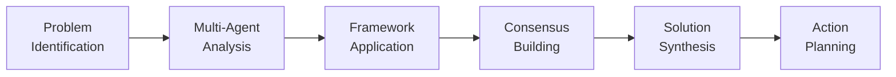
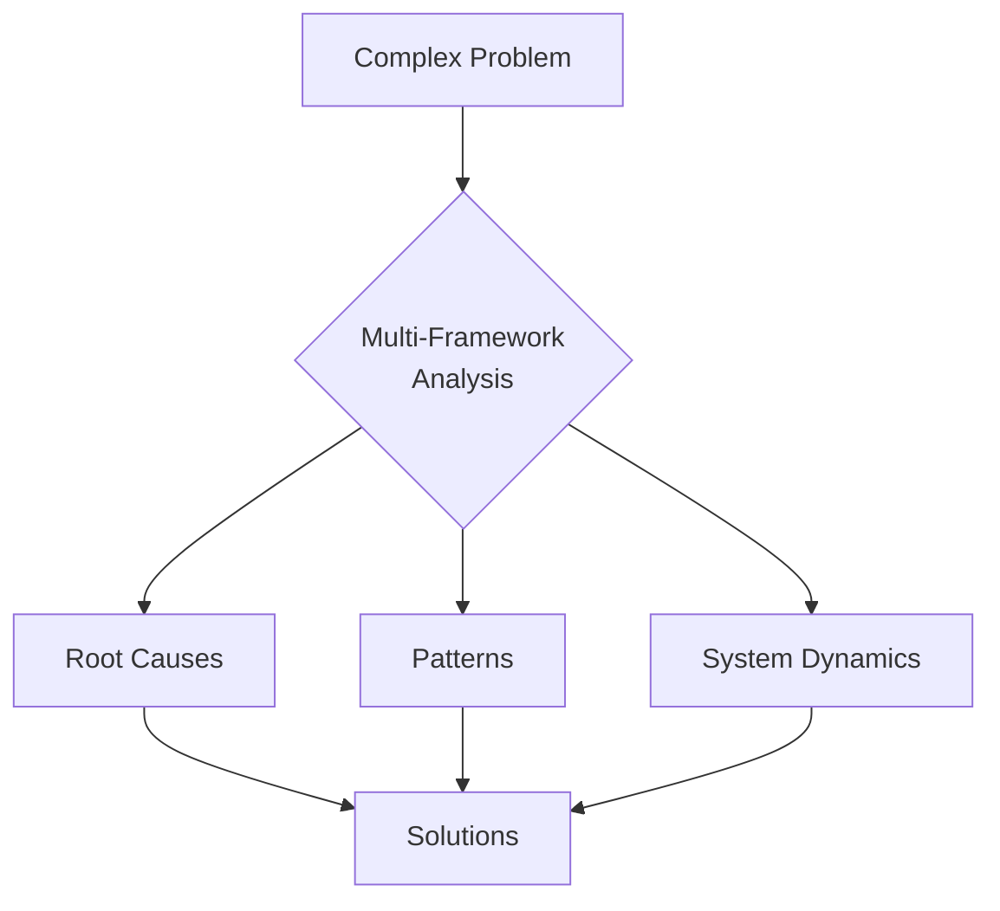

# Problem Solver Pack Structure Guide

## 🧠 Overview

The Problem Solver expansion pack transforms your AI agents into expert problem-solving consultants who use mental models, systems thinking, and visual frameworks to tackle complex business and operational challenges.

## 🎯 Core Philosophy

**"Make the complex simple, the invisible visible, and the impossible possible."**

Our approach:
1. **Decompose** - Break big problems into manageable pieces
2. **Analyze** - Apply multiple mental models and frameworks  
3. **Visualize** - Use diagrams and visuals for clarity
4. **Synthesize** - Build consensus among diverse perspectives
5. **Solve** - Generate actionable solutions with clear next steps

## 👥 Agent Team

### 1. Systems Thinking Expert (Dr. Sarah Chen)
- Sees interconnections and feedback loops
- Maps complex systems and dependencies
- Identifies leverage points for maximum impact

### 2. First Principles Thinker (Marcus Reid)
- Breaks problems down to fundamental truths
- Questions all assumptions
- Rebuilds solutions from the ground up

### 3. Critical Thinking Analyst (Dr. Angela Foster)
- Identifies logical fallacies and biases
- Validates reasoning and evidence
- Ensures rigorous analysis

### 4. Creative Problem Solver (Jordan Park)
- Generates innovative solutions
- Applies lateral thinking techniques
- Combines ideas in novel ways

### 5. Root Cause Analyst (Kenji Tanaka)
- Digs deep to find true causes
- Prevents symptom-focused solutions
- Uses structured investigation methods

## 🔧 Problem-Solving Process



## 📊 Visualization Standards

### Mermaid Diagrams


### ASCII Art
```
┌─────────────────────────────────┐
│        PROBLEM SPACE            │
├─────────────┬───────────────────┤
│   SYMPTOMS  │   ROOT CAUSES     │
├─────────────┼───────────────────┤
│ • Visible   │ • Hidden factors  │
│ • Immediate │ • Systemic issues │
│ • Surface   │ • Deep patterns   │
└─────────────┴───────────────────┘
```

### Decision Matrices
| Solution | Impact | Effort | Risk | Score |
|----------|--------|--------|------|-------|
| Option A | High   | Medium | Low  | 8.5   |
| Option B | Medium | Low    | Low  | 7.0   |
| Option C | High   | High   | Med  | 6.5   |

## 🎯 Key Features

### 1. Adaptive Complexity
- **Auto-detects** user expertise level
- **Adjusts** explanations accordingly
- **Provides** appropriate detail depth

### 2. Visual-First Approach
- Every analysis includes diagrams
- Complex concepts made visual
- Multiple representation styles

### 3. Consensus Building
- Agents debate perspectives
- Structured conflict resolution
- Unified recommendations

### 4. Pattern Library
- Recognizes similar problems
- Suggests proven solutions
- Learns from each case

### 5. Assumption Tracking
- Documents all assumptions
- Tests validity
- Updates based on evidence

## 📁 Directory Structure

```
bmad-problem-solver/
├── agents/                 # 5 specialist problem solvers
│   ├── systems-thinker.md
│   ├── first-principles.md
│   ├── critical-analyst.md
│   ├── creative-solver.md
│   └── root-cause-analyst.md
├── frameworks/            # Mental models and methods
│   ├── classic/          # Proven frameworks
│   └── modern/           # Contemporary approaches
├── tasks/                # Interactive workflows
│   ├── problem-analysis.md
│   ├── solution-generation.md
│   └── decision-making.md
├── templates/            # Output formats
│   ├── problem-analysis-report.md
│   ├── solution-comparison.md
│   └── action-plan.md
├── workflows/            # Multi-agent processes
│   └── consensus-problem-solving.md
└── data/                # Pattern library
    ├── problem-patterns.json
    └── assumption-tracker.json
```

## 🚀 Quick Start Examples

### Business Problem
```
User: "Our customer acquisition cost is too high"

System: Initiating consensus-based problem analysis...

[Agents collaborate using MERMAID diagrams, frameworks, and structured analysis to identify root causes and solutions]
```

### Strategic Decision
```
User: "Should we expand internationally or focus on our home market?"

System: Applying decision frameworks with visual analysis...

[Multi-framework evaluation with clear visualizations and trade-off analysis]
```

## 🔗 Integration Points

- **Strategy Consulting**: Strategic problem framing
- **Product Manager**: Product-related challenges
- **Startup Advisor**: Growth and scaling issues
- **PMO Agile**: Operational improvements

## 📈 Success Metrics

- Problem clarity improvement: 85%+
- Solution effectiveness: 75%+
- Implementation success: 70%+
- User understanding: 90%+
- Time to insight: <30 minutes

## 🎓 Mental Models Included

### Classic Models
- First Principles Thinking
- Systems Thinking
- Occam's Razor
- Inversion
- Second-Order Thinking

### Business Models
- Porter's Five Forces
- Value Chain Analysis
- Jobs-to-be-Done
- Blue Ocean Strategy
- Disruption Theory

### Decision Models
- Expected Value
- Opportunity Cost
- Sunk Cost Recognition
- Risk/Reward Analysis
- Game Theory Basics

## 🏁 Getting Started

1. **Describe your problem** in plain language
2. **Let agents analyze** using multiple frameworks
3. **Review visualizations** for understanding
4. **Evaluate solutions** with clear criteria
5. **Execute action plan** with confidence

---

*"In the middle of difficulty lies opportunity." - Albert Einstein*

The Problem Solver pack turns complex challenges into structured opportunities for improvement.