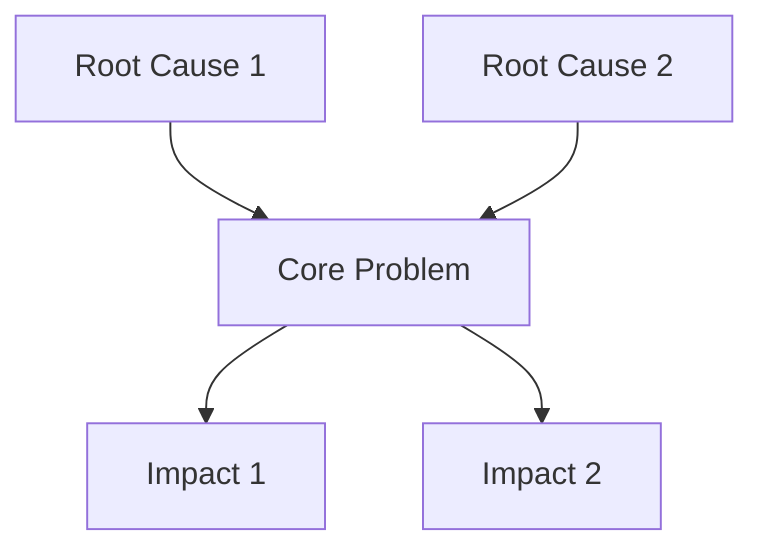
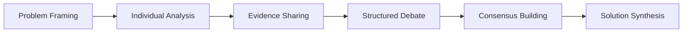

# BMAD Problem Solver Pack

[](https://github.com/your-org/BMAD-METHOD)
[](LICENSE)
[](https://github.com/your-org/BMAD-METHOD)

> **Systematic problem-solving through multi-agent collaboration, visual frameworks, and evidence-based analysis.**

## 🎯 Overview

The Problem Solver expansion pack provides comprehensive problem-solving capabilities for the BMAD-METHOD framework. It combines five specialist AI agents, proven frameworks, and collaborative workflows to tackle complex business and operational challenges.

### Key Features

- **Multi-Agent Analysis** - Five specialized problem-solving perspectives working in consensus
- **Framework Library** - Classic and modern problem-solving methodologies
- **Visual Thinking** - Mermaid diagrams, ASCII art, and structured visualizations
- **Pattern Recognition** - Library of 25+ common business problem patterns
- **Adaptive Complexity** - Automatically adjusts to user expertise level
- **Evidence-Based** - Rigorous validation and assumption tracking

## 🚀 Quick Start

### Installation

```bash
# Clone the BMAD-METHOD repository
git clone https://github.com/your-org/BMAD-METHOD.git
cd BMAD-METHOD/expansion-packs/bmad-problem-solver

# Verify installation
ls -la agents/ frameworks/ tasks/
```

### Basic Usage

```yaml
# Activate specialist agents
@systems-thinker "Map the feedback loops in our customer retention system"
@root-cause-analyst "Why do our deployments keep failing?"
@creative-solver "Generate alternatives to our current pricing model"

# Run comprehensive analysis
/analyze "Customer churn rate increased 25% over last quarter"

# Decision support
/decide "Choose between cloud providers: AWS, Azure, or GCP"
```

### Interactive Tasks

```bash
# Comprehensive multi-agent problem analysis
task: comprehensive-problem-analysis

# Multi-criteria decision analysis
task: decision-analysis-matrix

# Structured consensus building
workflow: consensus-problem-solving
```

## 👥 Expert Team

### 🔬 Dr. Sarah Chen - Systems Thinking Expert
**Specialty**: Complex system dynamics and leverage points
- Maps interconnections and feedback loops
- Identifies system leverage points for maximum impact
- Analyzes unintended consequences and delays
- **Commands**: `/map-system`, `/find-loops`, `/leverage-points`

### 🎯 Marcus Reid - First Principles Thinker
**Specialty**: Assumption-free problem reconstruction
- Questions all assumptions systematically
- Breaks problems down to fundamental truths
- Rebuilds solutions from ground-up reasoning
- **Commands**: `/breakdown`, `/fundamentals`, `/reconstruct`

### 🧠 Dr. Angela Foster - Critical Thinking Analyst
**Specialty**: Logic validation and bias detection
- Identifies cognitive biases and logical fallacies
- Validates evidence quality and reasoning
- Ensures analytical rigor and objectivity
- **Commands**: `/analyze`, `/validate`, `/biases`, `/fallacies`

### 💡 Jordan Park - Creative Problem Solver
**Specialty**: Innovation and breakthrough thinking
- Generates creative alternatives using SCAMPER and TRIZ
- Applies lateral thinking and analogical reasoning
- Combines disparate concepts for novel solutions
- **Commands**: `/reframe`, `/generate`, `/combine`, `/patterns`

### 🔍 Kenji Tanaka - Root Cause Analyst
**Specialty**: True source identification and prevention
- Conducts systematic root cause investigations
- Uses 5 Whys, Fishbone, and fault tree analysis
- Designs prevention strategies to eliminate recurrence
- **Commands**: `/investigate`, `/fishbone`, `/timeline`, `/prevention`

## 🛠️ Frameworks

### Classic Methodologies
- **[5 Whys](frameworks/classic/5-whys.md)** - Iterative root cause analysis
- **[Fishbone Diagram](frameworks/classic/fishbone-ishikawa.md)** - Cause-and-effect mapping
- **[SWOT Analysis](frameworks/classic/swot-analysis.md)** - Strategic position assessment
- **[Force Field Analysis](frameworks/classic/force-field-analysis.md)** - Change management tool
- **[Pareto Analysis](frameworks/classic/pareto-analysis.md)** - 80/20 prioritization

### Modern Approaches
- **[Design Thinking](frameworks/modern/design-thinking.md)** - Human-centered problem solving
- **[Jobs-to-be-Done](frameworks/modern/jobs-to-be-done.md)** - Customer motivation analysis
- **[Cynefin Framework](frameworks/modern/cynefin-framework.md)** - Complexity assessment
- **[OODA Loop](frameworks/modern/ooda-loop.md)** - Rapid decision cycles
- **[Blue Ocean Strategy](frameworks/modern/blue-ocean-strategy.md)** - Market creation

## 📊 Problem Pattern Library

Our comprehensive library includes patterns across key business domains:

### Operational Patterns
- Process Bottleneck
- Quality-Speed Trade-off
- Resource Allocation
- Workflow Inefficiency

### Strategic Patterns
- Analysis Paralysis
- Market Positioning
- Competitive Response
- Innovation Stagnation

### Organizational Patterns
- Communication Silos
- Change Resistance
- Culture Misalignment
- Leadership Gap

### Technical Patterns
- Technical Debt
- Scalability Issues
- Integration Complexity
- Security Vulnerabilities

### Financial Patterns
- Cash Flow Crisis
- Cost Management
- Revenue Plateau
- Investment ROI

Each pattern includes:
- Common symptoms and causes
- Proven solution approaches
- Applicable frameworks
- Success metrics
- Real-world case studies

## 🎨 Visual Problem Solving

### System Maps


### Decision Matrices
```
┌─────────────────┬─────────┬─────────┬─────────┐
│ Criteria        │ Option A│ Option B│ Option C│
├─────────────────┼─────────┼─────────┼─────────┤
│ Cost (30%)      │   8.5   │   7.0   │   6.5   │
│ Speed (25%)     │   6.0   │   9.0   │   7.5   │
│ Quality (25%)   │   9.0   │   6.5   │   8.0   │
│ Risk (20%)      │   7.5   │   8.0   │   9.0   │
├─────────────────┼─────────┼─────────┼─────────┤
│ TOTAL SCORE     │   7.6   │   7.4   │   7.4   │
└─────────────────┴─────────┴─────────┴─────────┘
```

### Process Flow
```
Problem Definition → Multi-Agent Analysis → Evidence Validation
       ↓                                           ↓
Action Planning ← Solution Synthesis ← Consensus Building
```

## 📋 Key Workflows

### Comprehensive Problem Analysis
**Duration**: 90-120 minutes  
**Output**: Detailed problem analysis report

1. Problem definition and scoping
2. Multi-agent perspective gathering
3. Evidence sharing and validation
4. Consensus building on root causes
5. Solution pathway development
6. Action planning and next steps

### Decision Analysis Matrix
**Duration**: 60-90 minutes  
**Output**: Decision recommendation report

1. Decision framing and criteria definition
2. Option generation and evaluation
3. Multi-criteria scoring and weighting
4. Sensitivity analysis and validation
5. Stakeholder impact assessment
6. Final recommendation with rationale

### Consensus Building Process


## 🔗 Integration Ecosystem

### Supported Integrations
- **Strategy Consulting** - Strategic problem diagnosis and validation
- **Product Management** - Feature prioritization and user feedback analysis
- **Market Research** - Research methodology validation and insight synthesis
- **PMO Agile** - Process improvement and team performance analysis
- **Startup Advisor** - Growth challenges and scaling solutions

### Integration Patterns
- **Advisory** - Problem Solver provides analysis, domain pack implements
- **Collaborative** - Joint problem-solving with shared ownership
- **Sequential** - Analysis phase followed by domain-specific execution
- **Validation** - Domain solutions validated through analytical frameworks

## 📈 Success Metrics

### Process Quality
- **Problem Clarity** - 85%+ improvement in problem understanding
- **Solution Effectiveness** - 75%+ implementation success rate
- **Stakeholder Alignment** - 90%+ consensus on key decisions
- **Time to Insight** - <30 minutes for initial analysis

### Business Impact
- **Decision Quality** - Improved outcomes through systematic analysis
- **Risk Mitigation** - Proactive identification and management
- **Implementation Speed** - Faster execution through clear action plans
- **Learning Capture** - Reusable insights for similar problems

## 🏗️ Architecture

```
bmad-problem-solver/
├── agents/              # Specialist problem-solving agents
├── frameworks/          # Mental models and methodologies
│   ├── classic/        # Proven traditional frameworks
│   └── modern/         # Contemporary approaches
├── tasks/              # Interactive problem-solving workflows
├── templates/          # Professional output formats
├── workflows/          # Multi-agent collaboration processes
├── data/               # Pattern library and knowledge base
├── config.yaml         # Pack configuration and metadata
└── INTEGRATION_GUIDE.md # Cross-pack integration documentation
```

## 🔧 Configuration

```yaml
# config.yaml
name: bmad-problem-solver
version: 1.1.0
description: Comprehensive problem-solving with multi-agent collaboration

capabilities:
  - problem_decomposition
  - root_cause_analysis
  - systems_thinking
  - decision_making
  - visual_thinking
  - pattern_recognition
  - assumption_testing

visualization_styles:
  - mermaid: flowcharts, mind maps, sequence diagrams
  - ascii_art: box diagrams, trees, matrices
  - markdown_tables: comparison matrices, decision grids
```

## 📚 Documentation

### Core Documentation
- [Framework Library](frameworks/)
- [Agent Specifications](agents/)
- [Task Workflows](tasks/)
- [Integration Guide](INTEGRATION_GUIDE.md)

### Technical References
- [Problem Pattern Library](data/problem-patterns.json)
- [Assumption Tracker Schema](data/assumption-tracker.json)
- [Template Specifications](templates/)

## 🤝 Contributing

We welcome contributions to improve the Problem Solver pack:

### Areas for Contribution
- **Problem Patterns** - Identify new recurring business problem types
- **Framework Enhancements** - Improve existing methodologies
- **Integration Examples** - Share successful cross-pack collaborations
- **Visualization Tools** - Develop new representation methods
- **Case Studies** - Document real-world successes

### Contribution Process
1. Fork the repository
2. Create a feature branch (`git checkout -b feature/new-pattern`)
3. Make your changes with tests and documentation
4. Submit a pull request with detailed description

## 📄 License

This project is licensed under the MIT License - see the [LICENSE](LICENSE) file for details.

## 🆘 Support

### Getting Help
- **Documentation** - Check framework guides and integration docs
- **Issues** - Report bugs or request features via GitHub Issues
- **Discussions** - Join community discussions for best practices
- **Examples** - Review case studies and integration examples

### Community Resources
- [GitHub Discussions](https://github.com/your-org/BMAD-METHOD/discussions)
- [Documentation Wiki](https://github.com/your-org/BMAD-METHOD/wiki)
- [Issue Tracker](https://github.com/your-org/BMAD-METHOD/issues)

## 🗺️ Roadmap

### Version 1.2 (Q2 2024)
- [ ] Advanced pattern matching algorithms
- [ ] Real-time collaboration features
- [ ] Enhanced visualization capabilities
- [ ] Mobile-responsive interfaces

### Version 1.3 (Q4 2024)
- [ ] Machine learning-powered pattern recognition
- [ ] Automated assumption validation
- [ ] Integration with external data sources
- [ ] Multi-language framework support

---

**Built for BMAD-METHOD** • **Designed for systematic problem solving** • **Optimized for collaborative intelligence**

*Transform your most complex challenges into clear pathways forward.*