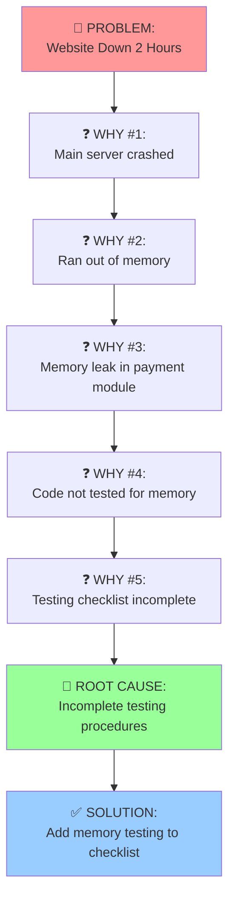

# 5 Whys Framework

## Overview
The 5 Whys is a simple yet powerful root cause analysis technique developed by Sakichi Toyoda and used extensively in Toyota's lean manufacturing. By asking "Why?" five times consecutively, you drill down from symptoms to root causes.

## When to Use
- Recurring problems that need permanent solutions
- Simple to moderately complex issues
- When you need quick root cause identification
- Problems with human or process factors

## Process Steps

### 1. Define the Problem Clearly
Write a specific, factual problem statement:
- ❌ "Sales are bad"
- ✅ "Monthly sales dropped 25% from $100k to $75k in Q3"

### 2. Ask Why #1
Why did this problem occur?
- Look for immediate, direct causes
- Avoid assumptions - stick to facts
- Document the answer clearly

### 3. Ask Why #2-5
For each answer, ask "Why?" again:
- Each "why" should dig deeper
- Stop when you reach a root cause you can control
- Sometimes you need fewer than 5, sometimes more

### 4. Validate the Root Cause
Test by asking: "If we fix this root cause, will the problem disappear?"

## Visual Template

```
🎯 PROBLEM: [State the specific problem]

1️⃣ WHY #1: Why did [problem] happen?
   → [Immediate cause]

2️⃣ WHY #2: Why did [immediate cause] happen?
   → [Secondary cause]

3️⃣ WHY #3: Why did [secondary cause] happen?
   → [Deeper cause]

4️⃣ WHY #4: Why did [deeper cause] happen?
   → [Root cause area]

5️⃣ WHY #5: Why did [root cause area] happen?
   → [TRUE ROOT CAUSE]

🎯 ROOT CAUSE: [Final root cause that can be acted upon]

✅ SOLUTION: [Action to address root cause]
```

## Example Application

**Problem:** Website went down for 2 hours yesterday

```
1️⃣ WHY #1: Why did the website go down?
   → The main server crashed

2️⃣ WHY #2: Why did the main server crash?
   → It ran out of memory

3️⃣ WHY #3: Why did it run out of memory?
   → A memory leak in the new payment module

4️⃣ WHY #4: Why was there a memory leak?
   → The code wasn't properly tested for memory usage

5️⃣ WHY #5: Why wasn't it tested for memory usage?
   → Our testing checklist doesn't include memory leak testing

🎯 ROOT CAUSE: Incomplete testing procedures
✅ SOLUTION: Add memory leak testing to deployment checklist
```

## Best Practices

### ✅ Do:
- Ask "why" for each level, not "who"
- Focus on process failures, not people failures
- Use facts and data, not opinions
- Validate your final root cause
- Create actionable solutions

### ❌ Don't:
- Stop at the first comfortable answer
- Blame individuals
- Make assumptions without evidence
- Skip validation of the root cause
- Create complex solutions for simple problems

## Common Pitfalls

### 1. **Stopping Too Early**
```
❌ Problem: Customer complaint
    Why? Customer was angry
    Solution: Train customer service to be nicer

✅ Problem: Customer complaint  
    Why? Order was delayed
    Why? Warehouse was understaffed
    Why? Two people called in sick
    Why? No backup staffing plan
    Solution: Create staffing contingency procedures
```

### 2. **Multiple Root Causes**
Sometimes you'll find multiple causal chains:
```
Problem: High customer churn

Branch A: Product issues → Feature gaps → Poor roadmap
Branch B: Service issues → Long response → Understaffed support

Solution: Address both branches independently
```

### 3. **Focusing on People vs. Process**
```
❌ "Why? John made a mistake"
✅ "Why? The process allowed mistakes to go undetected"
```

## Integration with Other Frameworks

### Combines Well With:
- **Fishbone Diagram**: Use 5 Whys on each branch
- **Pareto Analysis**: Focus 5 Whys on top 20% of causes
- **Timeline Analysis**: Apply 5 Whys to key events
- **Root Cause Analysis**: As the primary investigation tool

### When to Use Alternatives:
- **Complex Systems**: Use Systems Thinking
- **Multiple Variables**: Use Fishbone Diagram first
- **Technical Failures**: Use Fault Tree Analysis
- **Statistical Problems**: Use Statistical Process Control

## Mermaid Visualization



## Quick Reference Card

| Step | Question | Focus |
|------|----------|-------|
| 1 | What happened? | Define problem clearly |
| 2 | Why did it happen? | Immediate cause |
| 3 | Why did that happen? | Secondary cause |
| 4 | Why did that happen? | Deeper cause |
| 5 | Why did that happen? | Process/system cause |
| 6 | Why did that happen? | Root organizational cause |

**Remember**: Stop when you reach a cause you can take action on!

## Success Metrics
- ✅ Root cause addresses the problem permanently
- ✅ Solution prevents recurrence
- ✅ Each "why" logically follows from the previous
- ✅ Final cause is within your control to fix
- ✅ Validation confirms the causal chain

---

*"Ask 'why' five times about every matter." - Sakichi Toyoda*