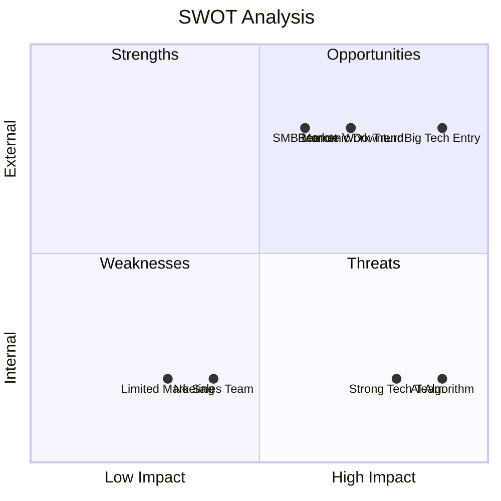

# SWOT Analysis Framework

## Overview
SWOT Analysis (Strengths, Weaknesses, Opportunities, Threats) is a strategic planning framework for evaluating internal and external factors affecting an organization, project, or decision. Developed by Albert Humphrey at Stanford in the 1960s, it provides a structured way to assess current position and future potential.

## When to Use
- Strategic planning and decision-making
- New market entry evaluation
- Competitive analysis
- Project risk assessment
- Business model evaluation
- Investment decisions
- Product launch planning

## The SWOT Matrix

```
                INTERNAL FACTORS        |        EXTERNAL FACTORS
                                       |
    POSITIVE    STRENGTHS              |        OPPORTUNITIES
    FACTORS     • What you do well     |        • External possibilities
                • Competitive advantages|        • Market trends
                • Unique resources     |        • Regulatory changes
                • Core competencies    |        • Technology advances
                                       |
    ────────────────────────────────────┼──────────────────────────────
                                       |
    NEGATIVE    WEAKNESSES             |        THREATS
    FACTORS     • Areas for improvement|        • External challenges
                • Resource limitations |        • Competitive pressures
                • Skill gaps           |        • Market barriers
                • Process problems     |        • Economic factors
```

## Detailed Framework

### STRENGTHS (Internal Positive)
What advantages do you currently have?

**Categories to Consider:**
- **Resources**: Financial, human, physical, technological
- **Capabilities**: Skills, expertise, processes, systems
- **Market Position**: Brand, reputation, customer loyalty
- **Relationships**: Partnerships, networks, supplier relations
- **Intellectual Property**: Patents, proprietary knowledge

**Key Questions:**
- What do we do better than competitors?
- What unique resources do we have?
- What do customers see as our strengths?
- What achievements are we most proud of?

### WEAKNESSES (Internal Negative)
What areas need improvement?

**Categories to Consider:**
- **Resource Gaps**: Funding, staffing, equipment limitations
- **Capability Gaps**: Skills, knowledge, process inefficiencies
- **Market Challenges**: Poor brand recognition, limited reach
- **Operational Issues**: Quality problems, high costs
- **Strategic Gaps**: Lack of focus, unclear positioning

**Key Questions:**
- What could we improve?
- Where do we lack resources?
- What do customers complain about?
- What causes us to lose sales?

### OPPORTUNITIES (External Positive)
What external factors could benefit you?

**Categories to Consider:**
- **Market Trends**: Growing segments, changing preferences
- **Technology**: New tools, automation possibilities
- **Regulatory**: Favorable policy changes
- **Economic**: Market growth, funding availability
- **Social**: Demographic shifts, lifestyle changes

**Key Questions:**
- What trends could benefit us?
- What gaps exist in the market?
- How might technology help us?
- What regulatory changes favor us?

### THREATS (External Negative)
What external factors pose risks?

**Categories to Consider:**
- **Competition**: New entrants, price wars, innovation
- **Market Changes**: Declining demand, shifting preferences
- **Economic**: Recession, inflation, currency fluctuation
- **Technology**: Disruption, obsolescence
- **Regulatory**: New restrictions, compliance costs

**Key Questions:**
- What trends threaten our business?
- What are competitors doing better?
- What external factors increase costs?
- What could make our product obsolete?

## Example: SaaS Startup SWOT

```
┌─────────────────────────────────┬─────────────────────────────────┐
│            STRENGTHS            │          OPPORTUNITIES          │
├─────────────────────────────────┼─────────────────────────────────┤
│ • Strong technical team (15 eng)│ • Remote work trend growing     │
│ • Proprietary AI algorithm      │ • SMB market underserved        │
│ • $2M runway (18 months)       │ • Integration partnerships      │
│ • 95% customer satisfaction     │ • European expansion possible   │
│ • Fast development cycles       │ • Enterprise features needed    │
│ • Flexible architecture         │ • API marketplace emerging      │
│ • Strong founder network        │ • Compliance automation demand  │
└─────────────────────────────────┴─────────────────────────────────┘
┌─────────────────────────────────┬─────────────────────────────────┐
│           WEAKNESSES            │            THREATS              │
├─────────────────────────────────┼─────────────────────────────────┤
│ • Limited marketing budget      │ • Google/Microsoft entering     │
│ • No enterprise sales team     │ • Economic downturn coming      │
│ • Brand awareness <5%          │ • Data privacy regulations      │
│ • Customer support understaffed│ • Open source alternatives      │
│ • Single founder dependency    │ • Customer churn increasing     │
│ • No mobile app yet            │ • Talent war for developers     │
│ • Limited international presence│ • Funding environment tightening│
└─────────────────────────────────┴─────────────────────────────────┘
```

## Strategic Analysis Combinations

### SO Strategies (Strengths + Opportunities)
Use strengths to capitalize on opportunities
```
Example: Use proprietary AI + SMB market opportunity
→ Strategy: Develop AI-powered SMB solution
```

### ST Strategies (Strengths + Threats)
Use strengths to avoid threats
```
Example: Use technical team + Big Tech threat
→ Strategy: Build specialized features Big Tech won't
```

### WO Strategies (Weaknesses + Opportunities)
Overcome weaknesses to pursue opportunities
```
Example: Fix marketing weakness + Enterprise opportunity
→ Strategy: Hire enterprise marketing team
```

### WT Strategies (Weaknesses + Threats)
Minimize weaknesses and avoid threats
```
Example: Limited budget + Economic downturn
→ Strategy: Focus on profitable customers only
```

## Advanced SWOT Techniques

### 1. **Weighted SWOT**
Rate each factor by importance (1-5):

| Strength | Weight | Score |
|----------|--------|-------|
| Technical team | 5 | 25 |
| AI algorithm | 4 | 20 |
| Customer satisfaction | 3 | 15 |
| **Total** | | **60** |

### 2. **Dynamic SWOT**
Track how factors change over time:

```
Factor: "Brand awareness"
Q1: Weakness (score: -3)
Q2: Weakness (score: -2)  ← Improving
Q3: Neutral (score: 0)    ← Target
Q4: Strength (score: +2)  ← Goal
```

### 3. **Stakeholder SWOT**
Different perspectives on same factors:

| Factor | Customer View | Investor View | Employee View |
|--------|---------------|---------------|---------------|
| Technical team | Strength | Strength | Weakness (overworked) |
| Limited marketing | Weakness | Threat | Opportunity (hiring) |

## Visualization Templates

### Matrix Format:
```
╔═══════════════════╦═══════════════════╗
║    STRENGTHS      ║   OPPORTUNITIES   ║
║                   ║                   ║
║ • Factor 1        ║ • External 1      ║
║ • Factor 2        ║ • External 2      ║
║ • Factor 3        ║ • External 3      ║
╠═══════════════════╬═══════════════════╣
║   WEAKNESSES      ║     THREATS       ║
║                   ║                   ║
║ • Factor 1        ║ • External 1      ║
║ • Factor 2        ║ • External 2      ║
║ • Factor 3        ║ • External 3      ║
╚═══════════════════╩═══════════════════╝
```

### Mermaid Quadrant:


## Best Practices

### ✅ Do:
- Be honest and objective
- Use specific, measurable factors
- Include diverse perspectives
- Focus on significant factors only
- Update regularly (quarterly)
- Link to strategic actions
- Validate with data

### ❌ Don't:
- List everything (focus on key factors)
- Be overly optimistic or pessimistic
- Confuse internal/external factors
- Copy from templates without customization
- Create without action planning
- Make it a one-time exercise

## SWOT Facilitation Process

### Preparation (15 minutes):
1. Define scope and context
2. Gather relevant data
3. Assemble diverse team
4. Set up analysis framework

### Individual Brainstorming (20 minutes):
1. Each person lists factors privately
2. Use sticky notes or digital tools
3. Aim for 5-10 factors per quadrant
4. Think beyond obvious items

### Group Discussion (30 minutes):
1. Share and consolidate factors
2. Debate and clarify items
3. Remove duplicates
4. Prioritize top factors

### Strategic Planning (30 minutes):
1. Identify SO, ST, WO, WT strategies
2. Link to existing plans
3. Create action items
4. Set review dates

## Common Pitfalls and Solutions

### Pitfall 1: **Generic Lists**
❌ "Good customer service"
✅ "95% customer satisfaction, 4.8/5 support rating"

### Pitfall 2: **Confusing Internal/External**
❌ Putting "competitor pricing" in weaknesses
✅ Putting "high prices" (internal) vs "price competition" (external threat)

### Pitfall 3: **Too Many Factors**
❌ 20 items per quadrant
✅ 5-7 most significant factors per quadrant

### Pitfall 4: **No Action Planning**
❌ Creating SWOT and filing it away
✅ Converting insights into strategic initiatives

## Integration with Other Frameworks

### Use SWOT After:
- **Market Research**: Understanding external environment
- **Competitive Analysis**: Knowing relative position
- **Financial Analysis**: Understanding resource constraints

### Use SWOT Before:
- **Strategy Development**: Informing strategic choices
- **Goal Setting**: Aligning objectives with capabilities
- **Resource Planning**: Allocating based on priorities

### Combine SWOT With:
- **Porter's Five Forces**: Industry structure analysis
- **PESTLE**: Macro-environmental factors
- **Value Chain**: Internal capability assessment
- **Blue Ocean**: Strategic positioning

## Success Metrics
- ✅ All quadrants have 5-7 key factors
- ✅ Factors are specific and measurable
- ✅ Team consensus on factor importance
- ✅ Clear strategies developed for each combination
- ✅ Action items assigned with owners and dates
- ✅ Regular review schedule established

---

*"SWOT analysis is a tool for auditing an organization and its environment. It's the first stage of planning and helps marketers to focus on key issues." - Malcolm McDonald*