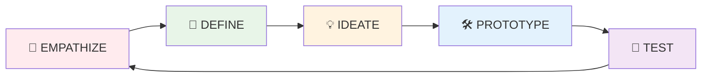
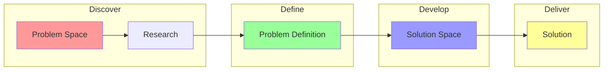

# Design Thinking Framework

## Overview
Design Thinking is a human-centered approach to innovation that integrates the needs of people, possibilities of technology, and requirements for business success. Popularized by IDEO and Stanford's d.school, it provides a systematic method for solving complex problems through empathy, creativity, and experimentation.

## When to Use
- Complex, ambiguous problems without clear solutions
- User experience and customer journey challenges
- Innovation and new product development
- Service design and process improvement
- When traditional approaches haven't worked
- Cross-functional team collaboration needed

## The 5-Stage Process



## Stage 1: EMPATHIZE 🤍
**Goal:** Understand users and their needs deeply

### Key Activities:
- **User Interviews**: Deep, open-ended conversations
- **Observation**: Watching users in their environment
- **Immersion**: Experiencing the problem firsthand
- **Journey Mapping**: Documenting user experiences
- **Stakeholder Analysis**: Identifying all affected parties

### Methods and Tools:

#### User Interview Framework:
```
🎯 EMPATHY INTERVIEW STRUCTURE

OPENING (5 min):
"Tell me about your typical day..."
"Walk me through how you currently..."

EXPLORATION (15 min):
"What frustrates you most about...?"
"What would make this easier?"
"Describe a time when..."

EMOTIONS (10 min):
"How does that make you feel?"
"What worries you about...?"
"What excites you about...?"

CLOSING (5 min):
"What haven't I asked that I should?"
"If you had a magic wand..."
```

#### Empathy Map:
```
┌─────────────────────┬─────────────────────┐
│      SAYS           │      THINKS         │
│ • Direct quotes     │ • Beliefs           │
│ • Defining words    │ • Thoughts          │
│                     │ • Assumptions       │
├─────────────────────┼─────────────────────┤
│      DOES           │      FEELS          │
│ • Actions           │ • Emotions          │
│ • Behaviors         │ • Feelings          │
│                     │ • Motivations       │
└─────────────────────┴─────────────────────┘
           USER'S PAINS    │    USER'S GAINS
           • Frustrations   │    • Wants
           • Obstacles      │    • Needs
           • Barriers       │    • Success measures
```

## Stage 2: DEFINE 🎯
**Goal:** Frame the problem from user's perspective

### Key Activities:
- **Synthesize** research findings
- **Identify** patterns and insights
- **Create** user personas
- **Define** point of view statement
- **Establish** design criteria

### Point of View Statement:
```
📝 POV TEMPLATE:

[USER] needs [NEED] because [INSIGHT]

Example:
"Busy parents need a simplified meal planning system 
because they feel overwhelmed by daily food decisions 
and want to spend more quality time with their children."

CRITERIA FOR GOOD POV:
✅ Human-centered (focuses on user)
✅ Broad enough to allow creativity
✅ Narrow enough to be manageable
✅ Based on research insights
```

### How Might We Questions:
```
🤔 HMW FRAMEWORK:

Transform POV into "How Might We..." questions:

POV: "Parents need simplified meal planning..."

HMW Questions:
• How might we reduce decision fatigue for meal planning?
• How might we make healthy eating effortless for families?
• How might we turn meal planning into quality time?
• How might we automate repetitive food decisions?
```

## Stage 3: IDEATE 💡
**Goal:** Generate many creative solution ideas

### Key Activities:
- **Brainstorming** sessions
- **SCAMPER** technique application
- **Crazy 8s** rapid ideation
- **Brainwriting** individual then group
- **Dot voting** for prioritization

### Ideation Rules:
```
🌟 BRAINSTORMING PRINCIPLES:

1. DEFER JUDGMENT
   • No criticism during generation
   • Build on "wild" ideas
   • Quantity over quality first

2. STRIVE FOR QUANTITY
   • Aim for 50+ ideas per session
   • Set time limits (7 minutes)
   • Keep energy high

3. BUILD ON IDEAS
   • "Yes, and..." instead of "Yes, but..."
   • Combine and modify ideas
   • Create idea clusters

4. STAY FOCUSED
   • Keep HMW question visible
   • Bring discussions back to user
   • One conversation at a time

5. BE VISUAL
   • Sketch ideas quickly
   • Use colors and symbols
   • Make ideas tangible
```

### Ideation Techniques:

#### Crazy 8s:
```
⚡ CRAZY 8s METHOD:
1. Fold paper into 8 sections
2. Set timer for 8 minutes
3. Sketch 1 idea per section per minute
4. No details - just concepts
5. Share and discuss all ideas
```

#### SCAMPER for Ideas:
```
🔄 SCAMPER TECHNIQUE:
S - Substitute: What can be substituted?
C - Combine: What can be combined?
A - Adapt: What can be adapted?
M - Modify: What can be modified?
P - Put to other use: How else can this be used?
E - Eliminate: What can be removed?
R - Reverse: What can be rearranged?
```

## Stage 4: PROTOTYPE 🛠️
**Goal:** Build quick, testable versions of ideas

### Key Activities:
- **Low-fidelity** prototyping
- **Rapid** building and iteration
- **Assumption** testing
- **Feature** prioritization
- **User flow** creation

### Prototype Types:

#### Fidelity Levels:
```
📊 PROTOTYPE FIDELITY SPECTRUM:

LOW FIDELITY:
• Paper sketches (5 minutes)
• Sticky note workflows (10 minutes)
• Role playing scenarios (15 minutes)
• Cardboard mockups (30 minutes)

MEDIUM FIDELITY:
• Digital wireframes (2 hours)
• Interactive prototypes (1 day)
• Service blueprints (4 hours)
• Video prototypes (1 day)

HIGH FIDELITY:
• Functional prototypes (1 week)
• Pilot programs (1 month)
• MVP development (3 months)
```

#### Quick Prototyping Methods:

##### Paper Prototyping:
```
📄 PAPER PROTOTYPE KIT:
• White paper sheets
• Colored markers
• Sticky notes
• Scissors and tape
• Phone/tablet frame cutout

PROCESS:
1. Sketch key screens/steps (15 min)
2. Create interactive flow (15 min)
3. Test with user (15 min)
4. Iterate immediately (15 min)
```

##### Service Blueprint:
```
👥 SERVICE BLUEPRINT STRUCTURE:

CUSTOMER ACTIONS:     What customer does
────────────────      (visible interactions)
FRONTSTAGE ACTIONS:   What staff does visibly
════════════════      (customer-facing)
BACKSTAGE ACTIONS:    What staff does invisibly
────────────────      (behind scenes)
SUPPORT PROCESSES:    Systems and tools needed
```

## Stage 5: TEST 🧪
**Goal:** Learn from users and refine solutions

### Key Activities:
- **User testing** with prototypes
- **Feedback** collection and analysis
- **Iteration** based on learnings
- **Assumption** validation/invalidation
- **Solution** refinement

### Testing Framework:
```
🧪 TESTING STRUCTURE:

BEFORE TESTING:
□ Define what you want to learn
□ Create testing scenarios
□ Prepare prototype
□ Recruit representative users
□ Plan observation method

DURING TESTING:
□ Set context and expectations
□ Give user realistic tasks
□ Observe without interfering
□ Ask follow-up questions
□ Note emotions and behaviors

AFTER TESTING:
□ Synthesize findings immediately
□ Identify patterns across users
□ Prioritize issues to address
□ Plan next iteration
□ Share learnings with team
```

### Testing Methods:

#### Usability Testing:
```
👤 USABILITY TEST SCRIPT:

INTRODUCTION (2 min):
"We're testing the design, not you..."
"Think aloud as you go..."
"There are no wrong answers..."

TASKS (20 min):
"Imagine you need to [specific scenario]"
"Show me how you would..."
"What would you do next?"

WRAP-UP (3 min):
"What did you like most/least?"
"What would you change?"
"Any other thoughts?"

OBSERVATION NOTES:
• Task completion rate
• Time to complete
• Error frequency
• Emotional reactions
• Verbatim quotes
```

## Advanced Design Thinking Techniques

### 1. **Double Diamond Process**


### 2. **Jobs-to-be-Done Integration**
```
🎯 JTBD + DESIGN THINKING:

1. EMPATHIZE: What job is the user hiring your product for?
2. DEFINE: What's the job statement?
3. IDEATE: How might we help users get the job done better?
4. PROTOTYPE: Test job completion effectiveness
5. TEST: Validate job satisfaction
```

### 3. **Systems Thinking Integration**
```
🌐 SYSTEMS VIEW:
• Map ecosystem of stakeholders
• Identify system leverage points
• Consider unintended consequences
• Design for system-wide impact
```

## Best Practices

### ✅ Do:
- Start with user research, not assumptions
- Include diverse perspectives on team
- Embrace "beginner's mind"
- Prototype early and often
- Test with real users regularly
- Document and share learnings
- Iterate based on feedback

### ❌ Don't:
- Skip the empathy phase
- Design for yourself
- Fall in love with first ideas
- Over-perfect prototypes
- Test with internal team only
- Ignore negative feedback
- Stop after first solution

## Team Composition

### Core Roles:
- **Facilitator**: Guides process, keeps energy up
- **Researcher**: Leads empathy and testing phases
- **Designer**: Creates prototypes and visualizations
- **Domain Expert**: Provides context and constraints
- **User Representative**: Advocates for user needs

### Workshop Structure (1-Day Sprint):
```
⏰ DESIGN THINKING DAY:

9:00 - 9:30    Opening & Empathy Review
9:30 - 10:30   Define POV & HMW Questions
10:45 - 12:00  Ideate (Multiple Rounds)
1:00 - 2:30    Prototype Building
2:45 - 4:00    Test with Users
4:00 - 4:30    Synthesis & Next Steps
```

## Common Pitfalls and Solutions

### Pitfall 1: **Rushing to Solutions**
❌ Jumping to ideation without empathy
✅ Spend 40% of time on empathy and define

### Pitfall 2: **Perfect Prototypes**
❌ Over-polishing early prototypes
✅ Keep prototypes rough and testable

### Pitfall 3: **Internal Testing Only**
❌ Testing with team members
✅ Always test with real users

### Pitfall 4: **One-Time Exercise**
❌ Treating it as workshop, not mindset
✅ Embed into regular development process

## Integration with Agile/Lean

### Design Thinking + Agile:
```
🔄 AGILE INTEGRATION:

Sprint 0: Empathize & Define (Research Sprint)
Sprint 1-2: Ideate & Prototype (Build Sprint)
Sprint 3: Test & Learn (Validation Sprint)
Sprint 4+: Iterate based on learnings
```

### Design Thinking + Lean Startup:
```
🚀 LEAN INTEGRATION:

BUILD: Prototype solutions
MEASURE: Test with users  
LEARN: Synthesize insights
PIVOT/PERSEVERE: Based on learnings
```

## Success Metrics
- ✅ User needs clearly understood and documented
- ✅ Problem statement validated with users
- ✅ Multiple solution concepts generated (20+)
- ✅ Prototypes tested with 5+ users
- ✅ Clear next steps defined based on learnings
- ✅ Team alignment on user-centered approach

---

*"Design thinking is a human-centered approach to innovation that draws from the designer's toolkit to integrate the needs of people, the possibilities of technology, and the requirements for business success." - Tim Brown, IDEO*