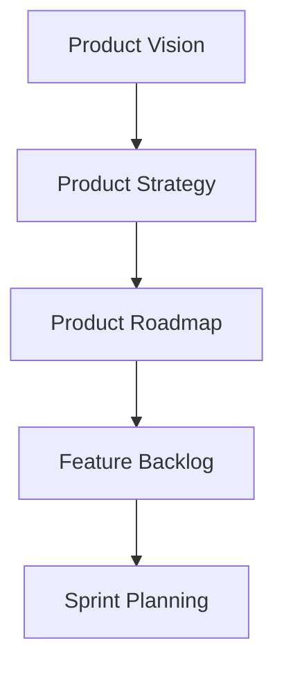

# BMAD Product Manager Pack

[](https://github.com/your-org/BMAD-METHOD)
[](LICENSE)
[](https://github.com/your-org/BMAD-METHOD)

> **Full product lifecycle management with JTBD, OKR, RICE frameworks for B2B/B2C tech products.**

## 🎯 Overview

The Product Manager expansion pack provides comprehensive product management capabilities for the BMAD-METHOD framework. It combines expert product thinking, proven frameworks, and systematic workflows to help teams build products users love.

### Key Features

- **Jobs-to-be-Done Analysis** - Deep customer need discovery and validation
- **OKR Planning** - Strategic goal-setting and alignment
- **RICE Prioritization** - Data-driven feature prioritization
- **Platform Thinking** - Strategic platform vs feature decision making
- **Agile Integration** - Seamless support for Agile/Lean methodologies
- **Cross-functional Collaboration** - Built for modern product teams

## 🚀 Quick Start

### Installation

```bash
# Clone the BMAD-METHOD repository
git clone https://github.com/your-org/BMAD-METHOD.git
cd BMAD-METHOD/expansion-packs/bmad-product-manager

# Verify installation
ls -la agents/ frameworks/ tasks/
```

### Basic Usage

```yaml
# Activate product management agents
@product-lead "Define our Q2 product roadmap"
@product-analyst "Analyze user engagement metrics for feature X"
@technical-pm "Assess technical debt impact on delivery"

# Run product tasks
/jtbd-analysis "Understand why users churn in onboarding"
/rice-prioritization "Prioritize next sprint features"

# Strategic planning
/okr-planning "Set product OKRs for next quarter"
```

### Interactive Tasks

```bash
# Jobs-to-be-Done analysis
task: jtbd-analysis

# OKR planning session
task: okr-planning

# Feature prioritization
task: rice-prioritization
```

## 👥 Product Team

### 📊 Sarah Chen - Product Lead
**Specialty**: Product vision and strategy
- Defines product vision and roadmap
- Facilitates stakeholder alignment
- Makes strategic product decisions
- **Commands**: `/vision`, `/roadmap`, `/strategy`, `/stakeholder-map`

### 📈 Marcus Johnson - Product Analyst
**Specialty**: Data-driven insights and metrics
- Analyzes user behavior and engagement
- Defines and tracks key metrics
- Provides data-backed recommendations
- **Commands**: `/metrics`, `/analyze-usage`, `/cohort-analysis`, `/funnel-analysis`

### 💡 Emily Rodriguez - Product Strategist
**Specialty**: Market positioning and competitive analysis
- Conducts market and competitive research
- Defines product positioning
- Identifies growth opportunities
- **Commands**: `/market-analysis`, `/competitive-intel`, `/positioning`, `/growth-opportunities`

### 🔧 Alex Thompson - Technical Product Manager
**Specialty**: Technical feasibility and architecture
- Assesses technical requirements
- Manages technical debt priorities
- Bridges product and engineering
- **Commands**: `/tech-assessment`, `/api-design`, `/tech-debt`, `/architecture-review`

## 🛠️ Frameworks

### Core Methodologies
- **[Jobs-to-be-Done](frameworks/jobs-to-be-done-complete.md)** - Customer need discovery
- **[RICE Framework](frameworks/rice-framework.md)** - Feature prioritization
- **[North Star Metrics](frameworks/north-star-metrics-framework.md)** - Success measurement
- **[Platform Principles](frameworks/platform-principles.md)** - Platform strategy
- **[Platform vs Feature](frameworks/platform-vs-feature-framework.md)** - Strategic decisions

## 📊 Product Templates

### Planning Templates
- **[Product Requirements Document](templates/prd-tmpl.yaml)** - Comprehensive PRD template
- **[OKR Planning](templates/okr-tmpl.yaml)** - Quarterly objective setting
- **[RICE Matrix](templates/rice-matrix-tmpl.yaml)** - Prioritization framework
- **[Launch Checklist](templates/product-launch-checklist-tmpl.yaml)** - Go-to-market readiness

## 🎨 Visual Product Planning

### Product Strategy Map


### RICE Prioritization Matrix
```
┌─────────────────┬────────┬────────┬────────┬────────┬─────────┐
│ Feature         │ Reach  │ Impact │ Confid │ Effort │ Score   │
├─────────────────┼────────┼────────┼────────┼────────┼─────────┤
│ User Dashboard  │  5000  │   3    │  80%   │   5    │  2400   │
│ API Integration │  2000  │   4    │  90%   │   3    │  2400   │
│ Mobile App      │  8000  │   2    │  70%   │   8    │  1400   │
│ Analytics Tool  │  3000  │   3    │  85%   │   5    │  1530   │
└─────────────────┴────────┴────────┴────────┴────────┴─────────┘
```

### Product Development Flow
```
Discovery → Definition → Design → Development → Delivery
    ↓           ↓          ↓           ↓           ↓
 User Research  PRD     Prototypes   Sprint    Launch
```

## 📋 Key Workflows

### Product Development Cycle
**Duration**: Sprint-based (2-4 weeks)  
**Output**: Shipped features and learnings

1. Discovery and user research
2. Problem definition and ideation
3. Solution design and validation
4. Development planning
5. Implementation and testing
6. Launch and measurement

### Product Launch Workflow
**Duration**: 4-6 weeks  
**Output**: Successful product launch

1. Pre-launch preparation
2. Marketing and sales enablement
3. Technical readiness check
4. Soft launch and testing
5. Full launch execution
6. Post-launch monitoring

### JTBD Analysis Process


## 🔗 Integration Ecosystem

### Supported Integrations
- **Strategy Consulting** - Strategic product decisions
- **Market Research** - User insights and market validation
- **PMO Agile** - Development execution and delivery
- **Startup Advisor** - Product-market fit guidance
- **Problem Solver** - Complex product challenges

### Integration Patterns
- **Research-First** - Market Research → Product Planning
- **Strategy-Driven** - Strategy → Product → Execution
- **Agile Delivery** - Product → PMO → Development
- **Data-Informed** - Analytics → Product → Iteration

## 📈 Success Metrics

### Product Metrics
- **User Engagement** - DAU/MAU, retention rates
- **Feature Adoption** - Usage rates, time to adopt
- **Business Impact** - Revenue, conversion, NPS
- **Delivery Velocity** - Cycle time, release frequency

### Team Performance
- **Planning Accuracy** - Estimate vs actual
- **Quality Metrics** - Defect rates, user satisfaction
- **Collaboration Health** - Cross-functional alignment
- **Innovation Rate** - New experiments launched

## 🏗️ Architecture

```
bmad-product-manager/
├── agents/              # Product management specialists
├── frameworks/          # Product methodologies
├── tasks/              # Interactive product workflows
├── templates/          # Product documentation templates
├── workflows/          # Multi-step processes
├── checklists/         # Launch and quality checklists
├── agent-teams/        # Team collaboration configs
├── data/               # Knowledge base
└── config.yaml         # Pack configuration
```

## 🔧 Configuration

```yaml
# config.yaml
name: bmad-product-manager
version: 1.0.0
description: Full product lifecycle management

capabilities:
  - jobs_to_be_done
  - okr_planning
  - rice_prioritization
  - platform_thinking
  - product_analytics
  - roadmap_planning
  - launch_management

frameworks:
  - jtbd: Jobs-to-be-Done methodology
  - rice: Reach, Impact, Confidence, Effort
  - okr: Objectives and Key Results
  - north_star: Single metric focus
```

## 📚 Documentation

### Core Documentation
- [JTBD Framework Guide](frameworks/jobs-to-be-done-complete.md)
- [Platform Principles](frameworks/platform-principles.md)
- [Product Launch Checklist](checklists/product-launch-checklist.md)
- [Team Workflows](workflows/)

### Templates & Tools
- [PRD Template](templates/prd-tmpl.yaml)
- [OKR Template](templates/okr-tmpl.yaml)
- [RICE Matrix](templates/rice-matrix-tmpl.yaml)
- [Launch Checklist](templates/product-launch-checklist-tmpl.yaml)

## 🤝 Contributing

We welcome contributions to improve the Product Manager pack:

### Areas for Contribution
- **Framework Extensions** - New product methodologies
- **Template Library** - Additional product documents
- **Integration Examples** - Cross-pack workflows
- **Best Practices** - Product management guides
- **Case Studies** - Success stories

### Contribution Process
1. Fork the repository
2. Create a feature branch (`git checkout -b feature/new-framework`)
3. Make your changes with documentation
4. Submit a pull request with examples

## 📄 License

This project is licensed under the MIT License - see the [LICENSE](LICENSE) file for details.

## 🆘 Support

### Getting Help
- **Documentation** - Check framework guides
- **Issues** - Report bugs via GitHub Issues
- **Discussions** - Join product community
- **Examples** - Review workflow examples

### Community Resources
- [GitHub Discussions](https://github.com/your-org/BMAD-METHOD/discussions)
- [Documentation Wiki](https://github.com/your-org/BMAD-METHOD/wiki)
- [Issue Tracker](https://github.com/your-org/BMAD-METHOD/issues)

## 🗺️ Roadmap

### Version 1.1 (Q2 2024)
- [ ] AI-powered user research synthesis
- [ ] Advanced analytics integrations
- [ ] Experiment tracking framework
- [ ] Customer journey mapping

### Version 1.2 (Q4 2024)
- [ ] Product-led growth frameworks
- [ ] Automated metric tracking
- [ ] Stakeholder communication tools
- [ ] Multi-product portfolio management

---

**Built for BMAD-METHOD** • **Designed for modern product teams** • **Optimized for user-centric development**

*Build products that users love and businesses need.*