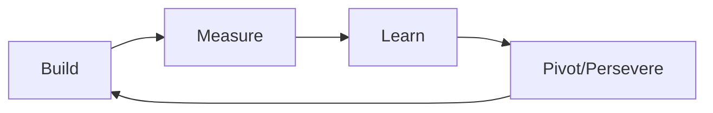
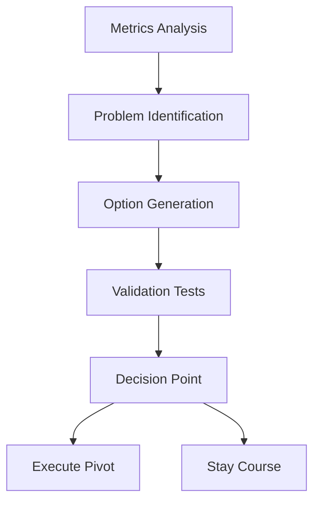

# BMAD Startup Advisor Pack

[](https://github.com/your-org/BMAD-METHOD)
[](LICENSE)
[](https://github.com/your-org/BMAD-METHOD)

> **Comprehensive startup advisory from ideation through exit, with proven frameworks for every stage.**

## 🎯 Overview

The Startup Advisor expansion pack provides end-to-end startup guidance for the BMAD-METHOD framework. It combines experienced entrepreneurship, venture capital insights, and growth hacking strategies to help startups succeed at every stage.

### Key Features

- **Lean Startup Methodology** - Build-Measure-Learn validation cycles
- **Business Model Canvas** - Comprehensive business design
- **Fundraising Guidance** - From angel to Series A and beyond
- **Growth Hacking** - Data-driven growth experimentation
- **Pivot Analysis** - Strategic direction changes
- **Exit Planning** - M&A and IPO preparation

## 🚀 Quick Start

### Installation

```bash
# Clone the BMAD-METHOD repository
git clone https://github.com/your-org/BMAD-METHOD.git
cd BMAD-METHOD/expansion-packs/bmad-startup-advisor

# Verify installation
ls -la agents/ frameworks/ tasks/
```

### Basic Usage

```yaml
# Activate startup advisors
@serial-entrepreneur "Help validate my B2B SaaS idea"
@vc-advisor "Review my pitch deck for Series A"

# Run startup tasks
/analyze-product-market-fit "Current traction metrics"
/prepare-fundraising "Seed round preparation"

# Strategic planning
/execute-pivot-analysis "Current model not scaling"
```

### Interactive Tasks

```bash
# Product-market fit analysis
task: analyze-product-market-fit

# Customer discovery
task: conduct-customer-discovery

# Business model validation
task: validate-business-model
```

## 👥 Startup Team

### 🚀 Alex Chen - Serial Entrepreneur
**Specialty**: Startup operations and scaling
- Founded and exited 3 successful startups
- Expert in product-market fit
- Specializes in B2B SaaS and marketplaces
- **Commands**: `/validate-idea`, `/find-pmf`, `/scale-operations`, `/exit-strategy`

### 💰 Sarah Mitchell - Venture Capital Advisor
**Specialty**: Fundraising and investor relations
- Former operator turned VC
- Evaluated 1000+ startups
- Expert in pitch deck creation
- **Commands**: `/pitch-review`, `/valuation-analysis`, `/investor-strategy`, `/term-sheet`

## 🛠️ Frameworks

### Core Methodologies
- **[Lean Startup Framework](frameworks/lean-startup-framework.md)** - Validated learning approach
- **[Business Model Patterns](frameworks/business-model-patterns.md)** - Proven business models
- **[Growth Model Framework](frameworks/growth-model-framework.md)** - PLG, SLG, MLG, CLG strategies
- **[Unit Economics](frameworks/unit-economics.md)** - Financial viability analysis
- **[AARRR Metrics](frameworks/aarrr-metrics.md)** - Pirate metrics for growth

## 📊 Startup Templates

### Planning Templates
- **[Business Model Canvas](templates/business-model-canvas-tmpl.md)** - One-page business design
- **[Lean Canvas](templates/lean-canvas-tmpl.md)** - Problem-solution fit
- **[Pitch Deck](templates/pitch-deck-tmpl.md)** - Investor presentation
- **[Financial Model](templates/financial-model-tmpl.md)** - Revenue projections

### Execution Templates
- **[OKR Planning](templates/okr-planning-tmpl.md)** - Objective setting
- **[Go-to-Market](templates/go-to-market-tmpl.md)** - Launch strategy
- **[Investor Update](templates/investor-update-tmpl.md)** - Monthly updates
- **[Business Canvas](templates/business-canvas-tmpl.md)** - Strategic overview

## 🎨 Visual Strategy Tools

### Lean Startup Cycle


### Growth Stages
```
┌─────────────┬─────────────┬─────────────┬─────────────┬─────────────┐
│   Ideation  │  Validation │    Traction │    Growth   │    Scale    │
├─────────────┼─────────────┼─────────────┼─────────────┼─────────────┤
│ • Idea      │ • MVP       │ • First     │ • Product   │ • Series B+ │
│ • Research  │ • Customers │   Revenue   │   Market Fit│ • Expansion │
│ • Prototype │ • Feedback  │ • Seed      │ • Series A  │ • Exit prep │
└─────────────┴─────────────┴─────────────┴─────────────┴─────────────┘
```

### Unit Economics Framework
```
CAC (Customer Acquisition Cost)
├── Marketing Spend: $X
├── Sales Cost: $Y
└── Total CAC: $(X+Y)/customers

LTV (Lifetime Value)
├── Average Revenue/User: $A
├── Gross Margin: B%
├── Churn Rate: C%
└── LTV: $A × B% × (1/C%)

LTV:CAC Ratio = Target: 3:1 or higher
```

## 📋 Key Workflows

### Startup Launch Workflow
**Duration**: 12-16 weeks  
**Output**: Market-ready product with initial traction

1. Idea validation and research
2. Customer discovery interviews
3. MVP development
4. Initial user testing
5. Product iteration
6. Go-to-market execution

### Fundraising Workflow
**Duration**: 3-6 months  
**Output**: Closed funding round

1. Preparation and materials
2. Investor research and outreach
3. Pitch meetings
4. Due diligence support
5. Term sheet negotiation
6. Closing and onboarding

### Pivot Workflow


## 🔗 Integration Ecosystem

### Supported Integrations
- **Product Management** - Product development and iteration
- **Market Research** - Customer insights and validation
- **Strategy Consulting** - Business model optimization
- **PMO Agile** - Agile development execution
- **Problem Solver** - Challenge identification

### Integration Patterns
- **Research-to-Product** - Market insights drive product
- **Strategy-to-Execution** - Plans to implementation
- **Problem-to-Pivot** - Challenge analysis to new direction
- **Product-to-Growth** - Feature development to scaling

## 📈 Success Metrics

### Early Stage (Pre-Seed/Seed)
- **Customer Interviews** - 100+ conversations
- **Problem Validation** - 70%+ problem recognition
- **Solution Interest** - 40%+ would pay
- **MVP Engagement** - Weekly active usage

### Growth Stage (Series A/B)
- **MRR Growth** - 15-20% month-over-month
- **Unit Economics** - LTV:CAC > 3:1
- **Burn Multiple** - < 2x (efficient growth)
- **Market Share** - Growing faster than market

### Scale Stage
- **ARR Growth** - $10M+ annual recurring revenue
- **Net Revenue Retention** - 120%+ expansion
- **Gross Margins** - 70%+ for SaaS
- **Rule of 40** - Growth + Profit > 40%

## 🏗️ Architecture

```
bmad-startup-advisor/
├── agents/              # Startup specialist agents
├── frameworks/          # Startup methodologies
├── tasks/              # Interactive workflows
├── templates/          # Startup documents
├── workflows/          # Multi-step processes
├── integration-guide.md # Cross-pack integration
├── INTEGRATION_GUIDE.md # Integration documentation
├── PACK_STRUCTURE_GUIDE.md # Pack organization
└── config.yaml         # Pack configuration
```

## 🔧 Configuration

```yaml
# config.yaml
name: bmad-startup-advisor
version: 1.0.0
description: Comprehensive startup advisory

capabilities:
  - business_model_validation
  - customer_development
  - fundraising_guidance
  - growth_strategy
  - pivot_analysis
  - exit_planning
  - investor_relations

methodologies:
  - lean_startup: Build-Measure-Learn cycles
  - business_model_canvas: Strategic planning
  - growth_hacking: Data-driven experimentation
  - venture_funding: Investment strategies
```

## 📚 Documentation

### Core Documentation
- [Lean Startup Guide](frameworks/lean-startup-framework.md)
- [Business Model Patterns](frameworks/business-model-patterns.md)
- [Growth Framework](frameworks/growth-model-framework.md)
- [Integration Guide](INTEGRATION_GUIDE.md)

### Templates & Tools
- [Pitch Deck Template](templates/pitch-deck-tmpl.md)
- [Financial Model](templates/financial-model-tmpl.md)
- [Business Canvas](templates/business-model-canvas-tmpl.md)
- [Investor Updates](templates/investor-update-tmpl.md)

## 🤝 Contributing

We welcome contributions to improve the Startup Advisor pack:

### Areas for Contribution
- **Industry Verticals** - Specialized startup guidance
- **Regional Variations** - Location-specific advice
- **New Frameworks** - Emerging methodologies
- **Success Stories** - Case studies and examples
- **Tool Integrations** - Startup stack connections

### Contribution Process
1. Fork the repository
2. Create a feature branch (`git checkout -b feature/new-framework`)
3. Make your changes with documentation
4. Submit a pull request with examples

## 📄 License

This project is licensed under the MIT License - see the [LICENSE](LICENSE) file for details.

## 🆘 Support

### Getting Help
- **Documentation** - Check framework guides
- **Issues** - Report bugs via GitHub Issues
- **Discussions** - Join startup community
- **Examples** - Review case studies

### Community Resources
- [GitHub Discussions](https://github.com/your-org/BMAD-METHOD/discussions)
- [Documentation Wiki](https://github.com/your-org/BMAD-METHOD/wiki)
- [Issue Tracker](https://github.com/your-org/BMAD-METHOD/issues)

## 🗺️ Roadmap

### Version 1.1 (Q2 2024)
- [ ] Additional specialist agents (Growth Hacker, CFO)
- [ ] Advanced financial modeling
- [ ] Automated metrics tracking
- [ ] Investor CRM integration

### Version 1.2 (Q4 2024)
- [ ] AI-powered market analysis
- [ ] Competitive intelligence tools
- [ ] Cap table management
- [ ] International expansion guides

---

**Built for BMAD-METHOD** • **Designed for startup success** • **Powered by entrepreneurial experience**

*From idea to exit, we're with you every step of the way.*