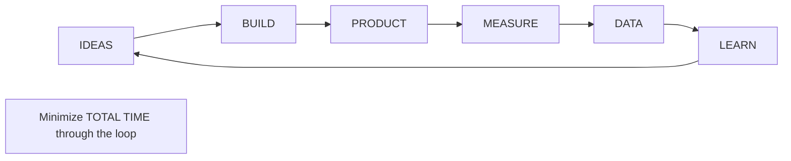

# Lean Startup Framework

## Framework Overview
```yaml
framework:
  id: lean-startup
  name: Lean Startup Methodology
  purpose: Minimize waste and maximize learning in startup development
  core_principle: Build-Measure-Learn feedback loop
  created_by: Eric Ries
  adapted_for: BMAD startup advisory
```

## Core Concepts

### 1. The Build-Measure-Learn Loop


### 2. Fundamental Principles

#### Validated Learning
```markdown
Definition: Progress measured by validated learning about customers

Implementation:
1. Form hypothesis about customer need
2. Build minimum viable test
3. Measure actual behavior
4. Learn from the data
5. Pivot or persevere

Success Metrics:
- Learning velocity (insights/week)
- Hypothesis validation rate
- Time to first customer insight
- Cost per learning cycle
```

#### Minimum Viable Product (MVP)
```markdown
Definition: Smallest thing you can build to start learning

MVP Types:
1. Concierge MVP - Manual service delivery
2. Wizard of Oz - Fake the backend
3. Landing Page - Test demand only
4. Single Feature - Core value only
5. Prototype - Visual representation

MVP Criteria:
□ Tests core hypothesis
□ Provides measurable data
□ Built in days/weeks, not months
□ Real customers can use it
□ Clear learning objective
```

## Implementation Guide

### Phase 1: Problem Discovery
```markdown
Week 1-2: Customer Problem Interviews

Daily Activities:
- 3-5 customer interviews
- Document pain points
- Identify patterns
- Rank problem severity

Interview Script:
1. "Tell me about your workflow"
2. "What's most frustrating?"
3. "How do you solve this today?"
4. "What would ideal look like?"
5. "How much time/money does this cost?"

Success Criteria:
- Same problem mentioned by >40%
- High pain score (7+/10)
- Current solutions inadequate
- Budget exists for solution
```

### Phase 2: Solution Design
```markdown
Week 3-4: Solution Hypothesis

Key Questions:
1. What's our riskiest assumption?
2. What's the simplest test?
3. How will we measure success?
4. What will we do with results?

Solution Canvas:
┌─────────────────┬─────────────────┐
│ Customer        │ Problem         │
│ [Who]          │ [What hurts]    │
├─────────────────┼─────────────────┤
│ Solution        │ Key Metrics     │
│ [How we help]   │ [What to track] │
├─────────────────┼─────────────────┤
│ Unique Value    │ Channels        │
│ [Why us]        │ [How to reach]  │
└─────────────────┴─────────────────┘
```

### Phase 3: Build MVP
```markdown
Week 5-6: Rapid Building

MVP Checklist:
□ Core feature only
□ Manual processes OK
□ Measurement built in
□ Launch plan ready
□ Learning goals defined

Technical Approach:
- Use no-code tools when possible
- Leverage existing platforms
- Focus on user flow, not polish
- Instrument everything
- Prepare for iterations
```

### Phase 4: Measure & Learn
```markdown
Week 7-8: Data Collection

Metrics Framework:
1. Acquisition - How do users find us?
2. Activation - Do they have good first experience?
3. Retention - Do they come back?
4. Revenue - Will they pay?
5. Referral - Do they tell others?

Learning Documentation:
- Hypothesis: [What we believed]
- Experiment: [What we tested]
- Data: [What happened]
- Insight: [What we learned]
- Next Action: [Pivot or persevere]
```

## Pivot Decision Framework

### When to Pivot
```markdown
Pivot Triggers:
□ Flat user growth for 3+ months
□ CAC > LTV with no improvement path
□ <5% of users actively engaged
□ No one willing to pay
□ Founders lost passion

Pivot Types:
1. Zoom-in Pivot - Feature becomes product
2. Zoom-out Pivot - Product becomes feature
3. Customer Segment Pivot - New audience
4. Platform Pivot - App to platform
5. Business Model Pivot - Change monetization
6. Technology Pivot - New solution approach
7. Channel Pivot - New distribution
```

### Pivot Process
```markdown
Step 1: Acknowledge Reality (1 day)
- Review metrics honestly
- Accept current approach failing
- Commit to change

Step 2: Analyze Learnings (2-3 days)
- What worked well?
- What didn't work?
- What surprised us?
- What do customers really want?

Step 3: Generate Options (2-3 days)
- Brainstorm pivot directions
- Evaluate against learnings
- Pick top 3 options
- Quick validation tests

Step 4: Choose Direction (1 day)
- Score options on:
  - Customer demand evidence
  - Team capability
  - Market size
  - Competitive landscape
  - Resource requirements

Step 5: Execute Pivot (Ongoing)
- Communicate to stakeholders
- Rapid MVP of new direction
- Reset metrics baselines
- Double down if working
```

## Innovation Accounting

### Startup Metrics That Matter
```markdown
Pre-Revenue Metrics:
- Customer interviews/week
- Hypothesis tests run
- Learning velocity
- Time to insight
- Feature usage rates

Early Revenue Metrics:
- Customer acquisition cost
- Lifetime value
- Monthly recurring revenue
- Churn rate
- Activation rate

Growth Metrics:
- Month-over-month growth
- Viral coefficient
- Net promoter score
- Payback period
- Burn rate vs growth rate
```

### Progress Measurement
```markdown
Traditional: Vanity Metrics
❌ Total users
❌ Page views  
❌ Downloads
❌ Time on site

Lean: Actionable Metrics
✅ Daily active users
✅ Paid conversions
✅ Cohort retention
✅ Revenue per user

Weekly Review Questions:
1. What did we learn this week?
2. How did it change our strategy?
3. What will we test next?
4. Are we closer to product-market fit?
```

## Common Anti-Patterns

### 1. Analysis Paralysis
**Symptom**: Endless research, no building
**Solution**: Set 2-week maximum for any phase

### 2. Feature Creep
**Symptom**: Adding features before validating core
**Solution**: One feature at a time

### 3. Vanity Metrics
**Symptom**: Celebrating meaningless numbers
**Solution**: Focus on unit economics

### 4. Premature Scaling
**Symptom**: Hiring/spending before product-market fit
**Solution**: Stay lean until retention proven

### 5. Founder Delusion
**Symptom**: Ignoring negative feedback
**Solution**: Let data drive decisions

## Tools and Templates

### Experiment Template
```markdown
Experiment Name: _______________
Date: _________

Hypothesis:
We believe that [target customer]
Will [expected behavior]
Because [reasoning]

Test Design:
- Method: _________
- Duration: _______
- Success Criteria: _______

Results:
- Quantitative: _________
- Qualitative: _________
- Surprises: _________

Decision:
□ Persevere - Double down
□ Pivot - Change direction
□ Perish - Kill this idea
```

### Weekly Learning Report
```markdown
Week of: _________

Tests Run: ___
Customers Talked To: ___
Key Insights:
1. ________________
2. ________________
3. ________________

Next Week's Hypothesis:
_____________________

Burn Rate: $______
Runway: ___ months
```

## Integration with Other Frameworks

### With Business Model Patterns
- Use Lean Startup to validate chosen model
- Test pricing assumptions early
- Iterate on value proposition

### With Growth Framework
- Lean principles continue post-PMF
- Growth experiments follow same loop
- Scale what's validated

### With Other Packs
- Product Manager: Feature prioritization
- Market Researcher: Customer insights
- PMO Agile: Sprint planning alignment

## Success Stories

### Dropbox
- MVP: Simple video demonstration
- Learning: People wanted easy file sync
- Pivot: From USB enhancement to cloud

### Airbnb
- MVP: Air mattresses at conference
- Learning: Trust and photos matter
- Pivot: From events to everyday travel

### Zappos
- MVP: Manually fulfilled orders from stores
- Learning: People would buy shoes online
- Scale: Built infrastructure after validation

## Key Takeaways

1. **Speed Beats Perfection**
   - Launch in weeks, not months
   - Learn from real customers
   - Iterate based on data

2. **Failure Is Learning**
   - Failed experiments = valuable data
   - Pivot quickly when needed
   - Preserve cash by staying lean

3. **Customers Don't Lie**
   - Behavior > opinions
   - Money > interest
   - Retention > acquisition

4. **Stay Lean Until PMF**
   - Small team
   - Low burn
   - Fast iterations
   - Maximum learning

---

*The Lean Startup is not about being cheap, it's about being smart with resources while maximizing learning speed.*