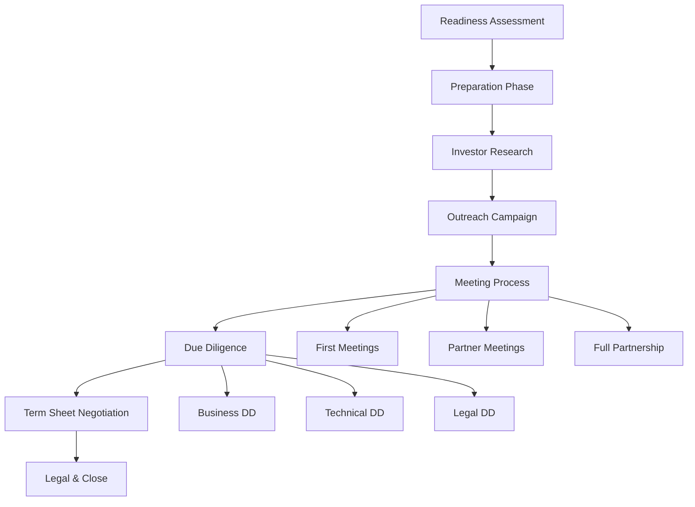

# Fundraising Workflow

## Workflow Metadata
```yaml
workflow:
  id: fundraising-workflow
  name: End-to-End Fundraising Process
  duration: 3-6 months
  complexity: high
  agents_involved:
    - vc-advisor (lead)
    - serial-entrepreneur
  dependencies:
    - financial model
    - pitch deck
    - traction metrics
```

## Workflow Overview



## Phase 1: Readiness Assessment (Week 1)

### Step 1.1: Fundability Audit
**Agent:** vc-advisor
**Duration:** 2 days

```markdown
Readiness Checklist:

Market & Traction:
□ Problem validated with customers
□ Solution showing early traction
□ Market size >$1B TAM
□ Clear competitive advantage
□ Growth trajectory positive

Metrics (varies by stage):
Pre-Seed:
□ 10+ customer interviews
□ MVP with initial users
□ Clear path to revenue

Seed:
□ $10k+ MRR or equivalent traction
□ Product-market fit signals
□ 20%+ MoM growth

Series A:
□ $1M+ ARR
□ Strong unit economics
□ Proven growth channels
□ 15%+ MoM growth

Team:
□ Full-time founders
□ Complementary skills
□ Domain expertise
□ Commitment demonstrated

Score: {{X}}/checklist items
Ready to raise? {{Yes/No/Almost}}
```

### Step 1.2: Fundraising Strategy
**Agent:** vc-advisor
**Duration:** 3 days

```markdown
Strategic Decisions:

1. Round Size & Use of Funds
   Amount: ${{amount}}
   Runway: {{months}} months
   
   Use of Funds:
   - Product: {} - ${{amount}}
   - Team: {} - ${{amount}}

2. Valuation Expectations
   Based on comparables:
   - Company A: ${{valuation}} at {{stage}}
   - Company B: ${{valuation}} at {{stage}}
   - Target range: ${{min}}-{{max}}M

3. Timeline Planning
   - Prep: 4 weeks
   - Active raise: 8-12 weeks
   - Close: 4 weeks
   - Total: 4-5 months

4. Lead Investor Profile
   - Check size: ${{amount}}
   - Industry focus: {{sectors}}
   - Stage focus: {{stage}}
   - Value-add: {{expertise}}
```

## Phase 2: Preparation Phase (Weeks 2-5)

### Step 2.1: Pitch Deck Creation
**Agent:** vc-advisor
**Task:** prepare-fundraising
**Duration:** 1 week

```markdown
Deck Development:

Day 1-2: Story & Structure
- Problem narrative
- Solution positioning
- Market opportunity
- Why now story

Day 3-4: Content Creation
- Traction slides
- Business model
- Go-to-market
- Team slide

Day 5-6: Design & Polish
- Visual consistency
- Data visualization
- Animations (minimal)
- Multiple versions

Day 7: Review & Test
- Advisor feedback
- Mock pitches
- Timing practice
- Q&A preparation

Deliverables:
- Email deck (PDF, <5MB)
- Presentation deck (live pitch)
- One-pager (quick summary)
```

### Step 2.2: Financial Model Build
**Agent:** vc-advisor
**Duration:** 1 week

```markdown
Model Requirements:

Structure:
1. Assumptions tab
2. Revenue build
3. Cost structure  
4. P&L projections
5. Cash flow
6. KPI dashboard
7. Scenario analysis

Key Components:
- 3-year monthly projection
- Unit economics detail
- Cohort analysis
- Hiring plan
- Burn rate analysis
- Break-even timeline

Validation:
□ Sanity check all formulas
□ Benchmark against comparables
□ Stress test assumptions
□ Board-ready formatting
```

### Step 2.3: Data Room Setup
**Agent:** vc-advisor
**Duration:** 3 days

```markdown
Data Room Structure:

📁 Company Info
- Incorporation docs
- Cap table
- Board minutes
- Stock agreements

📁 Financials
- Historical financials
- Financial model
- Bank statements
- Burn analysis

📁 Legal
- Customer contracts
- Employee agreements
- IP assignments
- Any litigation

📁 Product
- Product demos
- Technical architecture
- Roadmap
- Security overview

📁 Market
- Market analysis
- Competitive intel
- Customer testimonials
- Case studies

Platform: DocSend/Dropbox
Access: Limited, tracked
Updates: Weekly during raise
```

### Step 2.4: Reference Preparation
**Agent:** serial-entrepreneur
**Duration:** 2 days

```markdown
Reference Portfolio:

Customer References (5-7):
- Name: {{name}}
- Title: {{title}} at {{company}}
- Relationship: {{context}}
- Key message: {{what_they'll_say}}

Team References (3-5):
- Former colleagues
- Previous investors
- Industry experts

Preparation:
1. Get permission
2. Brief on process
3. Share key messages
4. Thank you planned
```

## Phase 3: Investor Research (Week 6)

### Step 3.1: Target List Building
**Agent:** vc-advisor
**Duration:** 3 days

```markdown
Investor Segmentation:

Tier 1 - Dream Partners (10-15):
```
| Firm | Partner | Thesis Fit | Portfolio Synergy | Warm Path |
|------|---------|------------|-------------------|-----------|
| {{firm}} | {{name}} | Perfect | {{companies}} | {{connection}} |
```

Tier 2 - Strong Fits (20-25):
- Good thesis alignment
- Right check size
- Stage match
- Some connection

Tier 3 - Volume Plays (25-30):
- Broader thesis
- Active investors
- Quick decisions

Research Tools:
- Crunchbase
- PitchBook
- AngelList
- Twitter
- Warm network
```

### Step 3.2: Warm Path Mapping
**Agent:** vc-advisor
**Duration:** 2 days

```markdown
Connection Mapping:

Direct Connections:
- Current investors → Their network
- Advisors → Their contacts
- Other founders → Their investors

Second Degree:
- LinkedIn analysis
- Alumni networks
- Customer intros
- Service providers

Intro Request Template:
"Hi {{name}},

Hope you're well! We're raising our {{round}} and I 
noticed you know {{investor}} at {{firm}}.

Quick context: {{one-liner}} with {{traction}}.

Would you be comfortable making an intro if you think 
there's a fit? Happy to send a forwardable blurb.

Best,
{{name}}"
```

## Phase 4: Outreach Campaign (Weeks 7-8)

### Step 4.1: Sequenced Outreach
**Agent:** vc-advisor
**Duration:** 2 weeks

```markdown
Outreach Strategy:

Week 1: Tier 3 (Practice)
- Test messaging
- Refine pitch
- Get feedback
- Build confidence

Week 2: Tier 2 (Momentum)
- Leverage learnings
- Create competition
- Build pipeline
- Generate buzz

Week 3+: Tier 1 (Close)
- Multiple options
- Strong position
- Create urgency
- Best terms

Daily Routine:
- 10 new outreaches
- 5 follow-ups
- Update CRM
- Team sync
```

### Step 4.2: Investor CRM Management
**Agent:** vc-advisor
**Duration:** Ongoing

```markdown
CRM Tracking:

For Each Investor:
- Firm & Partner
- Last contact
- Status
- Next action
- Interest level (1-5)
- Notes

Pipeline Stages:
1. Researched
2. Outreach sent
3. Response received
4. Meeting scheduled
5. Meeting complete
6. Due diligence
7. Term sheet
8. Passed/Closed

Weekly Metrics:
- Outreach → Meeting: {}
- DD → Term Sheet: {{%}}
- Velocity: {{days}} average
```

## Phase 5: Meeting Process (Weeks 9-14)

### Step 5.1: First Meetings
**Agent:** serial-entrepreneur
**Duration:** 2-3 weeks

```markdown
Meeting Preparation:

Before Each Meeting:
□ Research partner background
□ Study portfolio companies
□ Prepare 3 questions
□ Update deck with latest
□ Practice 2-minute pitch

Meeting Flow (30 min):
0:00-0:03 - Rapport building
0:03-0:10 - Company pitch
0:10-0:15 - Demo (if relevant)
0:15-0:25 - Q&A discussion
0:25-0:30 - Next steps

Common Questions:
- "What's your moat?"
- "How big can this get?"
- "Unit economics?"
- "Why will you win?"
- "Biggest risks?"

Post-Meeting:
- Thank you within 2 hours
- Send requested materials
- Update CRM
- Team debrief
```

### Step 5.2: Partner Meetings
**Agent:** vc-advisor
**Duration:** 2-3 weeks

```markdown
Partner Meeting Prep:

Enhanced Materials:
- Deep dive deck
- Live demo ready
- Detailed financials
- Reference list
- Vision deck

Typical Process:
- 2-3 partners attend
- 45-60 minutes
- Deeper dive expected
- Technical questions
- Market analysis

Success Factors:
- Energy and passion
- Clear communication
- Specific examples
- Strong Q&A
- Team chemistry
```

### Step 5.3: Full Partnership Meetings
**Agent:** vc-advisor
**Duration:** 1-2 weeks

```markdown
The Big Meeting:

Preparation Intensity:
- Mock presentations
- Q&A practice
- Slide memorization
- Energy management
- Team alignment

Presentation Strategy:
- Hook in first minute
- Data-driven story
- Show, don't tell
- Handle objections
- Strong close

Common Dynamics:
- Good cop/bad cop
- Technical deep dive
- Market skepticism
- Competitive concerns
- Team assessment

Decision Timeline:
- Same day (rare)
- Within 48 hours (common)
- Within 1 week (max)
```

## Phase 6: Due Diligence (Weeks 15-17)

### Step 6.1: Business DD Management
**Agent:** vc-advisor
**Duration:** 1-2 weeks

```markdown
DD Workstream Management:

Business/Market:
□ Customer reference calls
□ Financial deep dive
□ Cohort analysis review
□ Competition analysis
□ Market sizing validation

Product/Technical:
□ Architecture review
□ Security assessment  
□ Roadmap discussion
□ IP review
□ Tech debt analysis

Team/References:
□ Reference checks
□ Background checks
□ Team interviews
□ Culture assessment

Response Protocol:
- 24-hour response SLA
- Daily DD updates
- Centralized tracking
- Flag concerns early
```

### Step 6.2: DD Acceleration
**Agent:** serial-entrepreneur
**Duration:** Ongoing

```markdown
Speed Optimization:

Pre-empt Requests:
- FAQ document ready
- Common docs prepared
- References briefed
- Clean data room

Parallel Processing:
- Multiple work streams
- Dedicated point person
- Evening responses
- Weekend availability

Momentum Maintenance:
- Daily investor updates
- Proactive communication
- Quick problem solving
- Energy and enthusiasm
```

## Phase 7: Term Sheet Negotiation (Weeks 18-19)

### Step 7.1: Term Sheet Analysis
**Agent:** vc-advisor
**Duration:** 2-3 days

```markdown
Term Sheet Evaluation:

Economic Terms:
- Pre-money valuation: ${{amount}}
- Investment amount: ${{amount}}
- Post-money: ${{amount}}
- Dilution: {}

Control Terms:
- Board seats: {{composition}}
- Protective provisions: {{list}}
- Information rights: {{standard/heavy}}
- Pro-rata rights: {{who}}

Other Key Terms:
- Liquidation preference: {{1x/participating}}
- Anti-dilution: {{broad/narrow}}
- Vesting: {{standard/custom}}
- Drag-along: {{threshold}}

Negotiation Priorities:
1. {{term_1}} - Must have
2. {{term_2}} - Important  
3. {{term_3}} - Nice to have
```

### Step 7.2: Multi-Party Negotiation
**Agent:** vc-advisor
**Duration:** 3-5 days

```markdown
Negotiation Strategy:

If Multiple Term Sheets:
1. Create competition matrix
2. Identify unique value-adds
3. Set decision deadline
4. Be transparent about process

Negotiation Tactics:
- Focus on partnership quality
- Use lawyers effectively
- Pick battles wisely
- Think long-term
- Maintain relationships

Common Trade-offs:
- Valuation vs. Control
- Board seats vs. Independence
- Clean terms vs. Higher price
- Single lead vs. Co-leads
```

## Phase 8: Legal & Close (Weeks 20-22)

### Step 8.1: Legal Documentation
**Agent:** vc-advisor
**Duration:** 2-3 weeks

```markdown
Document Pipeline:

Week 1:
- Stock Purchase Agreement
- Investor Rights Agreement
- Right of First Refusal
- Voting Agreement

Week 2:
- Board resolutions
- Amended certificate
- Opinion letters
- Disclosure schedules

Week 3:
- Final reviews
- Signature pages
- Wire instructions
- Closing checklist

Legal Support:
- Use experienced counsel
- Budget $25-50k
- Daily check-ins
- Issue escalation
```

### Step 8.2: Closing Process
**Agent:** vc-advisor
**Duration:** 2-3 days

```markdown
Final Steps:

Pre-Close:
□ All documents finalized
□ Board approval secured
□ Conditions precedent met
□ Wire instructions confirmed
□ PR/announcement ready

Closing Day:
□ Final signatures
□ Wire confirmation
□ Stock issuance
□ Update cap table
□ File Delaware docs

Post-Close:
□ Welcome new investors
□ Send final docs
□ Update team
□ Announce publicly
□ Celebrate! 🎉
```

## Success Metrics

### Process KPIs
```markdown
Efficiency Metrics:
- Outreach → Meeting: >10%
- Meeting → TS: >5%
- Total process: <16 weeks
- Terms quality: Top quartile

Quality Metrics:
- Partner fit: High
- Terms fairness: Balanced
- Reference feedback: Positive
- Team energy: Maintained
```

### Common Failure Points

1. **Weak Story**
   - Sign: <5% meeting conversion
   - Fix: Refine narrative

2. **Bad Timing**
   - Sign: "Come back later"
   - Fix: Hit better metrics first

3. **Process Drag**
   - Sign: >6 months raising
   - Fix: Create urgency

4. **Team Issues**
   - Sign: Reference concerns
   - Fix: Address directly

## Post-Fundraise

### First 30 Days
```markdown
Immediate Actions:
1. Welcome investors properly
2. Set up board governance
3. Update financial controls
4. Begin hiring plan
5. Execute on plan

Communication:
- Monthly investor updates
- Board meeting schedule
- Slack channel (optional)
- Regular check-ins
```

### Integration Points

With Product Manager:
- Product roadmap for pitch
- Demo preparation
- Vision alignment

With Market Researcher:
- TAM validation
- Competitive analysis
- Market timing

With PMO Agile:
- Execution planning
- Milestone tracking
- Team scaling

## Completion Criteria

```markdown
Fundraise Complete When:
□ Target amount raised
□ Right partner(s) found
□ Fair terms achieved
□ Legal docs signed
□ Money in bank
□ Team celebrated
□ Execution begins
□ Updates scheduled
```

---

*Fundraising is not the goal, it's fuel for the journey. Choose partners who make the trip better.*