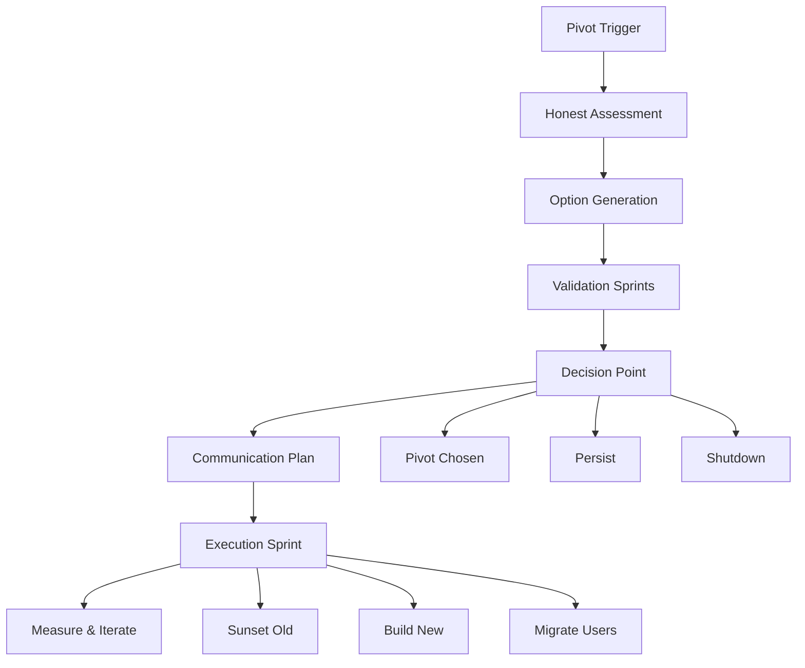

# Pivot Workflow

## Workflow Metadata
```yaml
workflow:
  id: pivot-workflow
  name: Strategic Pivot Execution
  duration: 8-12 weeks
  complexity: high
  agents_involved:
    - serial-entrepreneur (lead)
    - vc-advisor
  trigger_conditions:
    - no_product_market_fit
    - runway_concerns
    - market_shift
    - team_conviction_lost
```

## Workflow Overview



## Phase 1: Pivot Recognition (Week 1)

### Step 1.1: Trigger Analysis
**Agent:** serial-entrepreneur
**Duration:** 2 days

```markdown
Pivot Trigger Assessment:

Growth Metrics:
□ Flat/declining for 3+ months
□ CAC > LTV persistently
□ Churn > new users
□ No experiments working
□ Channels exhausted

Product Metrics:
□ Retention <20% at D30
□ Engagement declining
□ Feature adoption <10%
□ Support tickets increasing
□ NPS <0

Business Health:
□ Runway <6 months
□ Team morale low
□ Investors concerned
□ Competition winning
□ Market shifted

Trigger Count: {{X}}/15
Pivot Urgency: {{High/Medium/Low}}
```

### Step 1.2: Root Cause Analysis
**Agent:** serial-entrepreneur
**Task:** execute-pivot-analysis
**Duration:** 3 days

```markdown
Deep Dive Analysis:

The 5 Whys:
Problem: {{main_issue}}

Why 1: {{cause_1}}
Why 2: {{cause_2}}
Why 3: {{cause_3}}
Why 4: {{cause_4}}
Why 5: {{root_cause}}

Contributing Factors:
□ Product issues
  - {{specific_problems}}
□ Market issues
  - {{specific_problems}}
□ Business model issues
  - {{specific_problems}}
□ Team issues
  - {{specific_problems}}
□ Timing issues
  - {{specific_problems}}

Salvageable Assets:
- Technology: {{what_works}}
- Team: {{strengths}}
- Customers: {{segments}}
- Brand: {{value}}
- Learnings: {{insights}}
```

## Phase 2: Option Generation (Week 2)

### Step 2.1: Pivot Types Evaluation
**Agent:** serial-entrepreneur
**Duration:** 3 days

```markdown
Pivot Options Analysis:

1. Customer Segment Pivot
Current: {{segment}} → New: {{segment}}
Rationale: {{why}}
Effort: {{High/Med/Low}}
Risk: {{High/Med/Low}}
Quick test: {{method}}

2. Problem Pivot
Current: {{problem}} → New: {{problem}}
Rationale: {{why}}
Effort: {{High/Med/Low}}
Risk: {{High/Med/Low}}
Quick test: {{method}}

3. Solution Pivot
Current: {{solution}} → New: {{solution}}
Rationale: {{why}}
Effort: {{High/Med/Low}}
Risk: {{High/Med/Low}}
Quick test: {{method}}

4. Business Model Pivot
Current: {{model}} → New: {{model}}
Rationale: {{why}}
Effort: {{High/Med/Low}}
Risk: {{High/Med/Low}}
Quick test: {{method}}

5. Platform Pivot
Current: {{type}} → New: {{type}}
Rationale: {{why}}
Effort: {{High/Med/Low}}
Risk: {{High/Med/Low}}
Quick test: {{method}}

Top 3 Options:
1. {{option}}: {{brief_description}}
2. {{option}}: {{brief_description}}
3. {{option}}: {{brief_description}}
```

### Step 2.2: Opportunity Sizing
**Agent:** vc-advisor
**Integration:** @market-researcher
**Duration:** 2 days

```markdown
Market Analysis per Option:

Option 1: {{pivot_type}}
- TAM: ${{amount}}
- Competition: {{landscape}}
- Our advantages: {{list}}
- Time to market: {{months}}
- Investment needed: ${{amount}}

Option 2: {{pivot_type}}
- TAM: ${{amount}}
- Competition: {{landscape}}
- Our advantages: {{list}}
- Time to market: {{months}}
- Investment needed: ${{amount}}

Option 3: {{pivot_type}}
- TAM: ${{amount}}
- Competition: {{landscape}}
- Our advantages: {{list}}
- Time to market: {{months}}
- Investment needed: ${{amount}}

Recommendation Priority:
1. {{option}}: Highest potential
2. {{option}}: Fastest validation
3. {{option}}: Lowest risk
```

## Phase 3: Rapid Validation (Weeks 3-4)

### Step 3.1: Validation Sprints
**Agent:** serial-entrepreneur
**Duration:** 2 weeks

```markdown
Parallel Validation Tests:

Option 1 Validation:
Week 1:
□ Customer interviews (10)
□ Landing page test
□ Prototype mockup
□ Competitive analysis

Week 2:
□ Paid ad test ($500)
□ Concierge MVP (3 customers)
□ Pricing validation
□ Technical feasibility

Results:
- Customer interest: {{High/Med/Low}}
- Willingness to pay: {{Yes/No}}
- Technical risk: {{High/Med/Low}}
- Go/No-go: {{decision}}

[Repeat for Options 2 & 3]

Validation Scorecard:
| Option | Customer Interest | Market Size | Our Fit | Speed | Score |
|--------|------------------|-------------|---------|--------|--------|
| Opt 1 | {{score}}/10 | {{score}}/10 | {{score}}/10 | {{score}}/10 | {{total}} |
| Opt 2 | {{score}}/10 | {{score}}/10 | {{score}}/10 | {{score}}/10 | {{total}} |
| Opt 3 | {{score}}/10 | {{score}}/10 | {{score}}/10 | {{score}}/10 | {{total}} |
```

### Step 3.2: Financial Modeling
**Agent:** vc-advisor
**Duration:** 2 days

```markdown
Pivot Economics:

Shutdown Costs:
- Severance: ${{amount}}
- Contract penalties: ${{amount}}
- Wind-down: ${{amount}}
- Total: ${{amount}}

Pivot Investment:
- Development: ${{amount}}
- Marketing: ${{amount}}
- Team retention: ${{amount}}
- Buffer: ${{amount}}
- Total: ${{amount}}

Runway Analysis:
- Current burn: ${{amount}}/month
- Cash available: ${{amount}}
- Months remaining: {{number}}
- Post-pivot runway: {{number}} months

Break-even Projection:
- Option 1: {{months}} to revenue
- Option 2: {{months}} to revenue
- Option 3: {{months}} to revenue
```

## Phase 4: Decision Point (Week 5)

### Step 4.1: Go/No-Go Decision
**Agent:** serial-entrepreneur
**Duration:** 2 days

```markdown
Decision Framework:

PIVOT if ≥3 true:
□ Validation shows strong signal
□ Team excited about direction
□ Investors supportive
□ 9+ months runway post-pivot
□ Clear competitive advantage

PERSIST if ≥3 true:
□ Recent positive signal emerged
□ New experiments identified
□ Cost to pivot > potential gain
□ Team believes in current path
□ <6 months exploration done

SHUTDOWN if ≥3 true:
□ No viable pivot options
□ Team burned out
□ Investors withdrawing support
□ Market opportunity too small
□ Better opportunities elsewhere

Decision Matrix:
Current path score: {{X}}/50
Best pivot score: {{X}}/50
Shutdown score: {{X}}/50

FINAL DECISION: {{PIVOT/PERSIST/SHUTDOWN}}
Selected Pivot: {{option_name}}
```

### Step 4.2: Stakeholder Alignment
**Agent:** vc-advisor
**Duration:** 3 days

```markdown
Stakeholder Management:

Board/Investors:
- Schedule emergency meeting
- Present data-driven case
- Show validation results
- Request support/guidance
- Document decision

Team:
- All-hands meeting
- Transparent communication
- Address concerns
- Retention plans
- Role transitions

Customers:
- Segment by impact
- Personal outreach (high-value)
- Migration plan
- Incentives to stay
- Clear timeline

Key Messages:
- This is evolution, not failure
- Data supports decision
- Exciting opportunity ahead
- Team/customer first
- Clear execution plan
```

## Phase 5: Communication & Planning (Week 6)

### Step 5.1: Internal Communication
**Agent:** serial-entrepreneur
**Duration:** 2 days

```markdown
Team Communication Plan:

All-Hands Agenda:
1. Current reality (10 min)
   - Honest metrics
   - What's not working
   - Why change needed

2. New direction (15 min)
   - What we learned
   - New opportunity
   - Why we'll win

3. Transition plan (10 min)
   - Timeline
   - Role changes
   - Support available

4. Q&A (25 min)
   - Address concerns
   - Next steps
   - How to help

Follow-up Actions:
□ 1:1s with key people
□ Written FAQ
□ Daily standups
□ Open office hours
□ Anonymous feedback channel

Retention Strategy:
- Equity refresh for key people
- Clear roles in new direction
- Exciting vision
- Skill development opportunity
- Success bonuses
```

### Step 5.2: External Communication
**Agent:** vc-advisor
**Duration:** 3 days

```markdown
External Communications:

Customer Email:
Subject: Exciting Evolution at {{Company}}

Key Points:
- Thank you for journey
- What we learned from you
- New direction benefits
- Transition plan
- Special offers

Investor Update:
Subject: Strategic Pivot Decision

Sections:
- Executive summary
- Data supporting pivot
- New opportunity size
- Execution plan
- Support needed

Press/Public:
Blog post: "Why We're Pivoting"
- Customer learnings
- Market insights
- New vision
- Team commitment

Social Media:
- Positive framing
- Learning narrative
- Excitement for future
- Thank supporters
```

## Phase 6: Execution Sprint (Weeks 7-10)

### Step 6.1: Sunset Planning
**Agent:** serial-entrepreneur
**Duration:** 1 week

```markdown
Legacy Product Winddown:

Technical:
□ Code archive
□ Data export tools
□ API deprecation schedule
□ Documentation
□ Security considerations

Customer:
□ Migration tools
□ Data export
□ Refund policy
□ Support timeline
□ Success transitions

Business:
□ Contract reviews
□ Vendor notifications
□ Subscription cancellations
□ Asset transfers
□ Legal cleanup

Timeline:
- Day 1-7: Announcement
- Day 8-30: Migration support
- Day 31-60: Limited support
- Day 61-90: Read-only
- Day 91: Full sunset
```

### Step 6.2: New Product Sprint
**Agent:** serial-entrepreneur
**Integration:** @product-manager, @pmo-agile
**Duration:** 3 weeks

```markdown
MVP Development Plan:

Week 1: Foundation
□ Core architecture
□ Basic UI/UX
□ User authentication
□ Analytics setup
□ Payment integration

Week 2: Core Features
□ Feature 1: {{description}}
□ Feature 2: {{description}}
□ Feature 3: {{description}}
□ Basic onboarding
□ Initial testing

Week 3: Launch Prep
□ Bug fixes
□ Performance optimization
□ Beta user onboarding
□ Support documentation
□ Launch materials

Success Criteria:
- 50 beta users active
- Core value delivered
- <2 min to value
- Payment flow works
- Positive feedback
```

### Step 6.3: Go-to-Market Reset
**Agent:** vc-advisor
**Duration:** 1 week

```markdown
GTM Strategy:

Positioning:
- Old: {{previous_positioning}}
- New: {{new_positioning}}
- Key message: {{tagline}}

Target Customer:
- Profile: {{description}}
- Pain point: {{specific_pain}}
- Current solution: {{what_they_use}}
- Why switch: {{value_prop}}

Launch Channels:
1. Existing customers
   - Migration incentive
   - Early access
   - Founder calls

2. Product Hunt
   - Asset preparation
   - Community building
   - Launch day plan

3. Content marketing
   - Pivot story blog
   - Customer success stories
   - SEO optimization

4. Direct outreach
   - Target list: 100 prospects
   - Personalized emails
   - Demo offers
```

## Phase 7: Measure & Iterate (Weeks 11-12)

### Step 7.1: Success Metrics
**Agent:** vc-advisor
**Duration:** Ongoing

```markdown
Pivot Success Tracking:

Week 2 Checkpoint:
□ 25+ beta users
□ Daily usage happening
□ Core loop working
□ Positive feedback
□ Team energy high

Week 4 Checkpoint:
□ 100+ users
□ Week-over-week growth
□ First revenue
□ Retention improving
□ Clear roadmap

Week 8 Checkpoint:
□ Product-market fit signals
□ Sustainable CAC
□ Team growing
□ Investor confidence
□ Next round possible

Week 12 Assessment:
□ PMF score: {{score}}/100
□ Growth rate: {{%}} monthly
□ Burn rate: ${{amount}}
□ Runway: {{months}}
□ Team morale: {{score}}/10

Pivot Success? {{Yes/No/TBD}}
```

### Step 7.2: Continuous Learning
**Agent:** serial-entrepreneur
**Duration:** 1 week

```markdown
Pivot Post-Mortem:

What Worked:
1. Quick decision making
2. Team alignment
3. Customer communication
4. Validation process
5. Execution speed

What Didn't:
1. {{learning_1}}
2. {{learning_2}}
3. {{learning_3}}

Key Insights:
1. {{insight_1}}
2. {{insight_2}}
3. {{insight_3}}

Process Improvements:
1. {{improvement_1}}
2. {{improvement_2}}
3. {{improvement_3}}

Documentation:
- Create pivot playbook
- Share learnings publicly
- Update investor materials
- Archive for future
```

## Success Patterns

### Pattern 1: Speed & Decisiveness
```markdown
- Set hard deadlines
- Make decision with 70% info
- Execute immediately
- Don't look back
```

### Pattern 2: Customer-Centric
```markdown
- Keep best customers close
- Over-communicate
- Solve their biggest pain
- Make transition easy
```

### Pattern 3: Team First
```markdown
- Transparent communication
- Involve in decision
- Clear role transitions
- Celebrate the journey
```

## Common Pitfalls

1. **Analysis Paralysis**
   - Sign: 3+ months deciding
   - Fix: Set 30-day deadline

2. **Half Pivot**
   - Sign: Keeping too much legacy
   - Fix: Commit fully

3. **Same Problems**
   - Sign: Repeating mistakes
   - Fix: Address root causes

4. **Communication Gaps**
   - Sign: Stakeholder surprises
   - Fix: Over-communicate

## Completion Criteria

```markdown
Pivot Complete When:
□ Old product sunset
□ New direction launched
□ Team aligned & energized
□ Early traction signals
□ Investors supportive
□ 6+ months runway
□ Clear path forward
□ Lessons documented
```

---

*The best pivots combine brutal honesty about what's not working with intelligent reuse of what is. Move fast.*