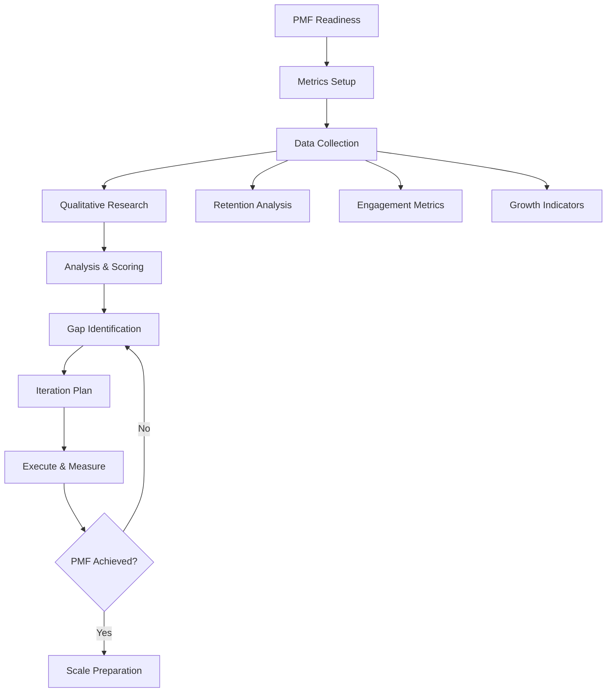

# Product-Market Fit Validation Workflow

## Workflow Metadata
```yaml
workflow:
  id: pmf-validation
  name: Product-Market Fit Discovery & Validation
  duration: 8-12 weeks
  complexity: high
  agents_involved:
    - serial-entrepreneur (lead)
    - vc-advisor
  dependencies:
    - live product
    - initial users
    - analytics setup
```

## Workflow Overview



## Phase 1: PMF Readiness Assessment (Week 1)

### Step 1.1: Current State Audit
**Agent:** serial-entrepreneur
**Duration:** 2 days

```markdown
Baseline Requirements:

Product Status:
□ Core features complete
□ Stable/few critical bugs
□ Onboarding flow works
□ Value prop clear

User Base:
□ 100+ active users (B2C)
□ 10+ customers (B2B)
□ 30+ days of data
□ Multiple cohorts

Analytics:
□ Event tracking live
□ Cohort analysis possible
□ Revenue tracking (if applicable)
□ Feedback channels open

Score: {{X}}/12
Ready for PMF analysis? {{Yes/No}}
```

### Step 1.2: Success Criteria Definition
**Agent:** vc-advisor
**Duration:** 1 day

```markdown
PMF Target Metrics by Type:

B2C SaaS:
- D30 Retention: >40%
- DAU/MAU: >20%
- Organic growth: >20%
- NPS: >30

B2B SaaS:
- M6 Retention: >80%
- Logo retention: >90%
- Expansion revenue: >20%
- NPS: >50

Marketplace:
- Liquidity achieved
- Repeat rate: >30%
- Cross-side satisfaction
- Take rate sustainable

Your Targets:
- Retention: {{target}}
- Engagement: {{target}}
- Growth: {{target}}
- Satisfaction: {{target}}
```

## Phase 2: Metrics Infrastructure (Week 2)

### Step 2.1: Analytics Setup
**Agent:** vc-advisor
**Duration:** 3 days

```markdown
Required Tracking:

User Journey Events:
□ Sign up started/completed
□ Onboarding steps
□ First value moment
□ Core action performed
□ Invite sent
□ Payment added
□ Churn event

Engagement Metrics:
□ Session frequency
□ Session duration
□ Feature usage
□ Power user actions

Business Metrics:
□ Revenue events
□ Subscription changes
□ Support tickets
□ Referral tracking

Tools Setup:
- Product: Mixpanel/Amplitude
- Revenue: Stripe/ChartMogul
- Feedback: Intercom/Delighted
- Session: FullStory/Hotjar
```

### Step 2.2: Dashboard Creation
**Agent:** vc-advisor
**Duration:** 2 days

```markdown
PMF Dashboard Structure:

Real-time Metrics:
┌─────────────────────────────┐
│ Daily Active Users: {{DAU}} │
│ New Signups: {{count}}      │
│ Activation Rate: {{%}}      │
│ Core Actions: {{count}}     │
└─────────────────────────────┘

Weekly Views:
- Cohort retention curves
- Feature adoption funnel
- User segmentation
- Revenue metrics

Monthly Analysis:
- Trend analysis
- Segment deep-dives
- Competitive benchmarks
- Predictive indicators

Alerts Setup:
- Retention drop >10%
- Activation <target
- Churn spike
- Usage decline
```

## Phase 3: Quantitative Analysis (Weeks 3-5)

### Step 3.1: Retention Analysis
**Agent:** serial-entrepreneur
**Task:** analyze-product-market-fit
**Duration:** 1 week

```markdown
Cohort Analysis Process:

1. Build Cohort Table:
   - Weekly cohorts
   - 6+ months history
   - Segment by source
   - Track by behavior

2. Identify Patterns:
   - Where retention flattens
   - Which cohorts perform best
   - What drives differences
   - Improvement over time

3. Benchmark Comparison:
   Current vs. Target vs. Best-in-class
   
   Your Performance:
   - D1: {})
   - D7: {})
   - D30: {})
   - D90: {})

4. Retention Drivers:
   - Feature correlation
   - User characteristics
   - Onboarding paths
   - Engagement levels
```

### Step 3.2: Engagement Deep Dive
**Agent:** vc-advisor
**Duration:** 3 days

```markdown
Engagement Analysis:

Core Action Definition:
Your core action: {{action}}
Frequency target: {{X}} per {{period}}

Usage Patterns:
1. Power Users (top 10%)
   - Actions/week: {{count}}
   - Features used: {{list}}
   - Revenue/user: ${{amount}}

2. Regular Users (next 30%)
   - Actions/week: {{count}}
   - Features used: {{list}}
   - Revenue/user: ${{amount}}

3. Casual Users (bottom 60%)
   - Actions/week: {{count}}
   - Features used: {{list}}
   - Revenue/user: ${{amount}}

Feature Adoption:
| Feature | % Tried | % Regular Use | Impact on Retention |
|---------|---------|---------------|---------------------|
| {{feature_1}} | {} | {{+X%}} |
| {{feature_2}} | {} | {{+X%}} |
| {{feature_3}} | {} | {{+X%}} |
```

### Step 3.3: Growth Analysis
**Agent:** vc-advisor
**Duration:** 4 days

```markdown
Growth Indicators:

Organic Growth Metrics:
- Direct traffic: {} of new users
- Viral coefficient: {{K-factor}}
- Referral rate: {} of traffic

Paid Growth Efficiency:
- Blended CAC: ${{amount}}
- Payback period: {{months}}
- LTV/CAC ratio: {{ratio}}
- Channel performance:
  * Channel 1: CAC ${{X}}, Quality {{score}}
  * Channel 2: CAC ${{X}}, Quality {{score}}

Growth Accounting:
New + Resurrected - Churned = Net Growth
{{equation_with_numbers}}

Quick Ratio: {{ratio}}
(Target: >4 for strong PMF)
```

## Phase 4: Qualitative Research (Weeks 6-7)

### Step 4.1: Sean Ellis Test
**Agent:** serial-entrepreneur
**Duration:** 1 week

```markdown
Survey Deployment:

Target Audience:
- Used product 2+ times
- In last 2 weeks
- Experienced core value
- Sample size: 100+

Question Set:
1. "How disappointed if no longer use?"
   - Very disappointed
   - Somewhat disappointed
   - Not disappointed

2. "What type of people benefit most?"
   [Open text]

3. "Main benefit you receive?"
   [Open text]

4. "How can we improve?"
   [Open text]

Results Analysis:
Very Disappointed: {{%}}
(PMF threshold: >40%)

Key Insights:
- Main benefit: {{theme}}
- Best user type: {{profile}}
- Top improvements: {{list}}
```

### Step 4.2: Customer Interviews
**Agent:** serial-entrepreneur
**Task:** conduct-customer-discovery
**Duration:** 1 week

```markdown
Interview Focus: PMF Validation

Target Segments:
1. Power users (5 interviews)
2. Churned users (5 interviews)
3. New users (5 interviews)

Key Questions:
For Active Users:
- "Walk through last use"
- "What would break without us?"
- "Have you recommended us?"
- "What's missing?"

For Churned Users:
- "Why did you leave?"
- "What are you using now?"
- "What would bring you back?"
- "Who should use this?"

Synthesis:
Love Reasons:
1. {{reason_1}}: {{frequency}}
2. {{reason_2}}: {{frequency}}

Leave Reasons:
1. {{reason_1}}: {{frequency}}
2. {{reason_2}}: {{frequency}}
```

## Phase 5: PMF Scoring & Gaps (Week 8)

### Step 5.1: Comprehensive PMF Score
**Agent:** vc-advisor
**Duration:** 2 days

```markdown
PMF Scorecard:

Quantitative (60%):
□ Retention: {{score}}/25
□ Engagement: {{score}}/20
□ Growth: {{score}}/15
Subtotal: {{score}}/60

Qualitative (40%):
□ Sean Ellis: {{score}}/20
□ NPS: {{score}}/10
□ Reviews: {{score}}/10
Subtotal: {{score}}/40

Total PMF Score: {{score}}/100

Interpretation:
- 80+: Strong PMF, scale aggressively
- 60-79: Moderate PMF, optimize first
- 40-59: Weak PMF, iterate core
- <40: No PMF, consider pivot

Your Status: {{interpretation}}
```

### Step 5.2: Gap Analysis
**Agent:** serial-entrepreneur
**Duration:** 2 days

```markdown
PMF Gap Identification:

Biggest Gaps:
1. {{metric}}: Current {{X}}, Target {{Y}}
   Impact: {{High/Med/Low}}
   Root cause: {{analysis}}

2. {{metric}}: Current {{X}}, Target {{Y}}
   Impact: {{High/Med/Low}}
   Root cause: {{analysis}}

3. {{metric}}: Current {{X}}, Target {{Y}}
   Impact: {{High/Med/Low}}
   Root cause: {{analysis}}

Improvement Levers:
| Gap | Solutions | Effort | Impact | Priority |
|-----|-----------|--------|---------|----------|
| {{gap_1}} | {{solutions}} | {{H/M/L}} | {{H/M/L}} | {{rank}} |
| {{gap_2}} | {{solutions}} | {{H/M/L}} | {{H/M/L}} | {{rank}} |
| {{gap_3}} | {{solutions}} | {{H/M/L}} | {{H/M/L}} | {{rank}} |
```

### Step 5.3: Segment Analysis
**Agent:** vc-advisor
**Duration:** 1 day

```markdown
PMF by Segment:

Segment Performance:
| Segment | Size | Retention | NPS | PMF Score |
|---------|------|-----------|-----|-----------|
| {{segment_1}} | {} | {{score}} | {{score}} |
| {{segment_2}} | {} | {{score}} | {{score}} |
| {{segment_3}} | {} | {{score}} | {{score}} |

Strategic Options:
1. Double down on {{best_segment}}
   - Highest PMF score
   - Largest opportunity
   - Clear value prop

2. Fix {{struggling_segment}}
   - Address: {{issues}}
   - Potential: {{size}}
   - Investment: {{requirements}}

3. Abandon {{worst_segment}}
   - PMF unlikely
   - Resource drain
   - Better opportunities

Recommendation: {{strategy}}
```

## Phase 6: Iteration Planning (Week 9)

### Step 6.1: Improvement Roadmap
**Agent:** serial-entrepreneur
**Duration:** 3 days

```markdown
PMF Improvement Plan:

Sprint 1-2: Quick Wins
□ Fix: {{activation_issue}}
  Impact: +{} retention
□ Improve: {{ux_problem}}
  Impact: +{} satisfaction
□ Launch: {{new_capability}}
  Impact: +{} conversion

Sprint 5-6: Growth Features
□ Add: {{viral_mechanism}}
  Impact: +{} revenue
□ Create: {{retention_hook}}
  Impact: +{{%}} stickiness

Success Metrics:
- D30 Retention: {{current}}% → {{target}}%
- Sean Ellis Test: {{current}}% → {{target}}%
- NPS: {{current}} → {{target}}
```

### Step 6.2: Experiment Design
**Agent:** vc-advisor
**Duration:** 2 days

```markdown
PMF Experiments Queue:

High Priority Tests:
1. {{Experiment Name}}
   Hypothesis: {{statement}}
   Success metric: {{metric}} +{}
   Duration: {{weeks}} weeks

Medium Priority:
- {{list_of_3-5_experiments}}

Low Priority:
- {{list_of_3-5_experiments}}

Experiment Velocity:
- Target: 2-3 per week
- Focus: Retention first
- Then: Activation
- Finally: Growth
```

## Phase 7: Execute & Measure (Weeks 10-12)

### Step 7.1: Sprint Execution
**Agent:** serial-entrepreneur
**Integration:** @pmo-agile
**Duration:** 2 weeks

```markdown
Execution Framework:

Daily:
- Check PMF metrics
- User feedback review
- Quick iterations
- Team sync

Weekly:
- Experiment results
- Metrics deep dive
- User interviews
- Priority adjustment

Sprint End:
- PMF score update
- Learning synthesis
- Next sprint planning
- Stakeholder update

Communication:
- Daily: Slack updates
- Weekly: Metrics email
- Biweekly: All-hands
- Monthly: Board update
```

### Step 7.2: Continuous Measurement
**Agent:** vc-advisor
**Duration:** Ongoing

```markdown
PMF Monitoring Dashboard:

Weekly Scorecard:
┌─────────────────────────────────┐
│ PMF Score: {{score}} ({{Δ}})    │
├─────────────────────────────────┤
│ Retention:  {} ({{Δ}})      │
│ Sean Ellis: {{%}} ({{Δ}})      │
│ NPS: {{score}} ({{Δ}})         │
└─────────────────────────────────┘

Trends:
- Improving: {{metrics}}
- Stable: {{metrics}}
- Declining: {{metrics}}

Action Items:
1. {{urgent_action}}
2. {{important_action}}
3. {{experimental_action}}
```

## Phase 8: PMF Achievement (When Ready)

### Step 8.1: PMF Validation
**Agent:** vc-advisor
**Duration:** 2 days

```markdown
Final PMF Checklist:

Strong Signals:
□ 40%+ "very disappointed"
□ Retention curve flat
□ Organic growth >20%
□ NPS >50
□ Low support burden
□ Expansion revenue
□ Competition copying
□ Investor interest
□ Press coverage
□ Talent attraction

Validation Complete:
□ 3 months consistent metrics
□ Multiple cohorts verified
□ Seasonality accounted
□ Segments identified
□ Scale plan ready

PMF Achieved? {{Yes/No}}
Confidence Level: {{%}}
```

### Step 8.2: Scale Preparation
**Agent:** serial-entrepreneur
**Task:** plan-growth-strategy
**Duration:** 1 week

```markdown
Post-PMF Planning:

Immediate Actions:
1. Document what's working
2. Codify best practices
3. Prepare to scale team
4. Refine unit economics
5. Plan growth experiments

Growth Foundations:
□ Proven acquisition channels
□ Onboarding optimized
□ Support systems scalable
□ Infrastructure ready
□ Hiring pipeline built

Next Phase Trigger:
When ready to scale beyond PMF →
Move to Scaling Workflow
```

## Success Patterns

### Pattern 1: Obsessive Focus
```markdown
- One core value prop
- One target segment
- One key metric
- Until PMF proven
```

### Pattern 2: Rapid Iteration
```markdown
- Daily releases
- Weekly experiments
- Constant feedback
- Quick decisions
```

### Pattern 3: Customer Voice
```markdown
- Talk to users daily
- Watch behavior closely
- Act on feedback fast
- Celebrate their success
```

## Common PMF Pitfalls

1. **False Positives**
   - Sign: Revenue without retention
   - Fix: Focus on cohort retention

2. **Feature Creep**
   - Sign: Building for edge cases
   - Fix: Core experience only

3. **Wrong Segment**
   - Sign: Mixed signals
   - Fix: Narrow focus

4. **Vanity Metrics**
   - Sign: Signups without usage
   - Fix: Engagement metrics

## Completion Criteria

```markdown
PMF Validation Complete:
□ PMF score >70
□ Retention targets met
□ Sean Ellis >40%
□ Clear growth path
□ Segment identified
□ Team aligned
□ Investors excited
□ Ready to scale
```

---

*Product-market fit is when customers sell your product for you. Everything else is just progress toward that goal.*