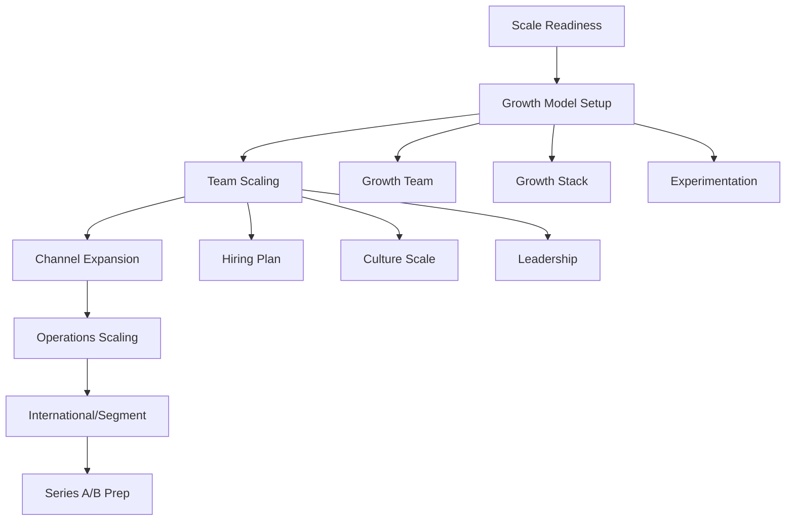

# Scaling Workflow

## Workflow Metadata
```yaml
workflow:
  id: scaling-workflow
  name: Post-PMF Scaling Journey
  duration: 6-12 months
  complexity: high
  agents_involved:
    - vc-advisor (lead)
    - serial-entrepreneur
  prerequisites:
    - product_market_fit
    - unit_economics_positive
    - growth_channel_identified
```

## Workflow Overview



## Phase 1: Scale Readiness (Week 1)

### Step 1.1: Scaling Prerequisites
**Agent:** vc-advisor
**Duration:** 2 days

```markdown
Scaling Checklist:

Product-Market Fit:
□ Retention >40% (consumer) or >80% (B2B)
□ NPS >50
□ Organic growth >20%
□ Sean Ellis test >40%

Unit Economics:
□ LTV:CAC >3:1
□ Payback <12 months
□ Gross margins >70% (SaaS)
□ Contribution margin positive

Growth Foundation:
□ 1+ scalable channel proven
□ CAC predictable
□ Sales process repeatable
□ Customer success working

Operations:
□ Tech infrastructure scalable
□ Support processes documented
□ Financial controls in place
□ Legal foundation solid

Score: {{X}}/16
Ready to scale? {{Yes/No}}
```

### Step 1.2: Scaling Strategy
**Agent:** vc-advisor
**Duration:** 3 days

```markdown
Strategic Decisions:

Growth Target:
- Current ARR: ${{amount}}
- 12-month target: ${{amount}}
- Growth rate required: {} of spend
2. Product & Eng: {} of spend
4. Operations: {{%}} of spend

Key Initiatives:
1. {{initiative_1}}: Build growth team
2. {{initiative_2}}: Scale main channel
3. {{initiative_3}}: Add new channels
4. {{initiative_4}}: Expand segments
5. {{initiative_5}}: International

Risk Factors:
- Competition response
- Talent availability
- Market saturation
- Operational complexity
```

## Phase 2: Growth Model Implementation (Weeks 2-4)

### Step 2.1: Growth Team Building
**Agent:** vc-advisor
**Task:** plan-growth-strategy
**Duration:** 1 week

```markdown
Growth Team Structure:

Immediate Hires (Month 1):
- Head of Growth
  - Background: {{requirements}}
  - Source: {{channels}}
  - Comp: ${{range}} + {{equity}}%

- Growth Engineer
  - Focus: Experimentation platform
  - Skills: {{list}}

- Performance Marketer
  - Channels: {{list}}
  - Budget: ${{amount}}/month

Month 2-3 Hires:
- Data Analyst
- Content Marketer
- Product Designer
- Sales Development Rep

Eventual Team (Month 6):
- Growth PM
- Lifecycle Marketer
- SEO Specialist
- Partnerships Manager
```

### Step 2.2: Growth Stack Setup
**Agent:** vc-advisor
**Duration:** 1 week

```markdown
Technology Infrastructure:

Analytics & Data:
□ Amplitude/Mixpanel (product)
□ Segment (data pipeline)
□ Looker/Mode (BI)
□ Google Analytics (web)

Marketing Automation:
□ Braze/Customer.io (lifecycle)
□ Intercom (support/engagement)
□ Klaviyo (email)
□ Branch (attribution)

Experimentation:
□ Optimizely/GrowthBook (A/B)
□ LaunchDarkly (features)
□ Hotjar (user behavior)

Sales Tools:
□ Salesforce/HubSpot (CRM)
□ Outreach (sequences)
□ Gong (call intelligence)
□ ZoomInfo (data)

Monthly Cost: ${{amount}}
Implementation: {{weeks}} weeks
```

### Step 2.3: Experimentation Framework
**Agent:** vc-advisor
**Duration:** 1 week

```markdown
Growth Process Design:

Weekly Rhythm:
Monday: Experiment planning
- Review results
- Prioritize backlog
- Design new tests

Wednesday: Mid-week check
- Monitor experiments
- Quick adjustments
- Data review

Friday: Results & learning
- Statistical significance
- Document insights
- Share learnings

Experiment Velocity:
- Week 1-4: 2 experiments/week
- Week 5-8: 5 experiments/week
- Week 9+: 10+ experiments/week

Focus Areas:
1. Activation optimization (Weeks 1-4)
2. Retention improvements (Weeks 5-8)
3. Referral mechanisms (Weeks 9-12)
4. Monetization tests (Weeks 13+)
```

## Phase 3: Team Scaling (Weeks 5-12)

### Step 3.1: Hiring Machine
**Agent:** serial-entrepreneur
**Duration:** Ongoing

```markdown
Hiring Infrastructure:

Process Setup:
1. Role definition framework
2. Interview process (4-5 steps)
3. Scorecard system
4. Reference check protocol
5. Offer approval matrix

Sourcing Strategy:
- Employee referrals (30%)
- Recruiters (30%)
- Direct outreach (25%)
- Inbound (15%)

Interview Framework:
- Screen (recruiter): 30 min
- Hiring manager: 45 min
- Team interviews: 3 x 45 min
- Executive: 30 min
- References: 2 minimum

Onboarding Program:
Week 1: Company immersion
Week 2: Role training
Week 3: First project
Week 4: 30-day review

Hiring Metrics:
- Time to fill: <30 days
- Offer accept: >80%
- 90-day retention: >95%
- Performance rate: >90%
```

### Step 3.2: Culture Scaling
**Agent:** serial-entrepreneur
**Duration:** 2 weeks

```markdown
Culture Codification:

Core Values Definition:
1. {{value_1}}: {{description}}
   - In practice: {{examples}}
   - Not: {{counter_examples}}

2. {{value_2}}: {{description}}
   - In practice: {{examples}}
   - Not: {{counter_examples}}

3. {{value_3}}: {{description}}
   - In practice: {{examples}}
   - Not: {{counter_examples}}

Culture Reinforcement:
- Hiring: Screen for values fit
- Onboarding: Values immersion
- Performance: Values = 50% of review
- Recognition: Values awards
- Decisions: Values-based framework

Communication Rituals:
- Weekly all-hands
- Monthly town halls
- Quarterly off-sites
- Annual summit
- Slack channels

Cultural Artifacts:
- Employee handbook
- Values posters
- Swag with meaning
- Origin stories
- Culture deck
```

### Step 3.3: Leadership Development
**Agent:** serial-entrepreneur
**Duration:** Ongoing

```markdown
Management Structure:

Organizational Design:
- Span of control: 5-7 max
- Layers: Minimize (<4)
- Clear reporting lines
- Cross-functional teams

Leadership Levels:
1. Team Lead (5-7 ICs)
2. Manager (3-5 teams)
3. Director (2-3 managers)
4. VP (2-3 directors)
5. C-level (functional)

Leadership Development:
- Manager training program
- 360 feedback process
- Mentorship matching
- External coaching budget
- Leadership offsites

Promotion Criteria:
□ Performance excellence
□ Values embodiment
□ Leadership potential
□ Business impact
□ Team feedback
```

## Phase 4: Channel Expansion (Weeks 8-16)

### Step 4.1: Channel Optimization
**Agent:** vc-advisor
**Duration:** 4 weeks

```markdown
Primary Channel Scaling:

Current Performance:
- Channel: {{channel_name}}
- CAC: ${{amount}}
- Volume: {{number}}/month
- Quality: {{score}}/10

Optimization Plan:
Week 1-2: Efficiency
- Creative testing
- Audience refinement
- Bid optimization
- Landing page tests

Week 3-4: Scale
- Budget increase: {} → {{%}}
```

### Step 4.2: New Channel Testing
**Agent:** vc-advisor
**Duration:** 4 weeks

```markdown
Channel Expansion Roadmap:

Test Queue:
1. {{Channel 1}}
   - Budget: ${{amount}}/month
   - Target CAC: ${{amount}}
   - Test duration: 4 weeks
   - Success criteria: {{metrics}}

2. {{Channel 2}}
   - Budget: ${{amount}}/month
   - Target CAC: ${{amount}}
   - Test duration: 4 weeks
   - Success criteria: {{metrics}}

3. {{Channel 3}}
   - Budget: ${{amount}}/month
   - Target CAC: ${{amount}}
   - Test duration: 4 weeks
   - Success criteria: {{metrics}}

Channel Testing Framework:
Week 1: Small budget test
Week 2: Optimize targeting
Week 3: Scale if working
Week 4: Decision to continue

Portfolio Target:
- No channel >40% of growth
- 3-4 profitable channels
- Mix of paid/organic
- Defensive + offensive
```

### Step 4.3: Sales Motion Scaling
**Agent:** serial-entrepreneur
**Duration:** 4 weeks

```markdown
Sales Team Scaling:

Current State:
- AEs: {{number}}
- Quota attainment: {{%}}
- Sales cycle: {{days}}
- ACV: ${{amount}}

Scaling Plan:
Month 1-2:
- Hire Sales Manager
- Add 3 AEs
- Build SDR team (2)
- Implement Salesforce

Month 3-4:
- Scale to 8 AEs
- Add Sales Ops
- Build comp plans
- Territory planning

Month 5-6:
- Customer Success team
- Sales Engineer role
- Channel partnerships
- International expansion

Sales Playbook:
1. Prospecting process
2. Discovery framework
3. Demo script
4. Objection handling
5. Negotiation guide
6. Handoff process
```

## Phase 5: Operations Scaling (Weeks 12-20)

### Step 5.1: Infrastructure Scaling
**Agent:** vc-advisor
**Integration:** @pmo-agile
**Duration:** 4 weeks

```markdown
Technical Infrastructure:

Current Limitations:
- Database: {{bottleneck}}
- API: {{bottleneck}}
- Frontend: {{bottleneck}}
- Third-party: {{bottleneck}}

Scaling Solutions:
1. Database optimization
   - Sharding strategy
   - Read replicas
   - Caching layer
   - Query optimization

2. API architecture
   - Microservices migration
   - Rate limiting
   - Load balancing
   - CDN implementation

3. DevOps excellence
   - CI/CD pipeline
   - Monitoring (DataDog)
   - Incident response
   - On-call rotation

Investment: ${{amount}}
Timeline: {{weeks}} weeks
```

### Step 5.2: Financial Operations
**Agent:** vc-advisor
**Duration:** 2 weeks

```markdown
Financial Infrastructure:

Systems Implementation:
□ NetSuite/QuickBooks upgrade
□ Expense management (Expensify)
□ Payroll system (Gusto/Rippling)
□ Revenue recognition
□ FP&A tools (Mosaic/Jirav)

Financial Controls:
- Approval matrix defined
- Budget vs actual monthly
- Department budgets
- Procurement process
- Audit preparation

Metrics & Reporting:
- Daily cash position
- Weekly sales metrics
- Monthly P&L
- Quarterly board deck
- Annual budget process

Finance Team:
- VP Finance (Month 1)
- Controller (Month 2)
- FP&A Manager (Month 3)
- AP/AR specialist (Month 4)
```

### Step 5.3: Customer Success Scaling
**Agent:** serial-entrepreneur
**Duration:** 4 weeks

```markdown
CS Infrastructure:

Team Building:
- Head of CS
- CS Managers (2)
- CS Representatives (4-6)
- Support Engineers (2)

Process Design:
1. Onboarding program
   - Day 1: Kickoff call
   - Day 7: Setup complete
   - Day 30: Success review
   - Day 90: Business review

2. Success metrics
   - Time to value: <7 days
   - Adoption score: >80
   - Health score: Green
   - NPS: >70

3. Expansion playbook
   - Usage monitoring
   - Upsell triggers
   - Feature adoption
   - Executive engagement

Technology:
- CS platform (Gainsight)
- Support tickets (Zendesk)
- Knowledge base (Notion)
- Community (Discord/Slack)
```

## Phase 6: Market Expansion (Weeks 20-24)

### Step 6.1: Segment Expansion
**Agent:** vc-advisor
**Integration:** @market-researcher
**Duration:** 2 weeks

```markdown
New Segment Analysis:

Adjacent Segments:
1. {{Segment 1}}
   - TAM: ${{amount}}
   - Overlap: {} with current
   - Required changes: {{list}}
   - Go-to-market: {{approach}}

Prioritization Matrix:
| Segment | TAM | Effort | Synergy | Score |
|---------|-----|--------|---------|--------|
| {{seg_1}} | {{size}} | {{H/M/L}} | {{H/M/L}} | {{score}} |
| {{seg_2}} | {{size}} | {{H/M/L}} | {{H/M/L}} | {{score}} |

Expansion Plan:
- Segment: {{chosen}}
- Investment: ${{amount}}
- Timeline: {{months}} months
- Success metrics: {{list}}
```

### Step 6.2: Geographic Expansion
**Agent:** serial-entrepreneur
**Duration:** 2 weeks

```markdown
International Strategy:

Market Prioritization:
1. {{Country/Region 1}}
   - Market size: ${{amount}}
   - Competition: {{level}}
   - Regulatory: {{complexity}}
   - Local partners: {{available}}

2. {{Country/Region 2}}
   - Market size: ${{amount}}
   - Competition: {{level}}
   - Regulatory: {{complexity}}
   - Local partners: {{available}}

Expansion Approach:
Phase 1: Remote team
- Local sales hire
- Marketing localization
- Support coverage
- Payment methods

Phase 2: Local entity
- Legal entity setup
- Local office
- Full team
- Compliance

Investment Required:
- Phase 1: ${{amount}}
- Phase 2: ${{amount}}
- Breakeven: {{months}} months
```

## Phase 7: Next Funding Preparation (Ongoing)

### Step 7.1: Series A/B Readiness
**Agent:** vc-advisor
**Task:** prepare-fundraising
**Duration:** 4 weeks

```markdown
Fundraising Preparation:

Metrics Requirements:
Series A:
- ARR: >$2M
- Growth: >15% monthly
- Burn multiple: <2
- Team: 20-30 people

Series B:
- ARR: >$10M
- Growth: >10% monthly
- Burn multiple: <1.5
- Team: 50-100 people

Materials Update:
□ Pitch deck refresh
□ Financial model update
□ Data room preparation
□ Reference cultivation
□ Board deck polish

Process Planning:
- Start conversations: {{date}}
- Active raise: {{date}}
- Target close: {{date}}
- Amount: ${{amount}}M
```

## Success Metrics

### Scaling KPIs
```markdown
Monthly Tracking:

Growth Metrics:
- MRR growth: {}
- Gross margin: {{%}}
- Burn multiple: {{ratio}}

Operational Metrics:
- Employee count: {{number}}
- Revenue/employee: ${{amount}}
- Customer count: {{number}}
- NPS score: {{score}}

Efficiency Metrics:
- CAC payback: {{months}}
- Magic number: {{ratio}}
- Rule of 40: {{score}}
- Quick ratio: {{ratio}}
```

### Scaling Challenges

1. **Quality Degradation**
   - Sign: NPS dropping
   - Fix: Slow hiring, increase training

2. **Culture Dilution**
   - Sign: Values drift
   - Fix: Reinforce constantly

3. **Process Breakdown**
   - Sign: Chaos increasing
   - Fix: Document and systematize

4. **Founder Bottleneck**
   - Sign: Everything needs you
   - Fix: Delegate and empower

## Completion Criteria

```markdown
Scaling Phase Success:
□ 10x revenue growth
□ 3+ growth channels
□ 50+ employees
□ Series A/B raised
□ International presence
□ Category leadership
□ Sustainable economics
□ Strong culture maintained
```

---

*Scaling is about building the machine that builds the machine. Focus on systems, not heroics.*