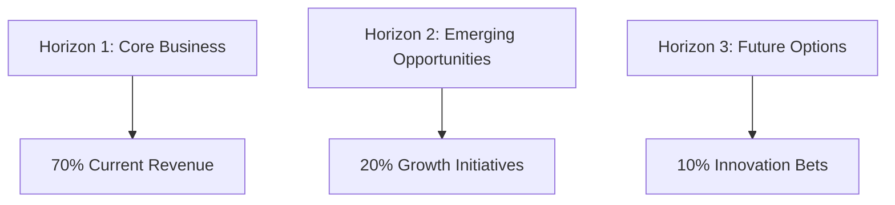

# BMAD Strategy Consulting Pack

[](https://github.com/your-org/BMAD-METHOD)
[](LICENSE)
[](https://github.com/your-org/BMAD-METHOD)

> **Elite strategy consulting with McKinsey, BCG, and Bain-inspired frameworks for transformational outcomes.**

## 🎯 Overview

The Strategy Consulting expansion pack brings world-class strategic thinking to the BMAD-METHOD framework. It combines proven consulting methodologies, expert strategic analysis, and systematic transformation approaches used by top-tier firms.

### Key Features

- **McKinsey 7S Framework** - Organizational alignment and effectiveness
- **Three Horizons Model** - Strategic innovation planning
- **Value Chain Analysis** - Competitive advantage identification
- **Transformation Roadmaps** - Systematic change management
- **Executive Communication** - Board-ready presentations
- **Strategic Situation Assessment** - Comprehensive strategic diagnosis

## 🚀 Quick Start

### Installation

```bash
# Clone the BMAD-METHOD repository
git clone https://github.com/your-org/BMAD-METHOD.git
cd BMAD-METHOD/expansion-packs/bmad-strategy-consulting

# Verify installation
ls -la agents/ frameworks/ tasks/
```

### Basic Usage

```yaml
# Activate strategy consultants
@senior-partner "Develop growth strategy for entering Asian markets"
@strategy-consultant "Analyze our competitive positioning"
@digital-strategist "Define digital transformation roadmap"

# Run strategic analysis
/mckinsey-7s-analysis "Assess organizational readiness for change"
/three-horizons-planning "Plan innovation pipeline"

# Strategic assessments
/strategic-situation-assessment "Current state analysis"
```

### Interactive Tasks

```bash
# McKinsey 7S organizational analysis
task: mckinsey-7s-analysis

# Three Horizons strategic planning
task: three-horizons-planning

# Comprehensive situation assessment
task: strategic-situation-assessment
```

## 👥 Strategy Team

### 🎯 Richard Sterling - Senior Partner
**Specialty**: C-suite advisory and transformation
- Leads strategic engagements
- Facilitates executive decisions
- Designs transformation programs
- **Commands**: `/strategic-options`, `/transformation-roadmap`, `/executive-summary`, `/board-presentation`

### 📊 Jessica Chen - Strategy Consultant
**Specialty**: Strategic analysis and planning
- Conducts market and competitive analysis
- Develops strategic frameworks
- Creates implementation plans
- **Commands**: `/market-analysis`, `/competitive-positioning`, `/strategic-plan`, `/implementation-roadmap`

### 💡 Marcus Thompson - Digital Strategist
**Specialty**: Digital transformation and innovation
- Designs digital strategies
- Identifies technology opportunities
- Plans digital capabilities
- **Commands**: `/digital-assessment`, `/tech-strategy`, `/innovation-roadmap`, `/capability-building`

### 🏢 Dr. Sarah Williams - Organization Design Expert
**Specialty**: Organizational effectiveness and change
- Designs organizational structures
- Plans change initiatives
- Aligns culture and strategy
- **Commands**: `/org-design`, `/change-readiness`, `/culture-assessment`, `/capability-map`

## 🛠️ Frameworks

### Classic Consulting Tools
- **[McKinsey 7S](frameworks/mckinsey-7s.md)** - Organizational alignment
- **[Three Horizons](frameworks/three-horizons-framework.md)** - Innovation planning
- **[Value Chain Analysis](frameworks/value-chain-analysis.md)** - Competitive advantage
- **[BCG Growth-Share Matrix](frameworks/bcg-matrix.md)** - Portfolio strategy
- **[Porter's Generic Strategies](frameworks/porters-generic-strategies.md)** - Competitive positioning

### Modern Strategic Tools
- **[Blue Ocean Strategy](frameworks/blue-ocean-strategy.md)** - Market creation
- **[Business Model Canvas](frameworks/business-model-canvas.md)** - Business design
- **[OKR Framework](frameworks/okr-framework.md)** - Strategic execution
- **[Digital Maturity Model](frameworks/digital-maturity.md)** - Digital assessment

## 📊 Strategy Templates

### Executive Deliverables
- **[Strategy Deck](templates/strategy-deck-tmpl.yaml)** - Executive presentation
- **[Transformation Roadmap](templates/transformation-roadmap-tmpl.yaml)** - Change journey
- **[Engagement Checklist](templates/strategy-engagement-checklist-tmpl.yaml)** - Project quality
- **[Executive Summary](templates/executive-summary-tmpl.yaml)** - C-suite briefing

## 🎨 Visual Strategy Tools

### Three Horizons Framework


### McKinsey 7S Model
```
                    Structure
                       ↓
    Strategy ← → Shared Values ← → Systems
                       ↓
                  Staff Skills
                       ↓
                     Style
```

### Strategic Options Matrix
```
┌─────────────────┬─────────────────┬─────────────────┐
│ Strategic Option│ Value Creation  │ Implementation  │
├─────────────────┼─────────────────┼─────────────────┤
│ Market Entry    │ High (8/10)     │ Medium (6/10)   │
│ M&A Strategy    │ Very High (9/10)│ Complex (4/10)  │
│ Digital Trans.  │ High (8/10)     │ High (7/10)     │
│ Cost Transform. │ Medium (6/10)   │ Quick (8/10)    │
└─────────────────┴─────────────────┴─────────────────┘
```

## 📋 Key Workflows

### Strategic Planning Cycle
**Duration**: 8-12 weeks  
**Output**: Comprehensive strategic plan

1. Situation assessment
2. Strategic options generation
3. Strategy formulation
4. Implementation planning
5. Execution roadmap
6. Monitoring framework

### Transformation Strategy Workflow
**Duration**: 12-16 weeks  
**Output**: Full transformation program

1. Current state diagnosis
2. Future state vision
3. Gap analysis
4. Initiative prioritization
5. Change roadmap
6. Quick wins identification

### Executive Strategy Process


## 🔗 Integration Ecosystem

### Supported Integrations
- **Market Research** - Market intelligence and insights
- **Product Management** - Strategic product decisions
- **PMO Agile** - Strategy execution and delivery
- **Problem Solver** - Complex strategic challenges
- **Startup Advisor** - Growth strategy guidance

### Integration Patterns
- **Research-Strategy-Execution** - Full value chain
- **Strategy-to-Operations** - Planning to implementation
- **Problem-to-Solution** - Issue resolution pathway
- **Vision-to-Value** - Strategic realization

## 📈 Success Metrics

### Engagement Quality
- **C-Suite Satisfaction** - Executive feedback scores
- **Strategy Adoption** - Implementation rates
- **Value Creation** - ROI and business impact
- **Time to Decision** - Strategic cycle time

### Business Outcomes
- **Revenue Growth** - Top-line expansion
- **Market Position** - Competitive improvement
- **Operational Excellence** - Efficiency gains
- **Innovation Pipeline** - New opportunity creation

## 🏗️ Architecture

```
bmad-strategy-consulting/
├── agents/              # Strategy consultant agents
├── frameworks/          # Consulting methodologies
├── tasks/              # Strategic analysis workflows
├── templates/          # Executive deliverables
├── workflows/          # Multi-phase engagements
├── tools/              # Analysis utilities
├── agent-teams/        # Consulting team configs
├── data/               # Knowledge base
└── config.yaml         # Pack configuration
```

## 🔧 Configuration

```yaml
# config.yaml
name: bmad-strategy-consulting
version: 1.0.0
description: Elite strategy consulting capabilities

capabilities:
  - strategic_analysis
  - transformation_planning
  - organizational_design
  - competitive_strategy
  - digital_strategy
  - executive_advisory
  - change_management

methodologies:
  - mckinsey_7s
  - three_horizons
  - value_chain
  - bcg_matrix
  - blue_ocean
```

## 📚 Documentation

### Core Documentation
- [McKinsey 7S Guide](frameworks/mckinsey-7s.md)
- [Three Horizons Framework](frameworks/three-horizons-framework.md)
- [Value Chain Analysis](frameworks/value-chain-analysis.md)
- [Transformation Workflows](workflows/)

### Templates & Tools
- [Strategy Deck Template](templates/strategy-deck-tmpl.yaml)
- [Roadmap Template](templates/transformation-roadmap-tmpl.yaml)
- [Engagement Checklist](templates/strategy-engagement-checklist-tmpl.yaml)
- [Executive Tools](tools/)

## 🤝 Contributing

We welcome contributions to improve the Strategy Consulting pack:

### Areas for Contribution
- **New Frameworks** - Modern strategy methodologies
- **Industry Playbooks** - Sector-specific strategies
- **Case Studies** - Transformation success stories
- **Executive Tools** - Board-ready templates
- **Integration Patterns** - Cross-pack workflows

### Contribution Process
1. Fork the repository
2. Create a feature branch (`git checkout -b feature/new-framework`)
3. Make your changes with documentation
4. Submit a pull request with case examples

## 📄 License

This project is licensed under the MIT License - see the [LICENSE](LICENSE) file for details.

## 🆘 Support

### Getting Help
- **Documentation** - Check framework guides
- **Issues** - Report bugs via GitHub Issues
- **Discussions** - Join strategy community
- **Examples** - Review case studies

### Community Resources
- [GitHub Discussions](https://github.com/your-org/BMAD-METHOD/discussions)
- [Documentation Wiki](https://github.com/your-org/BMAD-METHOD/wiki)
- [Issue Tracker](https://github.com/your-org/BMAD-METHOD/issues)

## 🗺️ Roadmap

### Version 1.1 (Q4 2025)
- [ ] AI-powered strategy insights
- [ ] Scenario planning tools
- [ ] War gaming simulations
- [ ] Executive dashboard

### Version 1.2 (Q2 2026)
- [ ] Industry-specific frameworks
- [ ] Strategy automation tools
- [ ] Board presentation AI
- [ ] Multi-language support

---

**Built for BMAD-METHOD** • **Inspired by elite consulting firms** • **Designed for transformational impact**

*Transform strategic thinking into sustainable competitive advantage.*