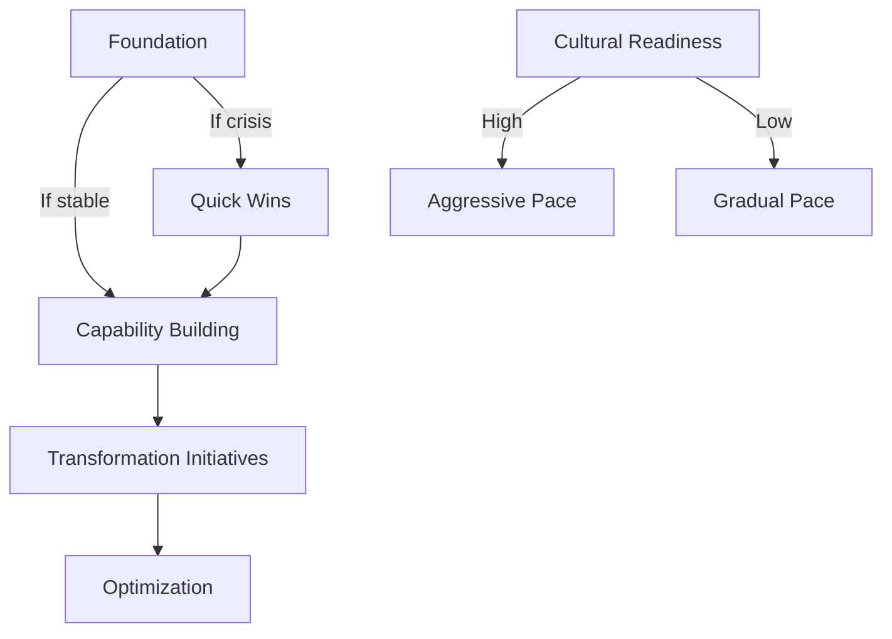

# Transformation Strategy Adaptive Workflow

## Overview
An adaptive workflow for developing and executing enterprise transformation strategies that adjusts based on transformation type, urgency, and organizational readiness.

## Workflow Metadata
```yaml
workflow:
  id: transformation-strategy
  name: Enterprise Transformation Strategy
  type: adaptive
  duration: 8-24 weeks
  agents:
    - senior-partner
    - strategy-consultant
    - org-design-expert
    - digital-strategist
  integration_points:
    - market-researcher: Market dynamics input
    - product-manager: Product strategy alignment
    - engineering: Technical feasibility
    - finance: Business case validation
```

## Phase 0: Transformation Scoping (Week 1)

### Step 0.1: Transformation Type Classification
**Lead Agent:** senior-partner

**Adaptive Questions:**
1. **What's driving the transformation?**
   - Crisis/Burning Platform → Turnaround Path
   - Growth Opportunity → Growth Transformation Path
   - Digital Disruption → Digital Transformation Path
   - Operational Issues → Operational Excellence Path
   - Strategic Repositioning → Strategic Transformation Path

2. **What's the urgency level?**
   - Critical (0-6 months) → Rapid Response Mode
   - High (6-12 months) → Accelerated Mode
   - Moderate (12-24 months) → Structured Mode
   - Low (24+ months) → Comprehensive Mode

3. **What's the scope?**
   - Enterprise-wide → Full Transformation
   - Business Unit → Focused Transformation
   - Function-specific → Targeted Transformation
   - Geographic → Regional Transformation

### Step 0.2: Readiness Assessment
**Quick diagnostic:**
- Leadership alignment
- Change capacity
- Financial resources
- Cultural readiness
- Technical capabilities

**Adaptive Path Selection:**
```python
def select_transformation_path(driver, urgency, scope, readiness):
    if driver == "crisis" and urgency == "critical":
        return "turnaround_sprint"
    elif readiness < 5 and scope == "enterprise":
        return "phased_transformation"
    elif driver == "digital" and readiness > 7:
        return "aggressive_digital"
    else:
        return "balanced_transformation"
```

## Phase 1: Strategic Diagnosis (Weeks 2-4)

### Path A: Crisis/Turnaround
**Lead Agent:** strategy-consultant

1. **Rapid Situation Assessment**
   - Cash runway analysis
   - Revenue/cost diagnostics
   - Competitive position
   - Stakeholder sentiment
   
   **If cash_runway < 6_months:**
   - Immediate cost actions
   - Asset rationalization
   - Emergency funding
   - Communication plan

2. **Stabilization Priorities**
   - Stop the bleeding initiatives
   - Quick win identification
   - Core business protection
   - Stakeholder management

### Path B: Growth Transformation
**Lead Agent:** strategy-consultant

1. **Growth Opportunity Mapping**
   ```
   WITH market_researcher:
     - Market expansion opportunities
     - Customer need evolution
     - Competitive white spaces
     - Ecosystem opportunities
   ```

2. **Capability Gap Analysis**
   - Growth capabilities needed
   - Current state assessment
   - Build/buy/partner decisions
   - Investment requirements

### Path C: Digital Transformation
**Lead Agent:** digital-strategist

1. **Digital Maturity Assessment**
   - Technology landscape
   - Data capabilities
   - Digital skills
   - Cultural readiness
   - Customer expectations

2. **Digital Vision Development**
   - Future state architecture
   - Platform strategies
   - Data monetization
   - Ecosystem positioning
   - Innovation agenda

### Adaptive Checkpoint 1
**Senior Partner Review:**
```
If diagnosis_confidence < 70%:
    - Extend analysis phase
    - Bring in expert advisors
    - Conduct deeper dives
Else:
    - Proceed to strategy development
    - Lock baseline facts
    - Align leadership team
```

## Phase 2: Strategy Development (Weeks 5-8)

### Step 2.1: Strategic Options Generation
**All agents collaborate**

**Adaptive Option Development:**
```yaml
for each transformation_type:
  generate_options:
    - conservative: Lower risk, proven approaches
    - balanced: Mix of proven and innovative
    - aggressive: High risk, high reward
    - hybrid: Staged approach with optionality
  
  evaluate_options:
    criteria:
      - value_potential
      - feasibility
      - risk_level
      - time_to_impact
      - capability_requirements
```

### Step 2.2: Operating Model Design
**Lead Agent:** org-design-expert

**Adaptive Design Principles:**
1. **If Digital Transformation:**
   - Agile organization structure
   - Cross-functional teams
   - Platform-based architecture
   - Data-driven decisions
   - Innovation governance

2. **If Operational Excellence:**
   - Process-centric design
   - Clear accountabilities
   - Performance management
   - Continuous improvement
   - Cost governance

3. **If Growth Transformation:**
   - Market-facing structure
   - Innovation capacity
   - Scaling mechanisms
   - Partnership models
   - Growth governance

### Step 2.3: Financial Modeling
**Integration with Finance:**
```python
def build_transformation_case(option, assumptions):
    costs = calculate_investment_required(option)
    benefits = project_value_creation(option, assumptions)
    risks = assess_execution_risks(option)
    
    return {
        'npv': calculate_npv(benefits - costs, risks),
        'payback': find_breakeven_period(costs, benefits),
        'irr': calculate_irr(costs, benefits),
        'risk_adjusted_return': apply_risk_factors(benefits, risks)
    }
```

## Phase 3: Stakeholder Alignment (Weeks 9-10)

### Step 3.1: Leadership Alignment
**Lead Agent:** senior-partner

**Adaptive Engagement Strategy:**
```
If high_resistance_expected:
    - Individual stakeholder meetings
    - Address specific concerns
    - Build coalition gradually
    - Find quick wins for skeptics
    
Elif moderate_alignment:
    - Leadership team workshops
    - Collaborative refinement
    - Consensus building
    - Commitment ceremony
    
Else:
    - Board presentation
    - Full leadership cascade
    - Public commitment
    - Rapid mobilization
```

### Step 3.2: Organization Readiness
**Lead Agent:** org-design-expert

**Change Readiness Actions:**
1. **Communication Strategy**
   - Burning platform narrative
   - Vision articulation
   - Success stories
   - Two-way dialogue

2. **Change Champions**
   - Identify influencers
   - Build change network
   - Equip with tools
   - Celebrate advocates

## Phase 4: Implementation Planning (Weeks 11-14)

### Step 4.1: Initiative Portfolio Design
**All agents collaborate**

**Adaptive Sequencing Logic:**


### Step 4.2: Governance Structure
**Adaptive Governance Models:**

1. **Crisis Mode:**
   - Daily war room
   - CEO-led taskforce
   - Rapid decision rights
   - Exception-based escalation

2. **Transformation Mode:**
   - Weekly SteerCo
   - PMO structure
   - Workstream leads
   - Regular board updates

3. **BAU Integration:**
   - Monthly reviews
   - Integrated planning
   - Performance management
   - Continuous improvement

### Step 4.3: Risk Mitigation Planning
**Risk-based Adaptations:**
```python
for risk in identified_risks:
    if risk.probability > 0.7 and risk.impact > 'high':
        create_contingency_plan(risk)
        assign_risk_owner(risk)
        establish_early_warning_indicators(risk)
    elif risk.type == 'execution':
        enhance_pmo_capabilities()
        increase_change_management_resources()
```

## Phase 5: Launch & Execution (Weeks 15+)

### Step 5.1: Mobilization
**Adaptive Launch Strategies:**

1. **Big Bang Launch** (if high urgency + high readiness)
   - All-hands kickoff
   - Full resource deployment
   - Aggressive timelines
   - High visibility

2. **Phased Rollout** (if moderate urgency + mixed readiness)
   - Pilot programs
   - Staged deployment
   - Learning integration
   - Risk mitigation

3. **Stealth Mode** (if low urgency + low readiness)
   - Under-radar pilots
   - Proof points building
   - Gradual expansion
   - Success amplification

### Step 5.2: Execution Management
**Adaptive Monitoring & Control:**

```yaml
monitoring_cadence:
  daily:
    - Critical metrics dashboard
    - Issue identification
    - Resource allocation
  
  weekly:
    - Milestone tracking
    - Risk assessment
    - Stakeholder pulse
    - Quick win celebration
  
  monthly:
    - Strategic review
    - Course correction
    - Capability building progress
    - Cultural shift measurement
```

### Step 5.3: Value Tracking
**Adaptive Value Capture:**

1. **Leading Indicators** (Weeks 1-12)
   - Activity metrics
   - Milestone completion
   - Engagement scores
   - Early adoptions

2. **Lagging Indicators** (Months 3-12)
   - Financial impact
   - Market share shifts
   - Customer satisfaction
   - Operational metrics

3. **Strategic Indicators** (Months 6+)
   - Competitive position
   - Innovation pipeline
   - Organizational health
   - Sustainable growth

## Phase 6: Sustainability & Scale

### Step 6.1: Institutionalization
**Making Change Stick:**
```
If transformation_success > target:
    - Embed in performance management
    - Update job descriptions
    - Revise incentive systems
    - Celebrate and recognize
    - Document best practices
    
Else:
    - Diagnose gaps
    - Adjust approach
    - Reinforce change
    - Address resistance
    - Iterate and improve
```

### Step 6.2: Continuous Evolution
**Adaptive Learning Loops:**
- Quarterly strategy reviews
- Annual transformation refresh
- Continuous capability building
- Innovation pipeline
- Next horizon planning

## Integration Protocols

### Cross-Pack Collaboration
```yaml
with_market_researcher:
  inputs:
    - Market dynamics
    - Customer evolution
    - Competitive moves
  outputs:
    - Strategic implications
    - Capability needs

with_product_manager:
  inputs:
    - Product strategy
    - Platform decisions
    - Innovation pipeline
  outputs:
    - Strategic alignment
    - Resource allocation
    - Go-to-market synergies

with_engineering:
  inputs:
    - Technical feasibility
    - Architecture options
    - Innovation possibilities
  outputs:
    - Technology strategy
    - Investment priorities
    - Capability roadmap
```

## Success Metrics Framework

### Transformation Scorecard
```markdown
| Dimension | Metric | Target | Actual | Status |
|-----------|--------|--------|--------|--------|
| Financial | Revenue growth | +X% | Y% | 🟢/🟡/🔴 |
| Operational | Cost reduction | -X% | Y% | 🟢/🟡/🔴 |
| Customer | NPS improvement | +X | Y | 🟢/🟡/🔴 |
| Innovation | New revenue streams | X% | Y% | 🟢/🟡/🔴 |
| Organization | Engagement score | X% | Y% | 🟢/🟡/🔴 |
| Strategic | Market position | Top X | Y | 🟢/🟡/🔴 |
```

### Adaptive Success Factors
- Clear vision and strategy: ✓/✗
- Leadership alignment: ✓/✗
- Organizational buy-in: ✓/✗
- Execution excellence: ✓/✗
- Value realization: ✓/✗
- Sustainable change: ✓/✗